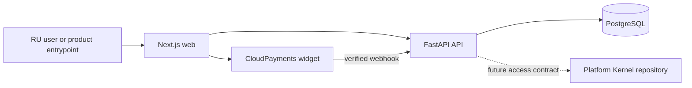

# Payment Portal Architecture

Status: authoritative current-state map
Last verified: 2026-07-11

## System boundary

This repository owns the RU-facing identity entry flow, legal-document and
acceptance records, checkout/order/payment records, CloudPayments webhooks, and
the payment portal UI. It does not own workflow execution, scenario runtime,
artifacts, or usage consumption. Those belong to the separate Platform Kernel
repository.



## Current domains

- **Identity** — regional users and hashed authentication sessions.
- **Legal** — legal entities, document versions, and append-only acceptances.
- **Billing** — entrypoints, checkout sessions, orders, items, payments,
  refunds, webhook inbox, and the temporary product access state.
- **CloudPayments integration** — provider request validation, redaction,
  idempotency, and translation into billing operations.

The API dependency direction is:

```text
contracts/models -> repositories -> services -> routers/wiring
```

Provider adapters may call application services but domain code must not import
provider or router modules. Core configuration, database, logging, telemetry,
and security helpers are shared infrastructure.

These directions are mechanically enforced with Python AST analysis. Routers
share authentication through session or service modules rather than importing
one another. The aggregate `app.models` module and the top-level compatibility
exports remain allowed until the model transition owned by ANY-71.

The web dependency direction is:

```text
shared contracts and UI -> features -> app routes
```

Shared modules do not import features or app routes. App routes and
cross-feature dependencies import public feature entrypoints; code within one
feature uses relative imports for its internal modules. ESLint enforces these
directions and rejects deep alias imports.

## Authoritative details

- [Data model](docs/architecture/payment-portal-data-model.md)
- [Deployment](docs/architecture/deployment.md)
- [Platform Kernel contract boundary](docs/architecture/platform-kernel-contract.md)
- [RU product journey](docs/product/ru-mvp.md)
- [Security](docs/SECURITY.md)
- [Reliability](docs/RELIABILITY.md)
