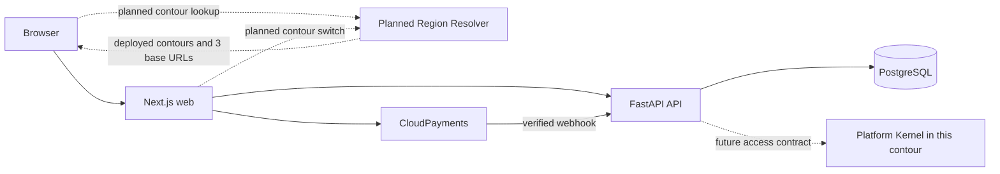

# Payment Portal Architecture

Status: authoritative current-state map
Last verified: 2026-09-09

## System boundary

This repository owns identity, legal-document and acceptance records, catalog
semantics, entitlement rules, local entitlements, and the payment portal UI for
**one contour per production instance**. In the current direct-provider flow it
also orchestrates checkout, orders, payments, subscriptions, and provider
webhooks. It does not own workflow execution, scenario runtime, artifacts, or
usage consumption. Those belong to the separate Platform Kernel repository.

The implemented instance is the `ru` contour. Target contours are `ru`, `eu`,
and `us`. See [contours](docs/architecture/contours.md).

Region Resolver is a separate UI-less service planned for contour selection.
When implemented, frontends will ask it for deployed contours and base URLs,
then talk to this portal and Platform Kernel directly. See
[Region Resolver contract](docs/architecture/region-resolver-contract.md).


```mermaid
flowchart LR
  Browser -. "planned contour lookup" .-> Resolver["Planned Region Resolver"]
  Resolver -. "deployed contours and 3 base URLs" .-> Browser
  Browser --> Web["Next.js web"]
  Web --> API["FastAPI API"]
  API --> DB[("PostgreSQL")]
  Web --> Provider["CloudPayments"]
  Provider -->|"verified webhook"| API
  API -. "future access contract" .-> PK["Platform Kernel in this contour"]
  Web -. "planned contour switch" .-> Resolver
```

This diagram shows **CURRENT IMPLEMENTATION CODE**, not a production billing
deployment. Payment Portal is still under development and has no production
CloudPayments subscribers or subscriptions. The implemented `ru` code contains
a Portal-managed direct CloudPayments flow. Under ANY-407, that capability
remains **TRANSITIONAL** until separately approved architecture and refactoring
work determines whether it is still needed; its presence does not commit the
product to using CloudPayments in production.

The sole long-term production target is the external-billing-managed flow, in
which the external system owns its external customer, invoice, payment, and
subscription lifecycle and the Portal stores normalized local projections. The
current Portal-managed flow remains documented and supported only as a
transitional capability. A `Subscription` that participates in a billing
lifecycle has exactly one billing owner at a time. A Portal-only access
lifecycle, such as a locally granted free trial without an external billing
lifecycle, remains Portal-owned and does not require an external billing owner.
No CloudPayments-to-external-billing migration or coexistence mechanism is
required or defined while there are no production subscriptions to migrate. See
[Billing Authority and Consistency](docs/architecture/billing-authority.md).

## Current domains

- **Identity** — contour-local users and hashed authentication sessions.
- **Legal** — legal entities, document versions, and append-only acceptances.
- **Billing** — entrypoints, checkout sessions, orders, items, payments,
  refunds, webhook inbox, subscriptions, entitlements, and subscription audit.
- **Portal-managed payment provider boundary** — direct-provider checkout
  actions selected through `payment_provider_accounts`; webhook normalization
  remains provider-adapter-specific. This boundary does not represent an
  external billing system.
- **CloudPayments integration** — the adapter registered in the current `ru`
  implementation: request validation, redaction, idempotency keys, response
  formatting, and translation into billing operations.

The target logical API dependency direction is:

```text
Presentation -> Application -> Domain

Application -> required persistence and integration capabilities
Persistence / Integrations -> implementations of those capabilities
Composition -> concrete wiring
```

Application owns use-case and transaction orchestration while Domain owns
transport- and vendor-independent rules. Persistence and Integrations implement
the outer capabilities required by Application, and Composition binds their
concrete implementations. This is the target logical model, not a claim that
the current physical package tree fully conforms. Current exceptions and the
transitional package mapping are recorded in
[Billing Authority and Consistency](docs/architecture/billing-authority.md).
Repositories remain selective boundaries for real persistence complexity, not
a requirement for every model.

For the current Portal-managed direct-provider flow, provider adapters are
registered at the API composition root by provider code. Provider-neutral
modules do not import provider integrations or branch on provider-specific
literals; they select enabled provider accounts and use the registered adapter
contract. An external billing system is a separate authority boundary and is
not registered in `PaymentProviderRegistry`. Core configuration, database,
logging, telemetry, and security helpers are shared infrastructure.

Python AST analysis currently enforces selected dependency constraints in the
transitional package tree, including core/domain-to-integration restrictions,
router import boundaries, and provider-neutrality rules. It does not
mechanically enforce the complete target logical layering above;
Presentation/Application/Domain/Persistence/Integration is not yet fully
represented by the physical packages. Routers share authentication through
session or service modules rather than importing one another. `app.models` is
the canonical persisted model layer: SQLAlchemy models and closed persisted
vocabularies are imported from its explicit public exports, while model modules
import canonical enums directly from `app.models.enums`. Provider contract
enums and open/provider/configuration identifiers remain owned by their
boundaries and are not persisted model enums.

## Runtime execution model

ANY-454 is not an async migration. Payment Portal remains sync-first. Domain,
Application, Persistence, synchronous SQLAlchemy, and current synchronous
integrations use ordinary synchronous functions. Async is limited to
unavoidable FastAPI/ASGI framework boundaries or concrete genuinely awaitable
outer I/O.

Current blocking database and application flows use normal synchronous
FastAPI `def` endpoints so the framework owns worker dispatch. Blocking
SQLAlchemy operations, synchronous HTTP clients, sleeps, and similar work must
not execute directly on an event-loop path. If an async framework boundary
must invoke blocking work, it passes a complete resource-owning synchronous
unit through the framework worker mechanism. It must not create a
request-scoped resource such as a SQLAlchemy `Session` and then move that
resource through a manually introduced thread bridge. Execution modality does
not justify duplicate sync/async application services or generic sync/async
adapters.

Async request and error middleware, FastAPI lifespan coordination, and the
shared exact-body dependency are valid framework boundaries. The current
provider server client, password-reset background callback, scheduled expiry
CLI, provider-neutral business operations, and Application, Domain, and
Persistence code remain synchronous. The `traced()` helper supports both sync
and async callables because it is boundary-neutral observability infrastructure,
not because application code should become async.

Exact raw request bytes are a Presentation/HTTP concern. A route with a concrete
exact-bytes requirement, such as webhook signature verification, uses the
shared `get_raw_request_body()` dependency. Integration routers do not create
their own `await request.body()` readers when that dependency satisfies the
requirement. The dependency only awaits the ASGI body and returns its bytes; it
does not parse payloads, verify signatures, apply provider logic, access
persistence, define logging policy, or call Application or Domain code.
Ordinary JSON APIs continue to use FastAPI/Pydantic request models. The shared
dependency is not a general async application abstraction.

CloudPayments and its lifespan cleanup remain transitional current
implementation details, not permanent provider lifecycle architecture. A
future integration chooses sync or async according to its actual outer I/O
client and keeps that modality at the integration boundary rather than
propagating it into Application, Domain, or Persistence.

The web dependency direction is:

```text
shared contracts and UI -> features -> app routes
```

Shared modules do not import features or app routes. App routes and
cross-feature dependencies import public feature entrypoints; code within one
feature uses relative imports for its internal modules. ESLint enforces these
directions and rejects deep alias imports.

## Error ownership and HTTP failure boundary

Core owns only neutral shared error primitives, including `AppError`. It does
not own feature-specific error vocabularies. Application and Domain own
business and use-case failure meaning. Their exceptions may use concrete
semantic types and may carry stable internal codes and safe diagnostics where
justified, but do not depend on FastAPI, HTTP status codes, or vendor response
semantics. `AppError.code` is optional: it remains available for justified
stable internal codes, especially existing integration/provider errors, while
semantic no-code exceptions use their type as their internal identity.

The reviewed checkout/password-reset slice uses concrete semantic exception
types rather than a generic exception plus a string code. This is not a rule
to create a class for every API code throughout the repository, and it does
not introduce a global error-code registry.

Integrations and the payment-provider boundary normalize vendor failures while
preserving retryability, idempotency, and unknown or ambiguous-outcome
semantics. Raw vendor responses and status vocabularies are not
Application/Domain error contracts.

Presentation owns HTTP status mapping and public error DTO/body shape. Only
explicitly allowlisted safe fields are serialized, and changed public errors
use structured `detail.code`. The frontend branches on `ApiError.status` and
structured `detail.code`; it does not parse serialized exception text.

Unexpected application failures are converted by the Presentation HTTP
middleware to a generic structured 500 response. The boundary emits one
bounded application-level diagnostic while request-ID context is active. The
diagnostic may include the request ID supplied by the logging context, method,
matched route template, exception type, and one application-owned
failure-location fingerprint containing only a repository-relative module/file
identifier, function name, and line number. It never includes source text,
locals, arguments, exception messages, raw traceback text, request inputs,
provider payloads, secrets, or payment data. Sentry and new monitoring remain
outside this architecture decision.

## Authoritative details

- [Contours](docs/architecture/contours.md)
- [Region Resolver contract](docs/architecture/region-resolver-contract.md)
- [Payment providers](docs/architecture/payment-providers.md)
- [Billing Authority and Consistency](docs/architecture/billing-authority.md)
- [Data model](docs/architecture/payment-portal-data-model.md)
- [Deployment](docs/architecture/deployment.md)
- [Platform Kernel contract boundary](docs/architecture/platform-kernel-contract.md)
- [Implemented `ru` journey](docs/product/ru-mvp.md)
- [Security](docs/SECURITY.md)
- [Reliability](docs/RELIABILITY.md)
