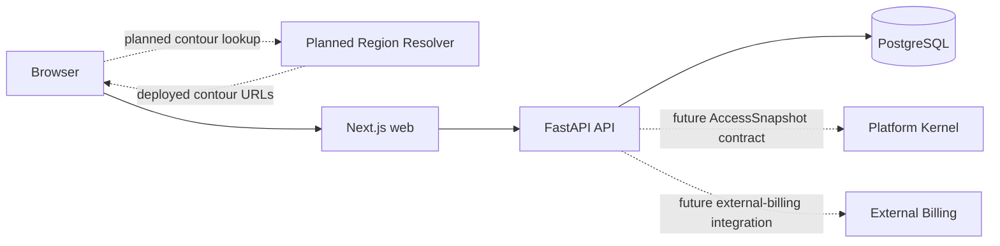

# Payment Portal Architecture

Status: authoritative current-state map
Last verified: 2026-09-24

## System boundary

This repository currently owns the `ru` contour's identity, authenticated
sessions, password recovery, legal-document/version/acceptance records, the
Payment Portal UI, and a provider-neutral external-billing persistence
baseline. It does not own workflow execution, artifacts, usage consumption, or
quota enforcement; those belong to the separate Platform Kernel repository.

Each production deployment serves exactly one contour. Region Resolver is a
separate planned service for contour selection; it is not implemented here.
See [contours](docs/architecture/contours.md) and the
[Region Resolver contract](docs/architecture/region-resolver-contract.md).


```mermaid
flowchart LR
  Browser -. "planned contour lookup" .-> Resolver["Planned Region Resolver"]
  Resolver -. "deployed contour URLs" .-> Browser
  Browser --> Web["Next.js web"]
  Web --> API["FastAPI API"]
  API --> DB[("PostgreSQL")]
  API -. "future AccessSnapshot contract" .-> Kernel["Platform Kernel"]
  API -. "future external-billing integration" .-> Billing["External Billing"]
```

## Billing architecture status

The direct-provider architecture has been physically removed. There is no
CloudPayments runtime, `PaymentProviderAdapter`, `PaymentProviderRegistry`,
provider-account routing model, direct-payment webhook path, or Portal-owned
catalog/order/payment/subscription/entitlement lifecycle. Checkout is
deliberately unavailable and the current web catalog is presentational.

The clean first-install schema contains ten retained identity/session/legal
tables and fifteen provider-neutral target persistence tables. Those fifteen
tables are empty after bootstrap and no current application behavior populates
them. They establish physical storage only; provider integration, purchase
orchestration, workers, paid-access derivation, invalidation delivery, and
Platform Kernel transport remain later work.

The canonical target is defined, in precedence order, by
[ADR 0005](docs/architecture/decisions/0005-external-billing-boundary.md), the
accepted [External Billing Boundary Design](docs/superpowers/specs/2026-09-15-external-billing-boundary-design.md),
and the accepted
[Portal <-> Kernel Access Contract Design](docs/superpowers/specs/2026-09-15-portal-kernel-access-contract-design.md).
External Billing owns commercial billing truth and lifecycle. Payment Portal
owns AnyToolAI identity and legal acceptance, the external-billing
anti-corruption/projection/reconciliation/recovery boundary, and
provider-neutral paid-access projection and delivery. Platform Kernel owns
technical product and metric vocabulary, durable actual usage, and quota
enforcement.

External Billing is not a direct payment provider and must never be modeled as
or registered through an adapter registry. The removed architecture is
described only as history in
[Payment Provider Boundary History](docs/architecture/payment-providers.md).

Provider-independent cleanup and persistence may precede Phase 0.
Provider-dependent LBX semantics, Widget behavior, paid-access derivation, and
launch remain gated by Phase 0 and their owning `ANY-504` steps.

## Current domains and API

- **Identity** — contour-local users, hashed sessions, registration, login,
  logout, and password reset.
- **Legal** — legal entities, versioned documents, required-document discovery,
  and append-only acceptance evidence.
- **Billing persistence** — the approved projections, immutable commercial
  mapping/purchase evidence, reconciliation/operation records, paid-access
  state, and invalidation outbox. There is no billing runtime yet.
- **Presentation** — the `ru` landing, product snapshot, auth/account shells,
  unavailable checkout/payment-result surfaces, and legal pages.

Current API composition exposes authentication, password reset, legal, health,
and metrics routes. Removed catalog, checkout-intent, payment-status, account
subscription, provider callback, and lifecycle-command contracts are not
compatibility surfaces.

The target logical dependency direction is:

```text
Presentation -> Application -> Domain

Application -> required persistence and integration capabilities
Persistence / Integrations -> implementations of those capabilities
Composition -> concrete wiring
```

For active FastAPI domain endpoints:

```text
FastAPI Presentation
    -> transport-neutral Application/service use case
    -> Domain + focused query/persistence capabilities
```

Presentation owns transport parsing/validation, dependency composition,
response DTOs, and HTTP error mapping. Application owns use-case and
transaction orchestration. Domain owns transport- and vendor-independent
rules. Persistence and future Integrations implement outer capabilities.

## Persistence boundary

`app.models` is the canonical ORM contract. SQLAlchemy models and closed
persisted vocabularies are exported explicitly from that package; there is no
parallel pure-domain entity graph. The authoritative current inventory is the
[as-built data model](docs/architecture/payment-portal-data-model.md).

`app.infrastructure.queries` owns focused SQLAlchemy read mechanics such as
query construction, filtering, ordering, loading, and requested row locks.
`app.infrastructure.persistence` owns focused write/storage mechanics whose
complexity justifies a separate capability, including atomic DML,
PostgreSQL-specific behavior, constraint interpretation, and targeted nested
savepoints.

Application orchestration owns the outer business transaction and decides when
to commit or roll it back. Query/persistence helpers may query, lock, mutate,
flush, interpret storage exceptions, and use a targeted nested savepoint; they
must not begin, commit, or roll back the outer transaction. SQLAlchemy
`Session` autobegin does not transfer logical ownership.

### Target billing storage boundary

The external-billing tables are provider-neutral persistence, not executable
commercial behavior:

- projection rows hold complete last-known-good capability/catalog documents;
- immutable mapping revisions and purchase snapshots preserve accepted
  commercial/legal provenance;
- external create operations preserve uncertain outcomes for safe recovery;
- webhook delivery rows preserve bounded/redacted evidence, not authority;
- work items are scheduling state, not business truth;
- normalized subscription/observation/allowance rows support later
  reconciliation;
- paid-access state and the invalidation outbox support later provider-neutral
  access delivery.

`external_billing_account_id` is an opaque configuration scope. No
`external_billing_accounts` entity or table exists. Platform Kernel product
and metric identifiers and External Billing object identifiers remain opaque
at this boundary.

Browser returns, Widget callbacks, webhook receipt, outbound command success,
payment state, or manual operator input alone never grant paid access.

### FastAPI dependency lifetimes

- `get_db()` creates and closes the request SQLAlchemy `Session`; it owns
  resource lifetime, not a request-wide transaction.
- `app.http_dependencies.get_current_session()` resolves authenticated
  user/session context and retains its separate `last_seen_at` bookkeeping
  transaction.
- Stateless Application/service functions are called directly; they are not
  wrapped in `Depends()` solely for substitution.

### Current transaction map

| Operation | Current owner and boundary |
| --- | --- |
| Registration | `register_user()` atomically commits the user, one legal-acceptance event, all required document-acceptance rows, and initial auth session. |
| Login | `login_user()` owns login bookkeeping and new-session commit. |
| Authenticated bookkeeping | `authenticate_session()` commits `last_seen_at` before endpoint execution as a separate transaction. |
| Logout | Auth bookkeeping commits first; `logout_session()` then deletes the session in a separate commit. |
| Legal acceptance | `accept_legal_document()` owns the acceptance commit and refresh. |
| Password-reset request | `prepare_password_reset()` intentionally commits cleanup, IP/account rate limits, and token creation as separate durable phases. |
| Password-reset confirmation | `confirm_password_reset()` atomically commits token claim, password change, outstanding-token invalidation, and active-session revocation. |
| Target billing tables | No current runtime transaction populates them. Their behavior belongs to later `ANY-504` steps. |

## Enforced architecture guards

Repository AST/static checks currently enforce:

- core/domain-to-integration and router dependency direction;
- active FastAPI Presentation and HTTP-composition persistence boundaries;
- focused persistence helpers cannot own outer commit/rollback;
- transport-neutral domain service/application trees;
- Sentry SDK access only through the infrastructure adapter;
- canonical ORM and persisted-enum ownership;
- no executable CloudPayments or direct-provider adapter/registry runtime;
- no legacy Portal Product/Plan/Order/Payment/Subscription/Entitlement/trial
  ORM/table graph;
- no `external_billing_accounts` table or foreign-key target.

The guards reject reintroduction without requiring deleted source files to
exist as evidence.

## Runtime execution model

Payment Portal remains sync-first. Domain, Application, Persistence, and
synchronous SQLAlchemy code use ordinary synchronous functions. Async is
limited to unavoidable FastAPI/ASGI framework boundaries or genuinely
awaitable outer I/O.

Blocking database/application work uses synchronous FastAPI endpoints so the
framework owns worker dispatch. An async framework boundary that must run a
blocking operation delegates a complete resource-owning synchronous unit; it
does not move a request-created SQLAlchemy `Session` across a manual thread
bridge. The delegated unit creates, owns, and closes its complete synchronous
resources inside the worker. Cancellation of the async waiter does not mean
the synchronous worker was forcibly stopped, so cancellation must not trigger
unsafe resource reuse or overlapping duplicate work. Request ID,
trace/span, and structured-log context remain correlated across the framework
worker boundary.

Password-reset email delivery remains the existing synchronous framework
background task. The clean baseline does not introduce a billing worker
runtime merely because durable work tables exist.

The web dependency direction is:

```text
shared contracts and UI -> features -> app routes
```

Shared modules do not import features/routes. Routes and cross-feature code use
public feature entrypoints; feature-internal code uses relative imports.

## Error ownership and observability

Domain/Application errors carry stable internal meaning. Presentation owns HTTP
status and public error DTO mapping. Unexpected failures return only the
generic structured response
`{"detail":{"code":"internal_server_error"}}`; exception messages, payloads,
headers, secrets, card/token/payment fields, and raw tracebacks are never
serialized.

The outer failure boundary for an operation owns application error reporting:
the HTTP failure boundary for propagated request failures, or the bounded
boundary that intentionally catches and absorbs a background failure. Failures
that continue propagating are not also reported by lower layers. Domain and
Application logic remain independent of direct Sentry SDK reporting, and all
`sentry_sdk` access stays behind the application-owned
`app.infrastructure.sentry` adapter. Each reportable failure has one reporting
owner so application logging/reporting and Sentry capture are not duplicated.

Sentry is an optional application-error destination. OpenTelemetry,
Prometheus-compatible metrics, structured logs, and persisted records keep
their separate roles. Diagnostics aid correlation but never become commercial,
idempotency, reconciliation, or access authority.

## Authoritative details

- [ADR 0005](docs/architecture/decisions/0005-external-billing-boundary.md)
- [External Billing Boundary Design](docs/superpowers/specs/2026-09-15-external-billing-boundary-design.md)
- [Portal <-> Kernel Access Contract Design](docs/superpowers/specs/2026-09-15-portal-kernel-access-contract-design.md)
- [Current as-built data model](docs/architecture/payment-portal-data-model.md)
- [Deployment and reset contract](docs/architecture/deployment.md)
- [Implemented `ru` journey](docs/product/ru-mvp.md)
- [Reliability requirements](docs/RELIABILITY.md)
- [Security requirements](docs/SECURITY.md)
- [Superseded billing authority](docs/architecture/billing-authority.md) —
  historical/superseded only; neither current-state nor target authority
