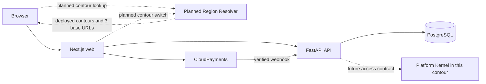

# Payment Portal Architecture

Status: authoritative current-state map
Last verified: 2026-09-04

## System boundary

This repository owns identity, legal-document and acceptance records, catalog
semantics, entitlement rules, local entitlements, and the payment portal UI for
**one contour per production instance**. In the current direct-provider flow it
also orchestrates checkout, orders, payments, subscriptions, and provider
webhooks. It does not own workflow execution, scenario runtime, artifacts, or
usage consumption. Those belong to the separate Platform Kernel repository.

The implemented instance is the `ru` contour. Target contours are `ru`, `eu`,
and `us`. See [contours](docs/architecture/contours.md).

Region Resolver is a separate UI-less service planned for contour selection.
When implemented, frontends will ask it for deployed contours and base URLs,
then talk to this portal and Platform Kernel directly. See
[Region Resolver contract](docs/architecture/region-resolver-contract.md).


```mermaid
flowchart LR
  Browser -. "planned contour lookup" .-> Resolver["Planned Region Resolver"]
  Resolver -. "deployed contours and 3 base URLs" .-> Browser
  Browser --> Web["Next.js web"]
  Web --> API["FastAPI API"]
  API --> DB[("PostgreSQL")]
  Web --> Provider["CloudPayments"]
  Provider -->|"verified webhook"| API
  API -. "future access contract" .-> PK["Platform Kernel in this contour"]
  Web -. "planned contour switch" .-> Resolver
```

This diagram shows **CURRENT IMPLEMENTATION CODE**, not a production billing
deployment. Payment Portal is still under development and has no production
CloudPayments subscribers or subscriptions. The implemented `ru` code contains
a Portal-managed direct CloudPayments flow. Under ANY-407, that capability
remains **TRANSITIONAL** until separately approved architecture and refactoring
work determines whether it is still needed; its presence does not commit the
product to using CloudPayments in production.

The expected launch model is an external-billing-managed flow, in which the
external system owns its external customer, invoice, payment, and subscription
lifecycle and the Portal stores normalized local projections. The architecture
also continues to support the transitional Portal-managed flow. In either
model, each subscription and its billing lifecycle has exactly one billing
owner. No CloudPayments-to-external-billing migration or coexistence mechanism
is required or defined while there are no production subscriptions to migrate.
See
[Billing Authority and Consistency](docs/architecture/billing-authority.md).

## Current domains

- **Identity** — contour-local users and hashed authentication sessions.
- **Legal** — legal entities, document versions, and append-only acceptances.
- **Billing** — entrypoints, checkout sessions, orders, items, payments,
  refunds, webhook inbox, subscriptions, entitlements, and subscription audit.
- **Portal-managed payment provider boundary** — direct-provider checkout
  actions selected through `payment_provider_accounts`; webhook normalization
  remains provider-adapter-specific. This boundary does not represent an
  external billing system.
- **CloudPayments integration** — the adapter registered in the current `ru`
  implementation: request validation, redaction, idempotency keys, response
  formatting, and translation into billing operations.

The target logical API dependency direction is:

```text
Presentation -> Application -> Domain

Application -> required persistence and integration capabilities
Persistence / Integrations -> implementations of those capabilities
Composition -> concrete wiring
```

Application owns use-case and transaction orchestration while Domain owns
transport- and vendor-independent rules. Persistence and Integrations implement
the outer capabilities required by Application, and Composition binds their
concrete implementations. This is the target logical model, not a claim that
the current physical package tree fully conforms. Current exceptions and the
transitional package mapping are recorded in
[Billing Authority and Consistency](docs/architecture/billing-authority.md).
Repositories remain selective boundaries for real persistence complexity, not
a requirement for every model.

For the current Portal-managed direct-provider flow, provider adapters are
registered at the API composition root by provider code. Provider-neutral
modules do not import provider integrations or branch on provider-specific
literals; they select enabled provider accounts and use the registered adapter
contract. An external billing system is a separate authority boundary and is
not registered in `PaymentProviderRegistry`. Core configuration, database,
logging, telemetry, and security helpers are shared infrastructure.

These directions are mechanically enforced with Python AST analysis. Routers
share authentication through session or service modules rather than importing
one another. `app.models` is the canonical persisted model layer: SQLAlchemy
models and closed persisted vocabularies are imported from its explicit public
exports, while model modules import canonical enums directly from
`app.models.enums`. Provider contract enums and open/provider/configuration
identifiers remain owned by their boundaries and are not persisted model enums.

The web dependency direction is:

```text
shared contracts and UI -> features -> app routes
```

Shared modules do not import features or app routes. App routes and
cross-feature dependencies import public feature entrypoints; code within one
feature uses relative imports for its internal modules. ESLint enforces these
directions and rejects deep alias imports.

## Authoritative details

- [Contours](docs/architecture/contours.md)
- [Region Resolver contract](docs/architecture/region-resolver-contract.md)
- [Payment providers](docs/architecture/payment-providers.md)
- [Billing Authority and Consistency](docs/architecture/billing-authority.md)
- [Data model](docs/architecture/payment-portal-data-model.md)
- [Deployment](docs/architecture/deployment.md)
- [Platform Kernel contract boundary](docs/architecture/platform-kernel-contract.md)
- [Implemented `ru` journey](docs/product/ru-mvp.md)
- [Security](docs/SECURITY.md)
- [Reliability](docs/RELIABILITY.md)
