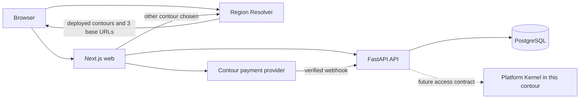

# Payment Portal Architecture

Status: authoritative current-state map
Last verified: 2026-08-18

## System boundary

This repository owns identity, legal-document and acceptance records,
checkout/order/payment records, provider webhooks, and the payment portal UI
for **one contour per production instance**. It does not own workflow execution,
scenario runtime, artifacts, or usage consumption. Those belong to the separate
Platform Kernel repository.

The implemented instance is the `ru` contour. Target contours are `ru`, `eu`,
and `us`. See [contours](docs/architecture/contours.md).

Region Resolver is a separate UI-less service. Frontends ask it for deployed
contours and base URLs, then talk to this portal and Platform Kernel directly.
See [Region Resolver contract](docs/architecture/region-resolver-contract.md).


```mermaid
flowchart LR
  Browser --> Resolver["Region Resolver"]
  Resolver -->|"deployed contours and 3 base URLs"| Browser
  Browser --> Web["Next.js web"]
  Web --> API["FastAPI API"]
  API --> DB[("PostgreSQL")]
  Web --> Provider["Contour payment provider"]
  Provider -->|"verified webhook"| API
  API -. "future access contract" .-> PK["Platform Kernel in this contour"]
  Web -->|"other contour chosen"| Resolver
```

## Current domains

- **Identity** — contour-local users and hashed authentication sessions.
- **Legal** — legal entities, document versions, and append-only acceptances.
- **Billing** — entrypoints, checkout sessions, orders, items, payments,
  refunds, webhook inbox, and the temporary product access state.
- **Payment provider boundary** — provider-neutral checkout actions selected
  through `payment_provider_accounts`; webhook normalization remains
  provider-adapter-specific.
- **CloudPayments integration** — the currently registered adapter for the `ru`
  contour: request validation, redaction, idempotency keys, response formatting,
  and translation into billing operations.

The API dependency direction is:

```text
contracts/models -> repositories -> services -> routers/wiring
```

This is an allowed dependency direction, not a requirement that every
operation use every layer. Services may use SQLAlchemy `Session` directly;
repositories are extracted only when they reduce duplication or isolate
persistence complexity.

Provider adapters are registered at the API composition root by provider code.
Provider-neutral modules do not import provider integrations and do not branch on
provider-specific literals; they select enabled provider accounts and use the
registered adapter contract. Core configuration, database, logging, telemetry,
and security helpers are shared infrastructure.

These directions are mechanically enforced with Python AST analysis. Routers
share authentication through session or service modules rather than importing
one another. The aggregate `app.models` module and the top-level compatibility
exports remain allowed until the model transition owned by ANY-71.

The web dependency direction is:

```text
shared contracts and UI -> features -> app routes
```

Shared modules do not import features or app routes. App routes and
cross-feature dependencies import public feature entrypoints; code within one
feature uses relative imports for its internal modules. ESLint enforces these
directions and rejects deep alias imports.

## Authoritative details

- [Contours](docs/architecture/contours.md)
- [Region Resolver contract](docs/architecture/region-resolver-contract.md)
- [Payment providers](docs/architecture/payment-providers.md)
- [Data model](docs/architecture/payment-portal-data-model.md)
- [Deployment](docs/architecture/deployment.md)
- [Platform Kernel contract boundary](docs/architecture/platform-kernel-contract.md)
- [Implemented `ru` journey](docs/product/ru-mvp.md)
- [Security](docs/SECURITY.md)
- [Reliability](docs/RELIABILITY.md)
