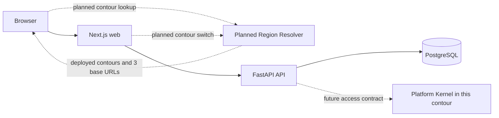

# Payment Portal Architecture

Status: authoritative current-state map
Last verified: 2026-09-16

## System boundary

This repository owns identity, legal-document and acceptance records, catalog
semantics, entitlement rules, local entitlements, and the payment portal UI for
**one contour per production instance**. It owns checkout and local billing
records, while normal runtime has no active direct payment provider. Retained
provider/webhook source is not part of normal application composition. It does
not own workflow execution, scenario runtime, artifacts, or usage consumption.
Those belong to the separate Platform Kernel repository.

The implemented instance is the `ru` contour. Target contours are `ru`, `eu`,
and `us`. See [contours](docs/architecture/contours.md).

Region Resolver is a separate UI-less service planned for contour selection.
When implemented, frontends will ask it for deployed contours and base URLs,
then talk to this portal and Platform Kernel directly. See
[Region Resolver contract](docs/architecture/region-resolver-contract.md).


```mermaid
flowchart LR
  Browser -. "planned contour lookup" .-> Resolver["Planned Region Resolver"]
  Resolver -. "deployed contours and 3 base URLs" .-> Browser
  Browser --> Web["Next.js web"]
  Web --> API["FastAPI API"]
  API --> DB[("PostgreSQL")]
  API -. "future access contract" .-> PK["Platform Kernel in this contour"]
  Web -. "planned contour switch" .-> Resolver
```

This diagram shows **CURRENT IMPLEMENTATION CODE**, not a production billing
deployment. Payment Portal is still under development and has no production
CloudPayments subscribers or subscriptions. The retained `ru` code contains
transitional direct-provider source and persistence, but normal backend and
frontend runtime does not initialize, register, load, or invoke CloudPayments.
Checkout is deliberately unavailable until a separately selected and
implemented billing integration exists.

The sole long-term production target is the external-billing-managed flow, in
which the external system owns its external customer, invoice, payment, and
subscription lifecycle and the Portal stores normalized local projections. The
retained Portal-managed source remains documented only for later cleanup. A
`Subscription` that participates in a billing
lifecycle has exactly one billing owner at a time. A Portal-only access
lifecycle, such as a locally granted free trial without an external billing
lifecycle, remains Portal-owned and does not require an external billing owner.
No CloudPayments-to-external-billing migration or coexistence mechanism is
required or defined while there are no production subscriptions to migrate. See
[Billing Authority and Consistency](docs/architecture/billing-authority.md).

## Current domains

- **Identity** — contour-local users and hashed authentication sessions.
- **Legal** — legal entities, document versions, and append-only acceptances.
- **Billing** — entrypoints, checkout sessions, orders, items, payments,
  refunds, webhook inbox, subscriptions, entitlements, and subscription audit.
- **Portal-managed payment provider boundary** — the retained direct-provider
  contract for a separately enabled integration; normal runtime has no
  registered provider and generic checkout fails closed. This boundary does
  not represent an external billing system.
- **CloudPayments integration** — retained source for request validation,
  redaction, idempotency keys, response formatting, and translation into
  billing operations; it is not registered or mounted in normal runtime.

The target logical API dependency direction is:

```text
Presentation -> Application -> Domain

Application -> required persistence and integration capabilities
Persistence / Integrations -> implementations of those capabilities
Composition -> concrete wiring
```

For active FastAPI domain endpoints, the implemented request path is:

```text
FastAPI Presentation
    -> transport-neutral Application/service use case
    -> Domain + focused query/persistence capabilities
```

Presentation owns transport parsing and validation, dependency composition,
response DTOs, and HTTP error mapping. Active domain modules that own an
`APIRouter` do not import `app.infrastructure.queries` or
`app.infrastructure.persistence` and do not issue SQLAlchemy `Session` query
or persistence operations directly. `app.http_dependencies` is the explicit
HTTP composition boundary and follows the same restriction. Retained provider
integration routers and operational health/metrics endpoints are outside this
active-domain rule because they have different boundary responsibilities.

Application owns use-case and transaction orchestration while Domain owns
transport- and vendor-independent rules. Persistence and Integrations implement
the outer capabilities required by Application, and Composition binds their
concrete implementations. This is the target logical model, not a claim that
the current physical package tree fully conforms. Current exceptions and the
transitional package mapping are recorded in
[Billing Authority and Consistency](docs/architecture/billing-authority.md).
The selective persistence rules are defined below; they do not require a
repository for every model.

## Persistence boundary

`app.models` is the canonical persisted ORM model contract. Persistence code
and its consumers use those SQLAlchemy models and closed persisted
vocabularies directly; this architecture does not introduce a parallel set of
pure-domain entities.

`app.infrastructure.queries` is the concern-oriented boundary for SQLAlchemy
read mechanics, including query construction, filtering, joins, ordering,
loading strategy, and requested row locking. Focused functions or query
objects are the default when sufficient. Repository classes are not required
per entity or table.

`app.infrastructure.persistence` is reserved for focused write or storage
mechanics whose complexity justifies a separate capability: raw SQL, bulk
DML, PostgreSQL-specific atomic operations, physical database constraint
interpretation, or storage-specific savepoint behavior required by an active
use case. Application owns business decisions and canonical ORM entity state
transitions. A SQLAlchemy `Session` may still pass through Application or
session orchestration at this architecture stage. Simple `db.add(entity)`,
`db.delete(entity)`, canonical ORM mutation, or equivalent enlistment does not
require an artificial repository wrapper.

Application orchestration owns each outer business transaction and decides when
to commit or roll it back. Focused query and persistence helpers may construct
queries, lock rows, perform atomic DML, flush, interpret storage exceptions, and
use a targeted nested savepoint. They do not start, commit, or roll back the
outer business transaction. SQLAlchemy `Session` autobegin is a session/database
mechanism and does not transfer logical transaction ownership to the first
helper that happens to issue SQL. The repository architecture checker protects
this boundary in `app.infrastructure.queries` and
`app.infrastructure.persistence`.

Current physical placement remains transitional even though active FastAPI
domain routes now delegate their use-case orchestration inward. Application
functions may remain in existing domain `service.py`, `services/`, or
`application/` modules; this does not require a repository per model or a
service container. Retained integration routes and CLI entrypoints keep their
documented boundary-specific responsibilities. Later physical package moves
must not change the transaction contract.

### Commercial transition boundary

Application owns the canonical `Order`/`Payment`/`Refund` commercial state
machine. Integration authenticates and validates provider input, correlates a
candidate local Order, and maps the verified fact into a typed provider-neutral
command. It does not import or mutate canonical `Payment`, `Refund`,
`PaymentStatus`, or `RefundStatus` state. Application reloads and locks the
Order first, revalidates provider/account/tenant/region and financial
correlation, and then applies the Payment or Refund projection.

Commercial transition functions participate in the caller-owned transaction:
they may lock, mutate, and flush, but never commit or roll back the outer
transaction. Their results distinguish `APPLIED`, commercial `DUPLICATE`,
stale `IGNORED`, and contradictory `CONFLICT` facts. Database uniqueness is
the final external Payment/Refund identity invariant; focused persistence may
use a targeted savepoint for the candidate identity insert and recover only
the named identity uniqueness race.

The retained webhook inbox is a compatibility boundary with two transactions.
The redacted receipt is committed first. Normalized processing then invokes the
Application commercial transition and, only for a newly applicable result,
hands the result to the existing subscription/entitlement lifecycle (Step 9)
in the same second transaction. A downstream failure rolls back the commercial
projection and lifecycle effects while preserving the durable inbox receipt.
Future reconciliation must feed the same Application transition path rather
than introduce another state machine. Retained CloudPayments remains absent
from normal runtime composition.

### Subscription and entitlement transition boundary

`app.domains.billing.service` is the public Application facade for local
Subscription and Entitlement mutations. Presentation, Integration, CLI, and job
entrypoints construct an operation-specific lifecycle command and invoke that
facade; they do not import lifecycle implementation modules, query subscription
persistence to make mutation-policy decisions, or maintain another access state
machine. Read-side account and access queries remain separate and valid.

The Step-8 commercial transition remains authoritative for canonical Order,
Payment, Refund, and confirmed commercial outcome state. Only a newly
applicable paid or refund outcome is handed to the Step-9 lifecycle boundary.
Step 9 validates the persisted commercial context and owns the resulting local
Subscription projection, Entitlement consequence, audit event, or legitimate
no-op. In particular, Integration does not decide whether a confirmed Refund
affects access. Local Entitlement state and validity are the Payment Portal
source of truth for product access; neither Subscription status nor provider or
vendor state is a second read-time access authority.

Lifecycle operation keys identify persisted operations. For normalized
authoritative subscription-state input, exact replay must match the
subscription, transition kind, normalized target, and authoritative occurrence
time; reuse with different semantic input fails closed. That input requires an
explicit timezone-aware authoritative `occurred_at`. Ordering compares only
new ordering-aware authoritative-state events: an older fact is recorded as a
stale no-op, equal-time same-target input is a safe no-op, equal-time
conflicting target fails closed, and a newer fact still passes through the
canonical transition graph. Legacy events whose timestamps may be processing
time are not silently promoted into ordering facts. Unknown or
non-normalizable authoritative state is rejected before mutation. These
freshness rules do not apply generically to trials, payments, refunds,
cancellation requests, or expiry commands.

The outer caller owns commit and rollback. Lifecycle and focused query or
persistence helpers may load, lock, mutate, and flush, but do not finalize the
outer transaction. The retained webhook keeps its two durable phases: the
redacted inbox receipt commits first, then the Step-8 commercial transition and
Step-9 consequence share the second transaction. A lifecycle failure rolls
back both transition groups while preserving the receipt. Trial and manual
access lifecycles remain valid without a provider subscription identity.

Retained CloudPayments/direct-provider code is deactivated compatibility
source, not the target billing architecture. ANY-497 owns future external
billing command flows. Future reconciliation must feed the same Application
transition boundaries and remains outside this implementation.

### FastAPI dependency lifetimes

Request-scoped resources and context are composed explicitly:

- `get_db()` creates and closes the SQLAlchemy `Session`; it owns Session
  lifetime, not a request-wide business transaction;
- `app.http_dependencies.get_current_session()` resolves authenticated
  user/session context from that request Session. Its established
  `last_seen_at` commit is a separate bookkeeping transaction.

`PaymentProviderRegistry` is app-scoped. `create_app()` creates it once on
application state, and `app.http_dependencies.get_payment_provider_registry()`
exposes that instance to routes without moving request-state access into the
provider-neutral registry.

Stateless Application/service functions are ordinary code called directly by
Presentation. They are not wrapped in `Depends()` merely for test substitution;
tests call them directly or override their actual resource/context dependencies.

### Current transaction map

| Operation | Current transaction owner and boundary |
| --- | --- |
| User registration | `app.domains.identity.services.auth.register_user()` commits `User` and its initial `AuthSession` atomically. A pre-commit failure leaves neither durable. |
| Login | `app.domains.identity.services.auth.login_user()` owns the existing single local commit for login bookkeeping and the new `AuthSession`. |
| Authenticated-request bookkeeping | `app.http_dependencies.get_current_session()` delegates authentication to `app.domains.identity.services.auth.authenticate_session()`, which commits `last_seen_at` before endpoint execution. This is a separate bookkeeping transaction. |
| Logout | Authentication bookkeeping commits first through the current-session dependency; `app.domains.identity.services.auth.logout_session()` then deletes the session in a separate commit. The whole request is not one transaction. |
| Legal acceptance | `app.domains.legal.service.accept_legal_document()` owns the acceptance commit and refresh. Any preceding authenticated-request bookkeeping remains a separate transaction. |
| Password-reset request | `app.domains.identity.services.password_reset.prepare_password_reset()` deliberately commits cleanup, IP rate-limit accounting, account rate-limit accounting, and reset-token creation as separate durable phases so a later failure does not erase already-consumed protection. |
| Password-reset confirmation | `app.domains.identity.services.password_reset.confirm_password_reset()` atomically commits token claim, password replacement, outstanding-token invalidation, and active-session revocation. |
| Commercial Payment/Refund transition (Step 8) | Application locks the Order first, applies the canonical commercial projection, and participates in the caller-owned transaction without finalizing it. |
| Subscription/entitlement lifecycle (Step 9) | Lifecycle functions consume newly applicable commercial results in the same caller-owned transaction and never finalize the outer transaction themselves. |
| Scheduled subscription expiry | The CLI owns one explicit transaction. It validates persisted identities before transaction exit and emits committed/success diagnostics only after commit. |
| Provider-account uniqueness recovery | The current checkout helper uses a nested savepoint to recover a concurrent unique insert; this is not a business commit. |
| Checkout | `app.domains.identity.services.checkout.create_checkout()` owns provider-configuration rollback and the final local commit. Checkout state and `prepare_checkout_action()` are local work before that commit; preparation performs no network command and is not evidence that future external-command ordering is already implemented. |
| Retained CloudPayments webhook source | The redacted inbox receipt commits first; normalized commercial processing and any Step-9 handoff share a second transaction. Delivery idempotency remains distinct from commercial replay. The source is not mounted in normal runtime. |

Retained CloudPayments and direct-provider persistence is transitional legacy
expected to be physically decommissioned later. It is not the architectural
template for future external billing, and new generic persistence boundaries
must remain independent of it so they do not make that removal harder. When an
active generic consumer and retained provider code share a helper, the helper
remains provider-neutral; CloudPayments-only semantics are not promoted into
the generic boundary merely to preserve legacy code.

When a direct-provider integration is explicitly enabled, provider adapters are
registered at the API composition root by provider code. In the current normal
runtime the registry is empty, so generic checkout fails closed and the
frontend checkout is unavailable. Provider-neutral modules do not import
provider integrations or branch on provider-specific literals. An external
billing system is a separate authority boundary and is not registered in
`PaymentProviderRegistry`. Core configuration, database, logging, telemetry,
and security helpers are shared infrastructure.

Python AST analysis currently enforces selected dependency constraints in the
transitional package tree, including core/domain-to-integration restrictions,
persistence-to-outward-layer restrictions, router import boundaries,
provider-neutrality, transport-neutral domain service/application trees, and
the active FastAPI domain Presentation persistence boundary. Active domain
Presentation is detected from actual `APIRouter` ownership rather than a router
filename list; `app.http_dependencies` and the app-scoped provider registry have
their explicit composition rules. The checker does not
mechanically enforce the complete target logical layering above;
Presentation/Application/Domain/Persistence/Integration is not yet fully
represented by the physical packages. Routers share authentication through
session or service modules rather than importing one another. `app.models` is
the canonical persisted model layer: SQLAlchemy models and closed persisted
vocabularies are imported from its explicit public exports, while model modules
import canonical enums directly from `app.models.enums`. Provider contract
enums and open/provider/configuration identifiers remain owned by their
boundaries and are not persisted model enums.

## Runtime execution model

ANY-454 is not an async migration. Payment Portal remains sync-first. Domain,
Application, Persistence, synchronous SQLAlchemy, and current synchronous
integrations use ordinary synchronous functions. Async is limited to
unavoidable FastAPI/ASGI framework boundaries or concrete genuinely awaitable
outer I/O.

Current blocking database and application flows use normal synchronous
FastAPI `def` endpoints so the framework owns worker dispatch. Blocking
SQLAlchemy operations, synchronous HTTP clients, sleeps, and similar work must
not execute directly on an event-loop path. If an async framework boundary
must invoke blocking work, it passes a complete resource-owning synchronous
unit through the framework worker mechanism. It must not create a
request-scoped resource such as a SQLAlchemy `Session` and then move that
resource through a manually introduced thread bridge. Execution modality does
not justify duplicate sync/async application services or generic sync/async
adapters.

Async request and error middleware, FastAPI lifespan coordination, and the
shared exact-body dependency are valid framework boundaries. Retained provider
source, the password-reset background callback, scheduled expiry CLI,
provider-neutral business operations, and Application, Domain, and
Persistence code remain synchronous. The `traced()` helper supports both sync
and async callables because it is boundary-neutral observability infrastructure,
not because application code should become async.

Exact raw request bytes are a Presentation/HTTP concern. A route with a concrete
exact-bytes requirement, such as webhook signature verification, uses the
shared `get_raw_request_body()` dependency. Integration routers do not create
their own `await request.body()` readers when that dependency satisfies the
requirement. The dependency only awaits the ASGI body and returns its bytes; it
does not parse payloads, verify signatures, apply provider logic, access
persistence, define logging policy, or call Application or Domain code.
Ordinary JSON APIs continue to use FastAPI/Pydantic request models. The shared
dependency is not a general async application abstraction.

CloudPayments source and its legacy lifecycle cleanup remain retained
transitional code, not active provider lifecycle architecture. A future
integration chooses sync or async according to its actual outer I/O client and
keeps that modality at the integration boundary rather than propagating it
into Application, Domain, or Persistence.

The web dependency direction is:

```text
shared contracts and UI -> features -> app routes
```

Shared modules do not import features or app routes. App routes and
cross-feature dependencies import public feature entrypoints; code within one
feature uses relative imports for its internal modules. ESLint enforces these
directions and rejects deep alias imports.

## Error ownership and HTTP failure boundary

Core owns only neutral shared error primitives, including `AppError`. It does
not own feature-specific error vocabularies. Application and Domain own
business and use-case failure meaning. Their exceptions may use concrete
semantic types and may carry stable internal codes and safe diagnostics where
justified, but do not depend on FastAPI, HTTP status codes, or vendor response
semantics. `AppError.code` is optional: it remains available for justified
stable internal codes, especially existing integration/provider errors, while
semantic no-code exceptions use their type as their internal identity.

The reviewed checkout/password-reset slice uses concrete semantic exception
types rather than a generic exception plus a string code. This is not a rule
to create a class for every API code throughout the repository, and it does
not introduce a global error-code registry.

Integrations and the payment-provider boundary normalize vendor failures while
preserving retryability, idempotency, and unknown or ambiguous-outcome
semantics. Raw vendor responses and status vocabularies are not
Application/Domain error contracts.

Presentation owns HTTP status mapping and public error DTO/body shape. Only
explicitly allowlisted safe fields are serialized, and changed public errors
use structured `detail.code`. The frontend branches on `ApiError.status` and
structured `detail.code`; it does not parse serialized exception text.

Unexpected application failures are converted by the Presentation HTTP
middleware to a generic structured 500 response. The boundary emits one
bounded application-level diagnostic while request-ID context is active. The
diagnostic may include the request ID supplied by the logging context, method,
matched route template, exception type, and one application-owned
failure-location fingerprint containing only a repository-relative module/file
identifier, function name, and line number. It never includes source text,
locals, arguments, exception messages, raw traceback text, request inputs,
provider payloads, secrets, or payment data.

Reportable failures follow the same ownership direction:

```text
Domain/Application
    -> semantic errors

outer Presentation/process boundary
    -> structured diagnostic
    -> explicit Sentry report according to policy
```

The centralized HTTP failure boundary is the default owner of HTTP failure
reporting. When an existing outer boundary catches a reportable exception and
converts or absorbs it before that centralized boundary can observe it, the
catching boundary owns exactly one explicit report before conversion or
absorption. This applies to retained CloudPayments webhook conversion source
and the password-reset email background callback; the retained webhook source
is not mounted in normal runtime. It does not change the dependency direction
or permit Sentry reporting from Domain/Application business logic.

The outer boundary owns at most one explicit report while preserving the
application log as an independent diagnostic signal. Mapped expected business
errors are not Sentry issues. Errors carry semantic meaning rather than Sentry
flags, and Domain/Application remain independent from Sentry. Direct
`sentry_sdk` imports are restricted to `app/infrastructure/sentry.py`; boundary
callers and composition roots use that application-owned adapter. Sentry is the
backend application-failure investigation entry point, not a replacement for
OpenTelemetry traces, bounded JSON logs, Prometheus/OpenTelemetry metrics, or
persisted business state.

## Authoritative details

- [Contours](docs/architecture/contours.md)
- [Region Resolver contract](docs/architecture/region-resolver-contract.md)
- [Payment providers](docs/architecture/payment-providers.md)
- [Billing Authority and Consistency](docs/architecture/billing-authority.md)
- [Data model](docs/architecture/payment-portal-data-model.md)
- [Deployment](docs/architecture/deployment.md)
- [Platform Kernel contract boundary](docs/architecture/platform-kernel-contract.md)
- [Implemented `ru` journey](docs/product/ru-mvp.md)
- [Security](docs/SECURITY.md)
- [Reliability](docs/RELIABILITY.md)
