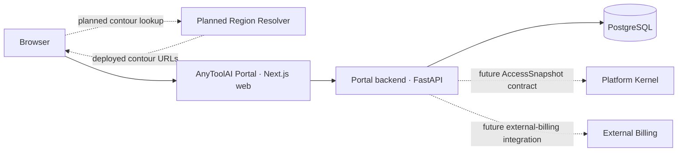

# AnyToolAI Portal Architecture

Status: authoritative current-state map
Last updated: 2026-10-06

## System boundary

This repository currently owns the `ru` contour's identity, authenticated
sessions, email verification, password recovery,
legal-document/version/acceptance records, the AnyToolAI Portal UI, and a
provider-neutral external-billing persistence baseline. It does not own
workflow execution, artifacts, usage consumption, or quota enforcement; those
belong to the separate Platform Kernel repository.

The current Portal combines public product discovery and direct account/auth
entry. It remains pre-production and provider-independent after ANY-636 4F;
External Billing/provider runtime is not implemented.

Each production deployment serves exactly one contour. Region Resolver is a
separate planned service for contour selection; it is not implemented here.
See [contours](docs/architecture/contours.md) and the
[Region Resolver contract](docs/architecture/region-resolver-contract.md).


```mermaid
flowchart LR
  Browser -. "planned contour lookup" .-> Resolver["Planned Region Resolver"]
  Resolver -. "deployed contour URLs" .-> Browser
  Browser --> Web["AnyToolAI Portal · Next.js web"]
  Web --> API["Portal backend · FastAPI"]
  API --> DB[("PostgreSQL")]
  API -. "future AccessSnapshot contract" .-> Kernel["Platform Kernel"]
  API -. "future external-billing integration" .-> Billing["External Billing"]
```

## Billing architecture status

The direct-provider architecture has been physically removed. There is no
CloudPayments runtime, `PaymentProviderAdapter`, `PaymentProviderRegistry`,
provider-account routing model, direct-payment webhook path, or Portal-owned
catalog/order/payment/subscription/entitlement lifecycle. Checkout is
deliberately unavailable and the current web catalog is presentational.

The clean first-install schema contains ten retained identity/session/legal
tables and fifteen provider-neutral target persistence tables. Those fifteen
tables are empty after bootstrap and no current application behavior populates
them. They establish physical storage only; provider integration, purchase
orchestration, workers, paid-access derivation, invalidation delivery, and
Platform Kernel transport remain later work.

The canonical target is defined, in precedence order, by
[ADR 0005](docs/architecture/decisions/0005-external-billing-boundary.md), the
accepted [External Billing Boundary Design](docs/superpowers/specs/2026-09-15-external-billing-boundary-design.md),
and the accepted
[Portal <-> Kernel Access Contract Design](docs/superpowers/specs/2026-09-15-portal-kernel-access-contract-design.md).
External Billing owns commercial billing truth and lifecycle. The AnyToolAI
Portal owns the implemented identity and legal acceptance flows and the later
external-billing anti-corruption/projection/reconciliation/recovery boundary
and provider-neutral paid-access projection and delivery. Platform Kernel owns
technical product and metric vocabulary, durable actual usage, and quota
enforcement.

The component historically named “Payments Portal” in those accepted records
maps to the Portal backend boundary implemented here. ADR 0005 and the accepted
2026-09-15 designs remain normative records with their original names.

External Billing is not a direct payment provider and must never be modeled as
or registered through an adapter registry. The removed architecture is
described only as history in
[Payment Provider Boundary History](docs/architecture/payment-providers.md).

Provider-independent cleanup and persistence may precede Phase 0.
Provider-dependent LBX semantics, Widget behavior, paid-access derivation, and
launch remain gated by Phase 0 and their owning `ANY-504` steps.

## Current domains and API

- **Identity** — contour-local users, hashed sessions, registration, login,
  logout, authenticated email verification, and password reset.
- **Legal** — legal entities, versioned documents, required-document discovery,
  and append-only acceptance evidence.
- **Billing persistence** — the approved projections, immutable commercial
  mapping/purchase evidence, reconciliation/operation records, paid-access
  state, and invalidation outbox. There is no billing runtime yet.
- **Presentation** — locale-prefixed landing, product discovery/detail pages,
  direct account/auth entry, account cabinet, recovery, verification, and
  canonical RU legal pages. Ordinary Portal-owned UI and metadata are localized
  across the seven supported route locales; canonical legal authority remains
  Russian. Billing, paid-access, and usage/quota panels show unavailable or
  unknown states, which do not establish no subscription, no access, or zero
  usage/quota.

### As-built 4F routes

```text
/[locale]
/[locale]/products
/[locale]/products/document-summary
/[locale]/products/prompt-optimizer
/[locale]/account
/[locale]/forgot-password
/[locale]/reset-password
/[locale]/verify-email
```

Legal routes remain `/ru/privacy`, `/ru/consent-personal-data`, `/ru/offer`,
`/ru/cancellation`, `/ru/cookies`, and `/ru/security`. `/account` owns direct
sign-in/registration and the authenticated cabinet; the header sign-in modal is
retained. Product cards open local detail pages, and account CTAs enter
`/account`; no purchase or fabricated product-execution target is exposed.
`document-summary` and `prompt-optimizer` are presentation/route slugs only,
not claimed Platform Kernel `product_id` or External Billing IDs.

The transitional pre-production `/{locale}/auth-checkout` and
`/{locale}/payment-result` routes were removed without redirects or compatibility
routes because they have no production compatibility obligation. This does not
set a permanent rule for future production route changes. The durable
[RU Portal 4F handoff](docs/product/ru-mvp.md) records the data ownership and
deferred ANY-504 Steps 6–10.

## Locale runtime and public routing

`config/locales.json` is the canonical machine-readable locale contract.
`npm run generate` derives the web contract at
`apps/web/src/generated/locales.ts` and the API contract at
`apps/api/app/generated/locales.py`; generated files are not hand-edited, and
`npm run generate:check` detects drift.

The exact supported route locales are `en`, `fr`, `it`, `de`, `es`, `ru`, and
`pt`, with `ru` as the default. `routeLocale` is the short identity used in
URLs and by next-intl routing. `languageTag` is the document language, and
`intlLocale` is the formatting identity. For Portuguese, the route identity is
`pt` while both language and formatting identities are `pt-BR`. Locale does
not select or persist tenant, contour/region, identity, provider, currency,
timezone, or any other application state.

The locale returned by next-intl's `useLocale` is the `routeLocale`; formatting
code resolves the canonical `intlLocale` through the generated mapping instead
of passing that route identity blindly to `Intl`. Currency and timezone remain
independent application facts and are never inferred from locale.

`apps/web/src/messages` owns canonical ordinary Portal UI and metadata copy.
All seven catalogs must have exact key parity, valid ICU syntax, and matching
argument and rich-text tag signatures. Server Components translate server-first.
The localized root client provider remains `messages={null}` and supplies only
locale/runtime context; true Client Components receive only their required
current-locale namespace or subset from the nearest appropriate server boundary.
The full current-locale catalog and catalogs for other locales are not sent to
ordinary client boundaries.

Shared API transport remains language-neutral. It exposes status, error codes,
and other machine facts; the owning web Presentation/UI boundary maps those
facts to localized human-readable messages.

Identity email communication has bounded locale-metadata flows:

```text
explicit validated routeLocale
  → generated languageTag
  → registration, verification-resend, or password-reset Accept-Language metadata
  → API Presentation normalization to canonical RouteLocale
  → localized verification/reset URL + backend-owned email
```

The web route boundary owns the `routeLocale` to `languageTag` mapping.
Registration and authenticated verification resend send the resulting canonical
language tag for verification delivery; password-reset request does the same
for recovery delivery. Login sends no locale metadata.
Generic shared API transport may carry that already-canonical header value but
does not own locale mapping or localized presentation. API Presentation
normalizes the request metadata before invoking password-reset application
code. Malformed and unsupported candidates are ignored individually so another
supported canonical candidate can still win. If normalization leaves no valid
supported canonical language candidate, such as when the header is missing or
contains only malformed or unsupported candidates, API Presentation falls back
to the generated default `ru` route locale. The canonical locale is ephemeral
delivery metadata only and never selects or persists tenant, region, identity,
provider, currency, or timezone.

Ordinary public routes live under `apps/web/src/app/[locale]`. The localized
root layout owns the document and derives `<html lang>` from the locale
contract. `/` is the only Accept-Language negotiation entry and falls back to
`ru`; an explicit locale-prefixed URL is authoritative. Other unprefixed
application paths are not localized implicitly. next-intl routing therefore
uses `localeDetection: false`, `localeCookie: false`, and application-owned
alternate metadata.

Canonical and alternate metadata is anchored to the required server/build-side
`APP_PUBLIC_BASE_URL` origin. Normal application navigation uses the
locale-aware exports from `apps/web/src/i18n/navigation.ts`; it must not
construct a `/ru` ordinary route. Locale is not persisted in cookies,
localStorage, or user records.

Generated RU legal paths remain canonical and RU-only, without invented locale
alternates. Password-reset confirmation (`/[locale]/reset-password`) and email
verification (`/[locale]/verify-email`) do not preserve fragment tokens through
locale navigation; each token stays on its current client-only flow. Generated
legal titles, bodies, versions, paths, and registration
acceptance statements remain source-owned canonical RU content. Seller facts,
support addresses, payment-method/provider facts, and user-entered content also
stay source-owned; catalogs localize only their surrounding Portal presentation.
The ordinary-copy guard, backend `Accept-Language` propagation, and localized
reset URLs and email content are implemented as part of the completed 4B
contract.

Current API composition exposes authentication, email verification, password
reset, legal, health, and metrics routes. Removed catalog, checkout-intent,
payment-status, account
subscription, provider callback, and lifecycle-command contracts are not
compatibility surfaces.

## HTTP API contract authority

For values that cross the backend/frontend HTTP boundary, the contract
authority chain is:

```text
FastAPI/Pydantic
  → app.openapi()
  → docs/generated/openapi.json
  → apps/web/src/generated/api-contracts/
  → generated Zod runtime validation + inferred wire types
  → shared API transport
  → feature/UI adapters and view state
```

The backend owns HTTP API request/response wire contracts and the OpenAPI
schema. Repository generation owns the generated frontend runtime
contracts/types and freshness checking; run `npm run generate` to update them
and `npm run generate:check` to detect drift. The generated API contracts live
under `apps/web/src/generated/api-contracts/`. The frontend owns HTTP
transport, form state, view models, presentation state, derived UI types, and
endpoint-orchestration adapters. Frontend code must not independently
re-author backend DTO fields.

ANY-541 covers HTTP API contracts only. Shared values that do not cross HTTP
retain their own canonical source and generation path, including route locales
and locale mappings from `config/locales.json` to generated Python and
TypeScript, legal acceptance text from the legal source to its generated web
artifact, and other repository-owned shared non-HTTP constants. A status,
enum, or value in an API request or response belongs to the
Pydantic/OpenAPI-generated contract. A shared backend/frontend value that does
not cross HTTP may retain a separate authority path, while a value used only
by frontend UI or view state remains frontend-owned.

ANY-541 migrated the current identity API surface for registration, login,
session, logout, password reset, email verification, and the
`email_verified` session/user fact. Account uses the generated auth session and
logout contracts. No current legal endpoint DTO required migration because the
current legal frontend does not maintain a parallel handwritten backend API
wire DTO consumer.

Successful response JSON is runtime-validated by generated contracts before
application code trusts it. Current application errors remain intentionally
narrow: `ApiError.detail` is `unknown`, and `apiErrorCode()` extracts only the
stable machine codes used by current UI. ANY-541 does not create a universal
generated error model. When a DSN is enabled, standard uncaught web/server/
request failures go to the `payment-portal-web` Sentry project. A handled
`ApiContractError` may use the optional sanitized reporter and follows the same
application error flow regardless of Sentry state; expected `ApiError` and
business outcomes are not blanket-reported as exceptions. Backend and web use
separate Sentry projects/DSNs in the same organization and share only the
diagnostic vocabulary `service`, `failure_category`, and `operation`. Sentry
events contain no payloads, tokens, user identity, query/fragment data, or raw
validation data.

For every future Portal-owned, web-consumed API, the implementation rule is:

1. Define request/response models with backend Pydantic.
2. Expose durable named OpenAPI components.
3. Run repository generation.
4. Consume the generated schema/type in the frontend shared API boundary.
5. Runtime-validate successful JSON before trusting it.
6. Keep form, UI, and view state local instead of putting it into API DTOs.

ANY-636 4F required no new Portal HTTP API. Existing generated auth contracts
and canonical legal assets supply the facts needed by the current UI; product
discovery is frontend presentation metadata. Future Portal-owned web APIs still
follow the ANY-541 rule above.

Generated contracts do not change domain-data ownership. Future web work must
not mirror or re-author External Billing commercial catalog, pricing, or
sellability truth; paid-access authority owned by later `ANY-504` steps; or
Platform Kernel actual usage and remaining-quota truth.

Implementation must stop before inventing a frontend wire contract when the
required backend API does not exist, the OpenAPI response is unnamed or
unsuitable for durable consumption, the generator cannot faithfully represent
backend wire semantics, the frontend would need to redefine wire meaning, the
data belongs to External Billing or Platform Kernel, or the change requires a
transport/auth redesign rather than a new contract. Those cases require the
owning architecture/API decision first.

Cross-cutting FastAPI Presentation code lives under `app.http`: dependency
composition in `app.http.dependencies`, failure mapping in `app.http.errors`,
and operational health and metrics routes in `app.http.health` and
`app.http.metrics`. Feature routers remain with their identity and legal
slices, while `app.main` owns only application composition.

The target logical dependency direction is:

```text
Presentation -> Application -> Domain

Application -> required persistence and integration capabilities
Persistence / Integrations -> implementations of those capabilities
Composition -> concrete wiring
```

For active FastAPI domain endpoints:

```text
FastAPI Presentation
    -> transport-neutral Application/service use case
    -> Domain + focused query/persistence capabilities
```

Presentation owns transport parsing/validation, dependency composition,
response DTOs, and HTTP error mapping. Application owns use-case and
transaction orchestration. Domain owns transport- and vendor-independent
rules. Persistence and future Integrations implement outer capabilities.

## Persistence boundary

`app.models` is the canonical ORM contract. SQLAlchemy models and closed
persisted vocabularies are exported explicitly from that package; there is no
parallel pure-domain entity graph. The authoritative current inventory is the
[as-built data model](docs/architecture/payment-portal-data-model.md).

`app.infrastructure.queries` owns focused SQLAlchemy read mechanics such as
query construction, filtering, ordering, loading, and requested row locks.
`app.infrastructure.persistence` owns focused write/storage mechanics whose
complexity justifies a separate capability, including atomic DML,
PostgreSQL-specific behavior, constraint interpretation, and targeted nested
savepoints.

Application orchestration owns the outer business transaction and decides when
to commit or roll it back. Query/persistence helpers may query, lock, mutate,
flush, interpret storage exceptions, and use a targeted nested savepoint; they
must not begin, commit, or roll back the outer transaction. SQLAlchemy
`Session` autobegin does not transfer logical ownership.

### Target billing storage boundary

The external-billing tables are provider-neutral persistence, not executable
commercial behavior:

- projection rows hold complete last-known-good capability/catalog documents;
- immutable mapping revisions and purchase snapshots preserve accepted
  commercial/legal provenance;
- external create operations preserve uncertain outcomes for safe recovery;
- webhook delivery rows preserve bounded/redacted evidence, not authority;
- work items are scheduling state, not business truth;
- normalized subscription/observation/allowance rows support later
  reconciliation;
- paid-access state and the invalidation outbox support later provider-neutral
  access delivery.

`external_billing_account_id` is an opaque configuration scope. No
`external_billing_accounts` entity or table exists. Platform Kernel product
and metric identifiers and External Billing object identifiers remain opaque
at this boundary.

Browser returns, Widget callbacks, webhook receipt, outbound command success,
payment state, or manual operator input alone never grant paid access.

### FastAPI dependency lifetimes

- `get_db()` creates and closes the request SQLAlchemy `Session`; it owns
  resource lifetime, not a request-wide transaction.
- `app.http.dependencies.get_current_session()` resolves authenticated
  user/session context and retains its separate `last_seen_at` bookkeeping
  transaction.
- Stateless Application/service functions are called directly; they are not
  wrapped in `Depends()` solely for substitution.

### Current transaction map

| Operation | Current owner and boundary |
| --- | --- |
| Registration | `register_user()` atomically commits the user, one legal-acceptance event, all required document-acceptance rows, initial auth session, and the email-verification capability. |
| Login | `login_user()` owns login bookkeeping and new-session commit. |
| Authenticated bookkeeping | `authenticate_session()` commits `last_seen_at` before endpoint execution as a separate transaction. |
| Logout | Auth bookkeeping commits first; `logout_session()` then deletes the session in a separate commit. |
| Legal acceptance | `accept_legal_document()` owns the acceptance commit and refresh. |
| Password-reset request | `prepare_password_reset()` intentionally commits cleanup, IP/account rate limits, and token creation as separate durable phases. |
| Password-reset confirmation | `confirm_password_reset()` atomically commits token claim, password change, outstanding-token invalidation, and active-session revocation. |
| Email-verification confirmation | `confirm_email_verification()` atomically commits the mailbox-verification fact, token claim, and invalidation of other outstanding verification capabilities. |
| Email-verification resend/rotation | `prepare_email_verification_resend()` atomically commits invalidation of the previous outstanding capability and creation of its replacement after the cooldown/lock checks. |
| Target billing tables | No current runtime transaction populates them. Their behavior belongs to later `ANY-504` steps. |

## Enforced architecture guards

Repository AST/static checks currently enforce:

- removed post-reset API compatibility modules and their imports cannot return;
- core/domain-to-integration and router dependency direction;
- active FastAPI Presentation and HTTP-composition persistence boundaries;
- focused persistence helpers cannot own outer commit/rollback;
- transport-neutral domain service/application trees;
- Sentry SDK access only through the infrastructure adapter;
- canonical ORM and persisted-enum ownership;
- no executable CloudPayments or direct-provider adapter/registry runtime;
- no legacy Portal Product/Plan/Order/Payment/Subscription/Entitlement/trial
  ORM/table graph;
- no `external_billing_accounts` table or foreign-key target.

Contract guards require named OpenAPI component schemas for active ordinary
JSON `2xx` success responses. The readiness `503` response is checked
separately and requires its named response schema; metrics remains outside
OpenAPI. Web lint rejects direct type assertions on `response.json()` and
`JSON.parse(...)` results in production source. Web localization guards require
exact seven-catalog key and ICU signature parity and prevent shared API
transport from regaining localized auth presentation ownership. The existing
bounded `/ru` route-literal guard remains in force. An AST-based ordinary-copy
guard scans active `.tsx` presentation under localized app routes, features,
and shared UI for direct human-readable JSX text, child string literals, and
the bounded user-facing literal attributes. Its exact path/surface/value
exceptions are limited to source-owned AnytoolAI brand fragments and the
`user@example.com` example placeholder.

The web boundary suite also requires `apps/web/src/shared/api/auth.ts` to
consume `@/generated/api-contracts/zod.gen`, rejects local declarations of the
migrated auth wire DTOs and the replaced handwritten auth/session/status,
password-reset, and email-verification response decoders, and continues to
allow frontend-only adapter, form, view, and error types. Generated artifact
freshness remains owned by `npm run generate:check`, not by the web boundary
suite.

The guards reject reintroduction without requiring deleted source files to
exist as evidence.

## Runtime execution model

AnyToolAI Portal remains sync-first. Domain, Application, Persistence, and
synchronous SQLAlchemy code use ordinary synchronous functions. Async is
limited to unavoidable FastAPI/ASGI framework boundaries or genuinely
awaitable outer I/O.

Blocking database/application work uses synchronous FastAPI endpoints so the
framework owns worker dispatch. An async framework boundary that must run a
blocking operation delegates a complete resource-owning synchronous unit; it
does not move a request-created SQLAlchemy `Session` across a manual thread
bridge. The delegated unit creates, owns, and closes its complete synchronous
resources inside the worker. Cancellation of the async waiter does not mean
the synchronous worker was forcibly stopped, so cancellation must not trigger
unsafe resource reuse or overlapping duplicate work. Request ID,
trace/span, and structured-log context remain correlated across the framework
worker boundary.

Password-reset email delivery remains the existing synchronous framework
background task. The clean baseline does not introduce a billing worker
runtime merely because durable work tables exist.

The web dependency direction is:

```text
shared contracts and UI -> features -> app routes
```

Shared modules do not import features/routes. Routes and cross-feature code use
public feature entrypoints; feature-internal code uses relative imports.

## Error ownership and observability

Domain/Application errors carry stable internal meaning. Presentation owns HTTP
status and public error DTO mapping. Unexpected failures return only the
generic structured response
`{"detail":{"code":"internal_server_error"}}`; exception messages, payloads,
headers, secrets, card/token/payment fields, and raw tracebacks are never
serialized.

The outer failure boundary for an operation owns application error reporting:
the HTTP failure boundary for propagated request failures, or the bounded
boundary that intentionally catches and absorbs a background failure. Failures
that continue propagating are not also reported by lower layers. Domain and
Application logic remain independent of direct Sentry SDK reporting, and all
`sentry_sdk` access stays behind the application-owned
`app.infrastructure.sentry` adapter. Each reportable failure has one reporting
owner so application logging/reporting and Sentry capture are not duplicated.

Sentry is an optional application-error destination. OpenTelemetry,
Prometheus-compatible metrics, structured logs, and persisted records keep
their separate roles. Diagnostics aid correlation but never become commercial,
idempotency, reconciliation, or access authority.

## Authoritative details

- [ADR 0005](docs/architecture/decisions/0005-external-billing-boundary.md)
- [External Billing Boundary Design](docs/superpowers/specs/2026-09-15-external-billing-boundary-design.md)
- [Portal <-> Kernel Access Contract Design](docs/superpowers/specs/2026-09-15-portal-kernel-access-contract-design.md)
- [Current as-built data model](docs/architecture/payment-portal-data-model.md)
- [Deployment and reset contract](docs/architecture/deployment.md)
- [As-built RU Portal 4F handoff](docs/product/ru-mvp.md)
- [Reliability requirements](docs/RELIABILITY.md)
- [Security requirements](docs/SECURITY.md)
- [Superseded billing authority](docs/architecture/billing-authority.md) —
  historical/superseded only; neither current-state nor target authority
