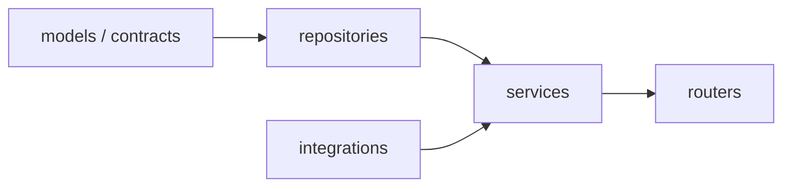
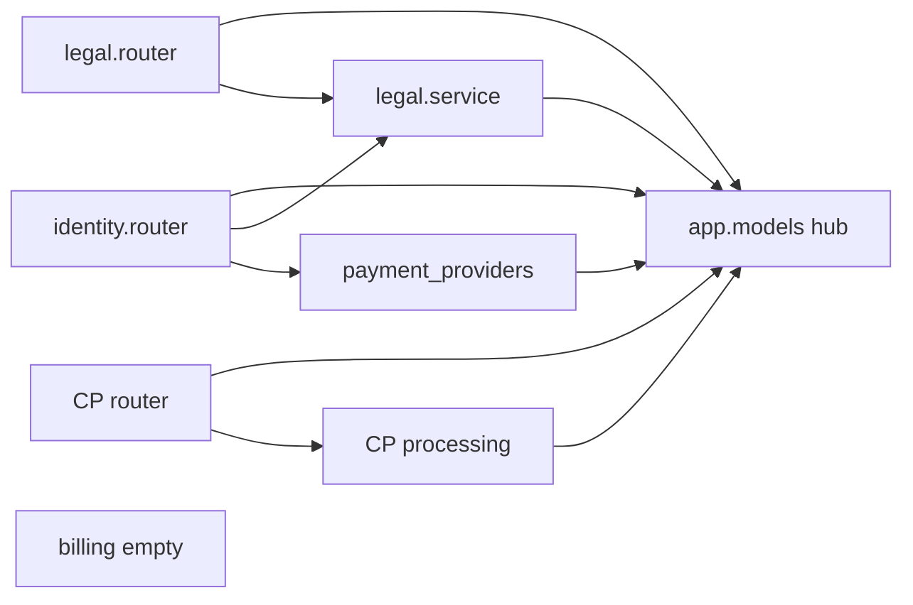

# DDD-lite architecture audit and safe remediation

Status: investigation snapshot; not current-state authority
Date: 2026-08-15
Scope: `apps/api/app`, `apps/web/src`
Code changes: none at audit time

This document records a read-only DDD-lite review and a remediation plan that
keeps CloudPayments delivery moving. [ARCHITECTURE.md](../../ARCHITECTURE.md)
and [the data model](payment-portal-data-model.md) remain the sources of truth
for implemented behavior. Findings here are maintainability and extensibility
gaps, not a claim that the RU MVP is broken.

Related active CloudPayments work (must not be blocked):

- [ANY-165 payment provider boundary](../exec-plans/active/ANY-165-payment-provider-boundary.md)
- [ANY-166 browser checkout adapter](../exec-plans/active/ANY-166-cloudpayments-browser-checkout-adapter.md)
- [ANY-167 notification adapter](../exec-plans/active/ANY-167-cloudpayments-notification-adapter.md)

ANY-112 already enforced a **minimal** import graph. This audit is about the
documented next step that ANY-112 explicitly deferred: repositories, services,
and aggregate ownership.

## Verdict

The package skeleton exists. DDD-lite does not.

Documented API direction:

```text
contracts/models -> repositories -> services -> routers/wiring
```

Observed production graph: `app.models` is the hub, `identity.router` is the
commerce application service, CloudPayments `processing.py` writes billing
aggregates, and `domains/billing` has no incoming production imports.

`python scripts/repo.py architecture check` can pass while that layering is
absent. It blocks illegal imports, the `cloudpayments` literal in
provider-neutral modules, and file-size caps. It does not fail SQL in routers,
a hollow billing domain, or integration-owned payment state.
`architecture-limits.json` already excepts `app/models.py`,
`identity/router.py`, and `CheckoutClient.tsx`.

Counts: **42 findings** — 4 P0, 18 P1, 14 P2, 6 P3. Seven items are already
named as transition debt (ANY-71, ANY-112, architecture-limit exceptions, or
legacy `product_access_states`).

## CloudPayments constraint

CloudPayments widget, checkout-intent, signed notifications, redaction,
idempotency, and response codes are the critical path. Remediation must not:

- freeze or rewrite `apps/api/app/integrations/cloudpayments/**` as a big-bang
- change webhook HTTP paths, HMAC verification, redaction, inbox idempotency,
  or CloudPayments body `code` values
- change `PaymentProviderAdapter` method signatures while adapters are landing
- relocate checkout-intent JSON fields that the widget adapter consumes
- expand `product_access_states` (legacy; [data model](payment-portal-data-model.md)
  forbids expanding it; ANY-71 owns entitlements)
- mix product behavior changes into structural moves

**Merge rule:** CloudPayments PRs win. Layering PRs rebase. Prefer additive
files and one-function delegations over file moves.

### Hot files (do not structurally edit while ANY-165/166/167 are in flight)

| Path | Why it is hot |
|---|---|
| `apps/api/app/integrations/cloudpayments/**` | Notification and adapter work |
| `apps/api/app/payment_providers/contracts.py` | Adapter protocol |
| `apps/api/app/payment_providers/registry.py` | Composition-root registration |
| `apps/api/app/domains/identity/router.py` (`checkout-intent`, `payment-status`) | Checkout payload for the widget |
| `apps/web/src/features/checkout/provider-adapters.ts` | Widget isolation |
| `apps/web/src/features/checkout/CheckoutClient.tsx` (widget start / CP errors) | ANY-166 browser path |
| `apps/web/src/features/payment-result/PaymentResultClient.tsx` | Refund/result status (ANY-76 overlap) |
| CloudPayments / checkout / webhook tests | Characterization baseline |

Additive edits inside those files are allowed only when they are required by a
CloudPayments ticket, not by this layering plan.

## Intended vs actual





## Ranked findings

Ranked by impact on maintainability and extensibility, not by whether current
RU MVP tests are green. **Debt?** = already acknowledged in architecture docs,
ANY-71, ANY-112, or an architecture-limit exception.

| Rank | ID | Sev | Impact | Category | Problem | Primary files | Debt? |
|---:|---|---|---:|---|---|---|---|
| 1 | F01 | P0 | 10 | Domain boundary | Billing domain is empty: unused re-export only. No service, repository, schemas, or router. Checkout, orders, payments, refunds, and webhooks live elsewhere. ANY-71 covers subscriptions later; implemented commerce has no application layer. | `apps/api/app/domains/billing/models.py` | No |
| 2 | F02 | P0 | 10 | Domain boundary | Identity router owns checkout, orders, and access. `create_checkout_intent` (~192 lines) writes `EntrypointSession`, `CheckoutSession`, `Order`, `OrderItem`, `ProductAccessState`. Session and payment-status query billing tables. Identity imports legal service, billing ORM types, and payment providers. Checkout sits under `/api/auth`. | `apps/api/app/domains/identity/router.py` | No |
| 3 | F03 | P0 | 10 | Domain boundary | CloudPayments processing is the billing state machine. Integrations should translate into domain operations. Instead they assign Order/Payment statuses (`paid`, `succeeded`, `payment_failed`, `canceled`, `refunded`) and persist aggregates. | `integrations/cloudpayments/processing.py`, `refunds.py` | No |
| 4 | F04 | P0 | 9 | God module | Two god functions concentrate the payment lifecycle: `process_webhook_event` (~214 lines) and `create_checkout_intent` (~192 lines). Any new provider, plan scope, or entitlement rule has to edit these two functions. | `identity/router.py`, `processing.py` | No |
| 5 | F05 | P1 | 9 | Layering | Documented repository layer does not exist. SQLAlchemy queries sit in routers, `session.py`, `password_reset.py`, `legal/service.py`, `payment_providers/accounts.py`, and CloudPayments modules. | `apps/api/app/**` | No |
| 6 | F06 | P1 | 9 | Layering | Routers query the database and commit. `identity/router.py` has ~29 `db.query`/`add`/`commit` sites. Legal accept loads `DocumentVersion` then commits after the service `db.add`. Webhook router builds `PaymentWebhookEvent`, commits, then processes. | identity/legal/CP routers, `password_reset.py` | No |
| 7 | F07 | P1 | 8 | God module | `password_reset.py` mixes router, service, and repository: Pydantic schemas, raw SQL rate limits, token CRUD, session revocation, email send, and FastAPI routes in 271 lines. | `domains/identity/password_reset.py` | No |
| 8 | F08 | P1 | 8 | Layering | Session dependency mixes HTTP, ORM, and commits. `get_current_session` uses `Header`, `HTTPException`, `db.query`, and `db.commit`. | `domains/identity/session.py` | No |
| 9 | F09 | P1 | 8 | Contracts | Provider protocol is coupled to ORM entities. `prepare_checkout_action` takes `Order` and `PaymentProviderAccount` from `app.models`. `CheckoutAction.as_response()` returns `dict[str, Any]`. | `payment_providers/contracts.py` | No |
| 10 | F10 | P1 | 8 | Layering | Provider-neutral accounts layer raises `HTTPException(503)` and queries ORM. HTTP belongs at the router edge. | `payment_providers/accounts.py` | No |
| 11 | F11 | P1 | 7 | Layering | CloudPayments adapter depends on FastAPI `Request`. It is not a pure translator of bytes/headers into `NormalizedPaymentEvent`. | `integrations/cloudpayments/adapter.py` | No |
| 12 | F12 | P1 | 8 | God module | `app.models.py` (~720 lines) is the real model home. Production imports `from app.models import …`. Domain `models.py` files are dead façades. Allowed until ANY-71. | `apps/api/app/models.py` | Yes |
| 13 | F13 | P1 | 7 | Domain boundary | Commerce HTTP lives under the auth router: `POST /api/auth/checkout-intent` and `GET /api/auth/payment-status`. `main.py` never mounts a billing router because none exists. | `domains/identity/router.py` | No |
| 14 | F14 | P1 | 8 | Contracts | No Pydantic response models. Zero `response_model=`. Request models exist inline. Responses are bare dicts (`present_user`, `present_document`, checkout, payment-status, webhook). | `apps/api/app/**` | No |
| 15 | F15 | P1 | 8 | Magic values | Domain statuses are free strings. The only production `Literal` is `CheckoutExperience`. Order/Payment/User/Plan/Webhook/Access statuses are compared as `'paid'`, `'succeeded'`, `'active'`, `'pending'`. DB `CheckConstraint` covers `plan.scope_type` only. | `models.py`, identity router, CP processing/validation/refunds/rules | No |
| 16 | F16 | P1 | 7 | Domain boundary | `CheckoutSession` is write-once (`status='order_created'`) and never updated. Webhook advances Order/Payment only. | `identity/router.py`, `models.py` | No |
| 17 | F17 | P1 | 8 | Domain boundary | `ProductAccessState` stays `pending` after a paid webhook. Checkout sets `pending`; processing never updates it. E2E asserts this. Payment-result reads Order/Payment so it can show paid; Account reads `product_state` and can keep showing pending. Legacy until ANY-71; the two UIs already disagree. | identity router, `processing.py`, `AccountClient.tsx`, `checkout-webhook.spec.ts` | Yes |
| 18 | F18 | P1 | 7 | Guardrail gap | Architecture checker does not enforce DDD-lite (see Verdict). | `scripts/repo.py`, `architecture-limits.json` | Yes |
| 19 | F19 | P1 | 8 | Frontend | `CheckoutClient.tsx` (~735 lines) mixes session, legal acceptances, checkout-intent, widget start, product cards, and status UI. CloudPayments error codes are handled here, not in the adapter. File already has a line-limit exception. | `features/checkout/CheckoutClient.tsx` | Yes |
| 20 | F20 | P1 | 8 | Frontend | API JSON is cast, not validated. `getJson`/`postJson` return `response.json() as T`. Account and payment-result bypass the shared client. `resolveApiBase` is copied three times. `SessionResponse` / `ProductState` are duplicated. | `shared/api/auth.ts`, `AccountClient.tsx`, `PaymentResultClient.tsx`, `HeaderAccount.tsx` | No |
| 21 | F21 | P1 | 6 | Magic values | Legal acceptance kind falls back silently: `ACCEPTANCE_KIND_BY_DOC_TYPE.get(doc_type, "terms_acceptance")`. | `domains/legal/service.py` | No |
| 22 | F22 | P1 | 6 | Error handling | Password-reset email failures are swallowed (`except Exception`: log warning, return). Hides delivery outages behind HTTP success. | `domains/identity/password_reset.py` | No |
| 23 | F23 | P2 | 6 | Magic values | Hardcoded catalog defaults in the identity router (`PRODUCT_DEFAULTS`, `99000`, trial 7). `present_product_state` still uses these when DB state is missing. | `identity/router.py` | No |
| 24 | F24 | P2 | 6 | Magic values | Tenant/region/provider literals as fallbacks (`anytoolai`, `ru`). Webhook inbox uses them when the order is missing. `find_order` filters `Order.provider == "cloudpayments"`. | `session.py`, CP router/rules/processing | No |
| 25 | F25 | P2 | 6 | Contracts | Webhook pipeline is `dict[str, Any]`. `_parse_data` swallows `JSONDecodeError` as `{}`. `NormalizedPaymentEvent.safe_payload` is untyped. | adapter, processing, validation, contracts | No |
| 26 | F26 | P2 | 5 | Thin shim | Root star-import compatibility modules pollute the import surface. Allowed until ANY-71. | `app/auth.py`, `legal.py`, `cloudpayments.py`, `legal_consents.py`, `database.py`, `settings.py` | Yes |
| 27 | F27 | P2 | 4 | Layering | Duplicated helpers: `utc_now` in session, legal service, and `processing.datetime_now`; `normalize_email` in identity router and password reset. | identity, legal, processing | No |
| 28 | F28 | P2 | 5 | Layering | Legal service is an anemic repository (SQL + `db.add`). Router still loads `DocumentVersion` and owns commit. | `legal/service.py`, `legal/router.py` | No |
| 29 | F29 | P2 | 5 | Frontend | Frontend catalog hardcodes products and 990 RUB. Home page duplicates the price instead of using catalog data. | `features/catalog/catalog.ts`, `app/ru/page.tsx` | Yes |
| 30 | F30 | P2 | 5 | Frontend | CloudPayments error codes leak into checkout UI (`cloudpayments_public_terminal_id_missing`, `cloudpayments_widget_mode_invalid`). | `CheckoutClient.tsx` | No |
| 31 | F31 | P2 | 5 | Frontend | Shared `HeaderAccount` owns session fetch, token writes, and the auth modal. | `shared/ui/HeaderAccount.tsx` | No |
| 32 | F32 | P2 | 4 | Frontend | Home route owns marketing UI instead of composing a feature entrypoint. | `app/ru/page.tsx` | No |
| 33 | F33 | P2 | 5 | Error handling | Payment-result polling fails open (empty `catch` leaves pending). Missing-email placeholder is used as a logic gate. Status strings compared without shared enums. | `PaymentResultClient.tsx` | No |
| 34 | F34 | P2 | 4 | Layering | Settings bypass: `os.getenv` for log/OTEL/legal-seed. CORS hardcodes `localhost:3000` beside `settings.cors_allow_origins`. | `core/observability.py`, `main.py` | No |
| 35 | F35 | P2 | 5 | Frontend | Session storage keys duplicated: `anytoolai_session_token_v1`, `anytoolai_session_changed`, `anytoolai_last_payment_result`. | Checkout, Account, HeaderAccount, password-reset, PaymentResult | No |
| 36 | F36 | P2 | 4 | Contracts | `NEXT_PUBLIC_API_BASE_URL` falls back to `http://localhost:8000`, masking missing env. | `shared/api/auth.ts`, Account, PaymentResult | No |
| 37 | F37 | P3 | 3 | Thin shim | One-import / unused domain model façades. | `domains/*/models.py`, root shims | Yes |
| 38 | F38 | P3 | 2 | Error handling | `skip_password_reset_email` is a no-op decoy. | `password_reset.py` | No |
| 39 | F39 | P3 | 2 | Frontend | `ProductCards.selectedCode` is unused. | `features/catalog/ProductCards.tsx` | No |
| 40 | F40 | P3 | 2 | Frontend | Ambient CloudPayments types at app root couple the app to the provider namespace. | `apps/web/src/types/cloudpayments.d.ts` | No |
| 41 | F41 | P3 | 2 | Frontend | Hardcoded hex in Footer SVG instead of Bundle 3 tokens. | `shared/ui/Footer.tsx` | No |
| 42 | F42 | P3 | 3 | Guardrail gap | Health payload names CloudPayments fields. Wiring is allowed; the contract is provider-specific. | `apps/api/app/main.py` | No |

## Layer inventory

Expected DDD-lite per domain: entities, value objects / enums, Pydantic
schemas, repository, application service, thin router.

| Area | Exists today | Missing vs DDD-lite |
|---|---|---|
| Identity | Fat router, `session.py`, `password_reset.py`, `passwords.py`, unused models façade | Repository, auth service, response schemas, enums. Session is HTTP+SQL. |
| Legal | Router + SQL service + unused models façade + `app/legal_seed.py` | Repository, response schemas, fail-fast acceptance-kind map. Router still queries. |
| Billing | Unused `models.py` re-export only | Entities ownership, enums, schemas, repos, checkout/order/payment/access services, router. |
| Payment providers | Protocol, registry, `accounts.py` | ORM-free port types; domain errors instead of `HTTPException`. |
| CloudPayments | Adapter, router, processing, validation, refunds, rules, payload | Side effects should call billing services. Adapter should not take FastAPI `Request`. |
| Core | settings, database, observability, email | Mostly fits. `getenv` bypass and SMTP `timeout=10` are local smells. |
| Web | `shared` → features → app; ESLint boundaries hold | Shared API barrel + runtime DTO validation; split `CheckoutClient`; stop duplicating fetch/session keys. |

## Hottest files

| File | Role today | Lines | Ceiling |
|---|---|---:|---|
| `apps/api/app/models.py` | God ORM aggregate | 720 | P1 |
| `apps/api/app/domains/identity/router.py` | Router + billing service + repo | 558 | P0 |
| `apps/api/app/integrations/cloudpayments/processing.py` | Integration acting as billing service | 463 | P0 |
| `apps/api/app/integrations/cloudpayments/adapter.py` | Adapter + FastAPI Request + Any dicts | 367 | P1 |
| `apps/api/app/integrations/cloudpayments/validation.py` | String status rules | 282 | P1 |
| `apps/api/app/domains/identity/password_reset.py` | Router + service + repo | 271 | P1 |
| `apps/web/src/features/checkout/CheckoutClient.tsx` | God UI + API + widget | 735 | P1 |
| `apps/web/src/features/payment-result/PaymentResultClient.tsx` | Polling + silent catch + magic status | 403 | P2 |
| `apps/api/app/integrations/cloudpayments/router.py` | Inbox persist + unit of work in router | 120 | P1 |
| `apps/api/app/domains/legal/router.py` | Still queries + commits | 109 | P2 |
| `apps/api/app/domains/legal/service.py` | Anemic SQL service | 105 | P2 |
| `apps/api/app/payment_providers/accounts.py` | HTTP + ORM in port layer | 80 | P1 |
| `apps/api/app/payment_providers/contracts.py` | Port depends on ORM | 71 | P1 |
| `apps/api/app/domains/identity/session.py` | HTTP + SQL auth | 42 | P1 |
| `apps/api/app/domains/billing/models.py` | Unused façade; only billing file | 35 | P0 |

## Persistence sites outside a repository

| Module | What it persists |
|---|---|
| `identity/router.py` | User, AuthSession, Plan/Product/Bundle reads, checkout aggregates, ProductAccessState |
| `identity/password_reset.py` | Rate-limit SQL, MagicLinkToken, User, AuthSession revoke |
| `identity/session.py` | AuthSession lookup + last_seen commit |
| `legal/router.py` | DocumentVersion load + commit |
| `legal/service.py` | DocumentVersion / DocumentAcceptance queries and add |
| `payment_providers/accounts.py` | CountryRegionRule, PaymentProviderAccount |
| `cloudpayments/router.py` | PaymentWebhookEvent insert + commit |
| `cloudpayments/processing.py` + `refunds.py` | Order, Payment, Refund, webhook event updates |

## One-import / thin production shims

| File | Imports | Role |
|---|---|---|
| `apps/api/app/cloudpayments.py` | `integrations.cloudpayments.router *` | Compat star-export |
| `apps/api/app/legal.py` | `domains.legal.router *` | Compat star-export |
| `apps/api/app/legal_consents.py` | `domains.legal.service *` | Compat star-export |
| `apps/api/app/database.py` | `core.database` | Compat re-export |
| `apps/api/app/settings.py` | `core.settings` | Compat re-export |
| `apps/api/app/auth.py` | identity session + identity router `*` | Compat; two modules |
| `domains/identity/models.py` | `app.models` subset | Unused façade |
| `domains/legal/models.py` | `app.models` subset | Unused façade |
| `domains/billing/models.py` | `app.models` subset | Unused; only billing file |

## What is already in good shape

- Domain folders exist: identity, legal, billing, `payment_providers`,
  `integrations/cloudpayments`. Core does not import domains.
- AST checks already forbid domain→integration, core→domain, and router→router.
  Provider-neutral modules cannot contain the `cloudpayments` literal.
- CloudPayments adapter redacts card keys. Named endpoint, event, and response
  code maps exist. Webhook processing is idempotent at the inbox row.
- Legal acceptances are append-only. Legal is the only domain with a real
  `service.py`. Password hashing is isolated in `passwords.py`.
- Web ESLint boundaries hold: no shared→feature imports, no feature
  deep-imports. Public feature barrels exist. Customer-facing copy is Russian.
  Legal versions come from the generated manifest.

## Safe remediation plan

### Principles

1. **Strangler, not rewrite.** Add billing/identity/legal application modules.
   Point existing callers at them in small diffs. Delete the old body only after
   the new path has the same tests green.
2. **Preserve public contracts.** No URL, webhook body `code`, redaction, or
   checkout-intent field changes unless a CloudPayments ticket requires them.
3. **Additive types first.** Introduce Enums/Literals and Pydantic models whose
   serialized values equal today's strings/dicts. Call sites can keep using
   `.value` until a later sweep.
4. **Do not expand `product_access_states`.** Account/payment-result disagreement
   (F17) may be fixed on the read path (Account should use order/payment like
   payment-result). Activating access from the webhook is ANY-71 product work,
   not this layering plan.
5. **One vertical slice per PR.** Prefer "move `upsert_payment_from_webhook`
   persistence into billing and leave the endpoint ladder in processing" over
   "split the CloudPayments package".
6. **Stop and fix.** If a layering PR conflicts with a CloudPayments PR, rebase
   or pause the layering PR. Do not merge overlapping edits to hot files.

### Phase 0 — now, while CloudPayments is in flight

Goal: reduce debt without touching hot files.

| ID | Task | Findings | Validation |
|---|---|---|---|
| 0.1 | Keep this document current when CloudPayments PRs land (file list / hot-file table only). | — | `npm run docs:check` |
| 0.2 | Split `password_reset.py` into router + service + queries. Keep HTTP paths. | F07, F22, F38 | `npm run test:api` focused on password reset |
| 0.3 | Move remaining `DocumentVersion` load and commit ownership into legal service. Fail fast on unknown `doc_type` (no default kind). | F21, F28 | legal API tests |
| 0.4 | Extract shared web session key, `resolveApiBase`, and `getJson`/`postJson` usage. Switch Account and HeaderAccount to the shared client. Do not edit `provider-adapters.ts` or Checkout widget start. | F20, F31, F35, F36 | `npm --workspace @anytoolai/web run test:components` |
| 0.5 | Deduplicate `utc_now` / `normalize_email` into existing identity helpers; legal can import the identity helper or a tiny `core` datetime helper. Do not import integrations. | F27 | architecture check + API tests |
| 0.6 | Add **new** `domains/billing/enums.py` (and identity/legal equivalents) wrapping current string vocabularies. Do not switch CloudPayments processing onto them yet. | F15 | architecture check; no behavior change |
| 0.7 | Home page: stop hardcoding 990; read catalog data. Dead `ProductCards.selectedCode`. | F29, F32, F39 | web component tests |

Non-goals for Phase 0: billing service extraction, processing.py surgery,
adapter Request decoupling, `app.models` split, CheckoutClient decomposition
of the widget path.

Definition of done: CloudPayments tests still pass unchanged; no diff in
`integrations/cloudpayments/**` unless a CloudPayments ticket owns it.

### Phase 1 — after ANY-166/167 stabilize, or between their PRs

Goal: give billing an application layer without changing webhook semantics.

Do this as several PRs, not one.

| ID | Task | Findings | Notes |
|---|---|---|---|
| 1.1 | Add `domains/billing/service.py` (checkout create) by moving the body of `create_checkout_intent` out of identity. Identity router stays the HTTP façade and keeps `/api/auth/checkout-intent` until a later URL move. | F01, F02, F04, F13, F23 | Highest merge risk with ANY-166. Wait until checkout-intent JSON is stable. |
| 1.2 | Move payment-status assembly into billing (still served from `/api/auth/payment-status`). | F02, F13 | Read-only vs webhook writers; lower risk. |
| 1.3 | One function at a time, make `processing.py` / `refunds.py` call billing persistence helpers (`upsert_payment_from_webhook`, refund recording). Leave endpoint routing, validation, and CP response mapping in the integration. | F03, F04, F16 | Domain must not import `app.integrations`. Integration imports billing service. |
| 1.4 | Advance `CheckoutSession` status from the same billing helpers that update Order (no product-access expansion). | F16 | Behavior addition; needs tests. Do not mix with ANY-167 unless that ticket already touches order transitions. |
| 1.5 | Account UI: derive subscription card state from order/payment like payment-result, or poll payment-status. Do not activate `ProductAccessState` from the webhook. | F17 | Product-consistent read model; still legacy access table. |

Definition of done: same webhook fixtures and E2E "access stays pending"
invariant; checkout-intent response shape unchanged; `processing.py` no longer
assigns Order/Payment status literals inline.

### Phase 2 — contracts and thin edges

Goal: make invalid states harder, without a provider rewrite.

| ID | Task | Findings |
|---|---|---|
| 2.1 | Add Pydantic response models and `response_model=` for auth, legal, checkout, payment-status. Serialized JSON must match today's keys. | F14 |
| 2.2 | Switch remaining string comparisons to Enums/Literals introduced in 0.6. | F15, F24 |
| 2.3 | Introduce repositories for identity, legal, billing. Routers stop calling `db.query` / `db.commit` except via a unit-of-work helper if one is adopted. | F05, F06 |
| 2.4 | `session.py`: HTTP adapter in the router/deps module; domain lookup without `HTTPException`. | F08 |
| 2.5 | `accounts.py`: domain error instead of `HTTPException`; router maps 503. | F10 |
| 2.6 | Adapter: router passes body + header map; adapter no longer takes FastAPI `Request`. Protocol still accepts ORM until Phase 3 if changing it now collides with ANY-165. | F11 |
| 2.7 | Typed webhook payload model; stop swallowing JSON decode as `{}` without an error code. | F25 |

Do 2.6 only after ANY-167's adapter surface is frozen.

### Phase 3 — web checkout split and provider-port cleanup

Goal: finish frontend and port decoupling after the widget path is stable.

| ID | Task | Findings |
|---|---|---|
| 3.1 | Split `CheckoutClient` into session/legal/checkout-intent/UI. Keep widget start in `provider-adapters.ts`. Map CP error codes inside the adapter. | F19, F30 |
| 3.2 | Runtime validation of session/checkout/payment-status JSON (shared DTOs). | F20 |
| 3.3 | Payment-result: no empty catch; no placeholder email as a control-flow value. | F33 |
| 3.4 | Decouple `PaymentProviderAdapter` from ORM (`Order` / `PaymentProviderAccount` → checkout snapshot DTO). | F09 |
| 3.5 | Observability/settings: stop `os.getenv` bypass; CORS only from settings. | F34 |
| 3.6 | Health contract: provider-neutral flags or nested provider map. | F42 |

### Phase 4 — ANY-71 and shim removal

Goal: entity ownership. Do not start until catalog/subscription/entitlement
work owns the model split.

| ID | Task | Findings |
|---|---|---|
| 4.1 | Split `app.models` into domain modules; delete unused façades; stop root star-imports. | F12, F26, F37 |
| 4.2 | Replace `product_access_states` with subscriptions/entitlements. Activate access only from verified webhook-processed payment state. | F17 (product) |
| 4.3 | Move checkout HTTP to a billing router when clients can change; keep compatibility routes if needed. | F13 |
| 4.4 | Tighten `check_python_boundaries` to fail SQL in routers and domain→router leaks **after** repositories exist. | F18 |
| 4.5 | Footer tokens; move ambient CP types next to checkout. | F40, F41 |

### Finding → phase map

| Findings | Phase |
|---|---|
| F07, F20–F22, F27–F29, F31, F32, F35, F36, F38, F39 | 0 (parallel with CloudPayments) |
| F01–F04, F13, F16, F17 (read-path only), F23 | 1 (after checkout/webhook JSON freeze) |
| F05, F06, F08, F10, F11, F14, F15, F24, F25 | 2 |
| F09, F19, F30, F33, F34, F42 | 3 |
| F12, F17 (activation), F18, F26, F37, F40, F41 | 4 / ANY-71 |

### Validation gates (every phase)

Use the smallest relevant check while iterating; before handoff run the
broadest check the environment supports.

```bash
python scripts/repo.py architecture check
python -m pytest apps/api/tests/test_architecture.py
python -m pytest apps/api/tests/test_api.py -k "cloudpayments or webhook or checkout or refund"
npm --workspace @anytoolai/web run test:components
npm run docs:check
npm run check:fast
```

When `TEST_POSTGRES_DATABASE_URL` is set:

```bash
python -m pytest apps/api/tests/test_cloudpayments_webhook_postgres.py
```

Do not claim a phase done if CloudPayments characterization tests regress, if
`docs/generated/openapi.json` drifts from an unintentional contract change, or
if `product_access_states` is expanded.

### Explicit non-goals

- Stopping or rewriting the CloudPayments integration to "get layering done".
- Activating paid access from the browser return URL.
- Implementing ANY-71 subscriptions/entitlements inside this plan.
- Presenting legal pages as counsel-approved.
- Collecting card data or logging unredacted payment fields.
