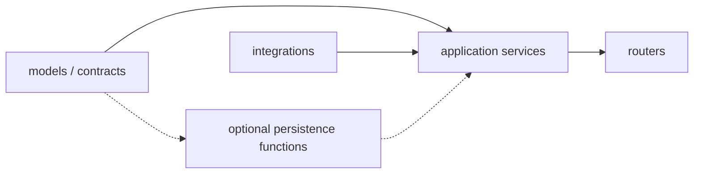
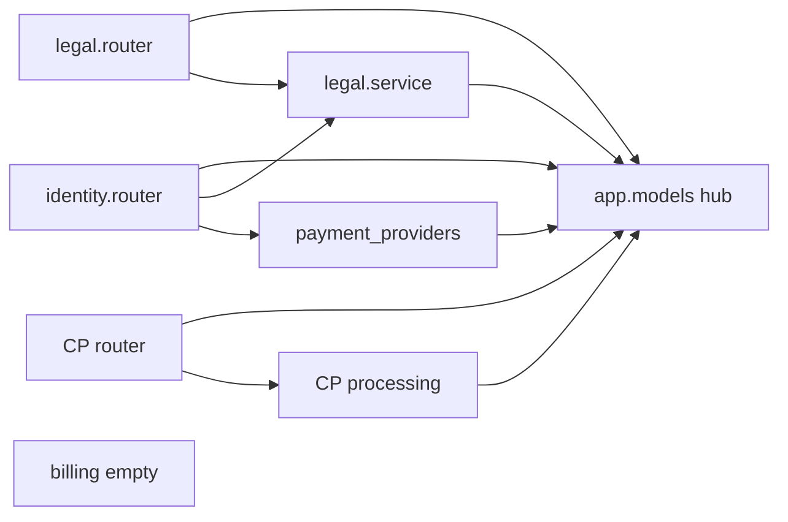

# DDD-lite architecture audit and safe remediation

Status: investigation snapshot; not current-state authority
Date: 2026-08-15
Revised: 2026-08-16
Scope: `apps/api/app`, `apps/web/src`

This is a smell catalog plus two targeted moves. It is not a DDD migration
programme and not a second source of truth.
[ARCHITECTURE.md](../../ARCHITECTURE.md) and
[the data model](payment-portal-data-model.md) remain authoritative for
implemented behavior.

The RU MVP is not claimed broken. Findings are maintainability and
extensibility gaps unless marked as a product display issue.

Related CloudPayments work (must not be blocked):

- [ANY-165 payment provider boundary](../exec-plans/active/ANY-165-payment-provider-boundary.md)
- [ANY-166 browser checkout adapter](../exec-plans/active/ANY-166-cloudpayments-browser-checkout-adapter.md)
- [ANY-167 notification adapter](../exec-plans/active/ANY-167-cloudpayments-notification-adapter.md)

ANY-112 already enforced a **minimal** import graph. ANY-112 deferred
repository/service decomposition. This document does not reopen that as a
blanket layer requirement.

## Verdict

The package skeleton exists. Billing application operations do not: checkout
and payment state transitions live in the identity router and the CloudPayments
integration.

**Target operations (about 70–80% of the architectural value):**

1. Checkout belongs to billing.
2. Payment/order/refund state transitions belong to billing.

Everything else is ANY-71, opportunistic cleanup when a file is already in the
diff, a product/ops decision, or work to skip until a later re-evaluation
proves it is needed.

[ARCHITECTURE.md](../../ARCHITECTURE.md) states the API arrow as an **allowed
dependency direction**, not a requirement to route every query through a
repository class, interface, or unit-of-work framework. A billing application
service may take a SQLAlchemy `Session`. Extract persistence functions only
where they cut duplication or isolate persistence complexity.

`python scripts/repo.py architecture check` can pass while billing operations
live outside the billing package. That is expected: the checker enforces the
minimal ANY-112 graph, not this snapshot.

## Severity scale

| Grade | Meaning in this document |
|---|---|
| P0 | Payment correctness or safety: wrong confirmation, broken idempotency, secret/card leak, access activated from a return URL, corrupted payment state. **None of the catalog items are P0.** |
| P1 | Next billing change is concentrated in the wrong module (identity router or CloudPayments processing). |
| P2 | Real maintainability debt; fix inside a vertical slice or a dedicated product ticket, not as a layer programme. |
| P3 | Opportunistic cleanup. Do not open a PR for it alone. |

Refactor priority is not incident severity. Empty packages and large files are
not P0.

## CloudPayments constraint

Do not freeze or rewrite `apps/api/app/integrations/cloudpayments/**`. Do not
change webhook HTTP paths, HMAC verification, redaction, inbox idempotency, or
CloudPayments body `code` values. Do not change `PaymentProviderAdapter`
signatures while adapters are landing. Do not relocate checkout-intent JSON
fields the widget consumes. Do not expand `product_access_states` (legacy;
ANY-71 owns entitlements).

**Merge rule:** CloudPayments PRs win. Layering PRs rebase or wait.

**Execution rule:** each implementation PR needs an existing Linear ticket and
a business reason. This snapshot is not a PR queue.

### Hot files while ANY-165/166/167 are in flight

| Path | Why it is hot |
|---|---|
| `apps/api/app/integrations/cloudpayments/**` | Notification and adapter work |
| `apps/api/app/payment_providers/contracts.py` | Adapter protocol |
| `apps/api/app/payment_providers/registry.py` | Composition-root registration |
| `apps/api/app/domains/identity/router.py` (`checkout-intent`, `payment-status`) | Checkout payload for the widget |
| `apps/web/src/features/checkout/provider-adapters.ts` | Widget isolation |
| `apps/web/src/features/checkout/CheckoutClient.tsx` (widget start / CP errors) | ANY-166 browser path |
| `apps/web/src/features/payment-result/PaymentResultClient.tsx` | Refund/result status (ANY-76 overlap) |
| CloudPayments / checkout / webhook tests | Characterization baseline |

No separate DDD refactor against these files until checkout-intent and
notification JSON are stable. Security/correctness fixes and changes required
by the CloudPayments tickets themselves are allowed.

## Intended vs actual





## Action legend for the catalog

| Action | Meaning |
|---|---|
| slice-1 | Move checkout create into billing, including the pending `ProductAccessState` write. Same URL and JSON. No access activation. No `CheckoutSession` lifecycle change. |
| slice-2 | Move Order/Payment/Refund transitions into billing. Integration keeps verify/redact/normalize and CP response mapping. |
| product | Needs a product/ops decision, not a DDD cleanup. |
| any-71 | Catalog, subscriptions, entitlements, model split, shim removal. |
| opportunistic | Fix when that file is already changing. |
| skip | Do not do unless re-evaluation after the two slices shows measurable cost. |

The catalog is a map of smells. It is not a backlog to burn down.

## Ranked findings

| Rank | ID | Sev | Action | Problem | Primary files |
|---:|---|---|---|---|---|
| 1 | F03 | P1 | slice-2 | CloudPayments processing owns Order/Payment/Refund transitions. Integration should translate into a billing operation. This is the main architectural win. | `integrations/cloudpayments/processing.py`, `refunds.py` |
| 2 | F02 | P1 | slice-1 | Identity router owns checkout, orders, and access writes. `create_checkout_intent` writes `EntrypointSession`, `CheckoutSession`, `Order`, `OrderItem`, `ProductAccessState`. Checkout sits under `/api/auth` (keep the URL). | `domains/identity/router.py` |
| 3 | F04 | P2 | slice-1 / slice-2 | `process_webhook_event` (~214 lines) and `create_checkout_intent` (~192 lines) concentrate the lifecycle. Size is a symptom; ownership is F02/F03. | identity router, `processing.py` |
| 4 | F01 | P2 | slice-1 | Billing package is an unused re-export. Empty package is not an incident; the missing application operations are F02/F03. | `domains/billing/models.py` |
| 5 | F17 | P2 | product | `ProductAccessState` stays `pending` after a paid webhook (documented legacy; E2E asserts it). Account can keep showing pending after pay. Payment-result may show paid from Order/Payment. **Paid and access-active are different facts.** Do not map a succeeded payment to "subscription active" on the read path. Show payment confirmed and access not activated separately. Activation is ANY-71. | identity router, `processing.py`, `AccountClient.tsx`, `checkout-webhook.spec.ts` |
| 6 | F16 | P2 | skip | `CheckoutSession` is write-once (`order_created`). Preserve that behavior in slice-1. Do not add a checkout-session lifecycle during the structural move; change status only with a separate product requirement. | identity router, `models.py` |
| 7 | F23 | P2 | slice-1 | `PRODUCT_DEFAULTS` in the identity router. Move with checkout, do not keep a second catalog in identity. | `identity/router.py` |
| 8 | F13 | P2 | skip | Commerce HTTP under `/api/auth`. Keep the path. A billing router is not required for slice-1. | `identity/router.py` |
| 9 | F15 | P2 | slice-1 / slice-2 | Statuses are free strings. Add Enum/Literal **in the same PR** that moves the transition, only for values that PR touches. No unused enum modules. | `models.py`, identity router, CP processing |
| 10 | F09 | P2 | skip | Provider protocol takes ORM `Order` / `PaymentProviderAccount`. Re-evaluate after the two slices; do not decouple during CloudPayments landing. | `payment_providers/contracts.py` |
| 11 | F11 | P2 | opportunistic | Adapter takes FastAPI `Request`. Peel to body/headers when that file is already changing after ANY-167 freezes. | `integrations/cloudpayments/adapter.py` |
| 12 | F12 | P2 | any-71 | `app.models.py` is the real model home. Allowed until ANY-71. | `apps/api/app/models.py` |
| 13 | F19 | P2 | skip | `CheckoutClient.tsx` mixes session, legal, checkout, and widget. Re-evaluate after slices; do not split the widget path during ANY-166. | `features/checkout/CheckoutClient.tsx` |
| 14 | F25 | P2 | slice-2 | Webhook payload is `dict[str, Any]`. Type only what the billing operation needs. Do not swallow decode errors as `{}` if that hides a real failure for that endpoint. | adapter, processing, validation, contracts |
| 15 | F24 | P2 | opportunistic | Tenant/region/provider string fallbacks (`anytoolai`, `ru`, `cloudpayments`). Change with the slice that owns that lookup. | `session.py`, CP router/rules/processing |
| 16 | F06 | P2 | slice-1 / slice-2 | Routers query and commit. The checkout router delegates checkout creation. The webhook router retains durable inbox and recovery orchestration; aggregate mutations delegate to billing. This is not a reason to introduce repositories everywhere. | identity/legal/CP routers, `password_reset.py` |
| 17 | F10 | P3 | opportunistic | `accounts.py` raises `HTTPException`. Map HTTP at the router when that module is already in the diff. | `payment_providers/accounts.py` |
| 18 | F14 | P3 | slice-1 / slice-2 | No `response_model=`. Add Pydantic models only for the JSON the slice already returns. Serialized keys stay the same. | `apps/api/app/**` |
| 19 | F05 | P3 | skip | "Missing repository layer" is not a defect under the allowed-direction reading of `ARCHITECTURE.md`. | — |
| 20 | F18 | P3 | skip | Do not tighten the architecture checker to require repositories until the two slices exist and a later ticket needs the guard. | `scripts/repo.py`, `architecture-limits.json` |
| 21 | F07 | P3 | opportunistic | `password_reset.py` mixes router/service/SQL. Not part of billing slices. | `domains/identity/password_reset.py` |
| 22 | F08 | P3 | opportunistic | Session dependency mixes HTTP and ORM. | `domains/identity/session.py` |
| 23 | F20 | P3 | opportunistic | Unvalidated `as T` and copied `resolveApiBase`. Real auth footgun; fix when those files already change. Not a DDD programme. | `shared/api/auth.ts`, Account, PaymentResult, HeaderAccount |
| 24 | F21 | P3 | opportunistic | Unknown legal `doc_type` falls back to `terms_acceptance`. Fail fast when legal service is already in the diff. | `domains/legal/service.py` |
| 25 | F22 | P3 | product | Password-reset HTTP success when email send fails may be anti-enumeration. Logging exists. Changing HTTP needs an ops contract (metric, retry, queue), not DDD cleanup. | `password_reset.py` |
| 26 | F26 | P3 | any-71 | Root star-import shims. Allowed until ANY-71. | `app/auth.py`, `legal.py`, `cloudpayments.py`, … |
| 27 | F27 | P3 | opportunistic | Duplicated `utc_now` / `normalize_email`. | identity, legal, processing |
| 28 | F28 | P3 | opportunistic | Legal service is SQL + `db.add`; router still loads `DocumentVersion`. | legal service/router |
| 29 | F29 | P3 | opportunistic | Frontend catalog hardcodes 990 RUB; home page duplicates the price. | `catalog.ts`, `app/ru/page.tsx` |
| 30 | F30 | P3 | opportunistic | CloudPayments error codes handled in `CheckoutClient` instead of the adapter. Fix with ANY-166 or a later checkout UI change. | `CheckoutClient.tsx` |
| 31 | F31 | P3 | opportunistic | `HeaderAccount` owns session fetch. | `shared/ui/HeaderAccount.tsx` |
| 32 | F32 | P3 | skip | Home route owns marketing UI. | `app/ru/page.tsx` |
| 33 | F33 | P3 | opportunistic | Payment-result empty `catch`; placeholder email used as control flow. | `PaymentResultClient.tsx` |
| 34 | F34 | P3 | opportunistic | `os.getenv` bypasses Settings; hardcoded CORS localhost. | `core/observability.py`, `main.py` |
| 35 | F35 | P3 | opportunistic | Duplicated session storage keys. | Checkout, Account, HeaderAccount, password-reset, PaymentResult |
| 36 | F36 | P3 | skip | `NEXT_PUBLIC_API_BASE_URL` localhost fallback. Do not remove without a concrete production failure. | `shared/api/auth.ts`, Account, PaymentResult |
| 37 | F37 | P3 | any-71 | Unused domain model façades. | `domains/*/models.py` |
| 38 | F38 | P3 | opportunistic | `skip_password_reset_email` no-op. | `password_reset.py` |
| 39 | F39 | P3 | opportunistic | `ProductCards.selectedCode` unused. | `ProductCards.tsx` |
| 40 | F40 | P3 | skip | Ambient CloudPayments types at app root. | `src/types/cloudpayments.d.ts` |
| 41 | F41 | P3 | opportunistic | Hardcoded Footer SVG hex. | `Footer.tsx` |
| 42 | F42 | P3 | skip | Health payload names CloudPayments fields. Do not rename without a consumer need. | `main.py` |

Counts after re-grade: **0 P0**, **2 P1**, **14 P2**, **26 P3**.

## Layer inventory

Expected per domain for **billing slices**: an application operation, the HTTP
façade that calls it, and persistence functions only where they pay for
themselves. Enums/DTOs only for values that slice serializes or transitions.

| Area | Exists today | Needed for the two slices |
|---|---|---|
| Identity | Fat router, `session.py`, `password_reset.py`, `passwords.py` | Thin HTTP façade for `POST /api/auth/checkout-intent`. Leave auth and `GET /api/auth/payment-status` in identity until re-evaluation after the two slices. |
| Legal | Router + SQL service | Unchanged unless a slice already touches acceptances. |
| Billing | Unused `models.py` re-export | `create_checkout` and payment-transition operations. Optional `repository.py` functions, not a generic layer. |
| Payment providers | Protocol, registry, `accounts.py` | Leave stable during CloudPayments landing. |
| CloudPayments | Adapter, router, processing, validation, refunds, rules, payload | Keep verify/redact/normalize/response codes. Call billing for aggregate transitions. |
| Core | settings, database, observability, email | Fits. |
| Web | `shared` → features → app | No required frontend split for the two slices. Account payment-vs-access copy is a product ticket. |

## Hottest files

| File | Role today | Lines | Relevant action |
|---|---|---:|---|
| `apps/api/app/models.py` | God ORM aggregate | 720 | any-71 |
| `apps/api/app/domains/identity/router.py` | Router + billing checkout | 558 | slice-1 |
| `apps/api/app/integrations/cloudpayments/processing.py` | Integration acting as billing state machine | 463 | slice-2 |
| `apps/api/app/integrations/cloudpayments/adapter.py` | Adapter + FastAPI Request | 367 | opportunistic after ANY-167 |
| `apps/api/app/integrations/cloudpayments/validation.py` | Provider-specific rules | 282 | stays in integration |
| `apps/api/app/domains/identity/password_reset.py` | Router + service + SQL | 271 | opportunistic |
| `apps/web/src/features/checkout/CheckoutClient.tsx` | God UI + API + widget | 735 | skip during ANY-166 |
| `apps/web/src/features/payment-result/PaymentResultClient.tsx` | Payment outcome UI | 403 | product/opportunistic |
| `apps/api/app/integrations/cloudpayments/router.py` | Inbox persist | 120 | slice-2 (keep inbox; call billing) |
| `apps/api/app/domains/billing/models.py` | Unused façade | 35 | slice-1 |

## Persistence sites (inventory, not a repository mandate)

| Module | What it persists |
|---|---|
| `identity/router.py` | User, AuthSession, Plan/Product/Bundle reads, checkout aggregates, ProductAccessState |
| `identity/password_reset.py` | Rate-limit SQL, MagicLinkToken, User, AuthSession revoke |
| `identity/session.py` | AuthSession lookup + last_seen commit |
| `legal/router.py` | DocumentVersion load + commit |
| `legal/service.py` | DocumentVersion / DocumentAcceptance queries and add |
| `payment_providers/accounts.py` | CountryRegionRule, PaymentProviderAccount |
| `cloudpayments/router.py` | PaymentWebhookEvent insert + commit |
| `cloudpayments/processing.py` + `refunds.py` | Order, Payment, Refund, webhook event updates |

## One-import / thin production shims

| File | Imports | Role |
|---|---|---|
| `apps/api/app/cloudpayments.py` | `integrations.cloudpayments.router *` | Compat star-export |
| `apps/api/app/legal.py` | `domains.legal.router *` | Compat star-export |
| `apps/api/app/legal_consents.py` | `domains.legal.service *` | Compat star-export |
| `apps/api/app/database.py` | `core.database` | Compat re-export |
| `apps/api/app/settings.py` | `core.settings` | Compat re-export |
| `apps/api/app/auth.py` | identity session + identity router `*` | Compat; two modules |
| `domains/identity/models.py` | `app.models` subset | Unused façade |
| `domains/legal/models.py` | `app.models` subset | Unused façade |
| `domains/billing/models.py` | `app.models` subset | Unused; only billing file |

Leave shims until ANY-71. Do not add new unused façades, unused enum modules,
or repository interfaces with one implementation.

## What is already in good shape

- Domain folders exist. Core does not import domains.
- AST checks forbid domain→integration, core→domain, and router→router.
  Provider-neutral modules cannot contain the `cloudpayments` literal.
- CloudPayments adapter redacts card keys. Named endpoint, event, and response
  code maps exist. Webhook processing is idempotent at the inbox row.
- Legal acceptances are append-only. Password hashing is isolated.
- Web ESLint boundaries hold. Legal versions come from the generated manifest.

## Remediation plan

Do not keep this snapshot updated as a live tracker. When a Linear ticket
lands, that ticket's exec-plan is the execution log.

### Step 0 — while ANY-165/166/167 are active

No separate DDD refactor.

Allowed:

- security or payment-correctness fixes
- a **product** ticket for Account copy: show "payment confirmed" and "access
  not activated" as separate facts (F17). Do not treat a succeeded payment as
  an active subscription
- changes the CloudPayments tickets themselves need

Not allowed as standalone work: unused enums, identity/legal repository
layers, password-reset split, home-page feature move, health-payload rename,
removing the localhost API fallback, splitting files for line count, Footer
tokens, relocating ambient TypeScript declarations.

### Step 1 — one billing vertical slice: checkout

After checkout-intent JSON is stable, pick an **existing** Linear ticket (or
file one with a business reason) and move checkout create:

```text
HTTP façade
  -> billing.create_checkout
  -> persistence functions only if they reduce complexity
  -> same JSON contract
  -> focused tests
```

Constraints:

- `POST /api/auth/checkout-intent` stays
- router validates HTTP and calls billing
- billing owns `EntrypointSession`, `CheckoutSession`, `Order`, `OrderItem`,
  and the legacy pending `ProductAccessState` write
- the pending access row moves with checkout, same behavior, **no activation**
- do not advance `CheckoutSession.status` (keep write-once `order_created`)
- JSON unchanged
- Enums/DTOs only for values this slice uses
- no generic repository, base class, or unit-of-work framework
- billing service may take `Session`
- `GET /api/auth/payment-status` stays in identity; re-evaluate after the two
  slices

This creates a real billing application layer without a full skeleton.

### Step 2 — payment state machine

Separate Linear ticket, separate PR, after notification handling is stable
enough to rebase:

- CloudPayments verifies, redacts, and normalizes the event
- a provider-neutral billing operation applies Order/Payment/Refund
  transitions
- Order/Payment/Refund mutations are applied atomically by the billing
  operation
- preserve the existing durable inbox commit **before** processing and
  failed-event recovery **after** rollback; do not fold inbox persistence and
  aggregate mutations into one transaction
- integration keeps provider-specific response mapping
- run PostgreSQL idempotency and monotonic-transition tests

Do not activate `product_access_states` from this move.

### Step 3 — stop and re-evaluate

After the two slices, check:

- is a second provider cheaper
- did transition duplication actually disappear
- are identity/legal repositories still unnecessary
- should `GET /api/auth/payment-status` move behind a billing read model
- do large frontend components still block change
- which remaining catalog items still have measurable cost

If the answer is no, later phases are not needed. ANY-71 separately owns model
ownership, subscriptions, entitlements, and shim removal.

## Validation gates

Use the smallest relevant check while iterating. Before each handoff run
`npm run check:fast`. Run `npm run docs:check` only when documentation or
OpenAPI changed.

Slice 1 (checkout):

```bash
python scripts/repo.py architecture check
python -m pytest apps/api/tests/test_architecture.py
python -m pytest apps/api/tests/test_api.py -k "checkout"
```

Slice 2 (payment transitions):

```bash
python scripts/repo.py architecture check
python -m pytest apps/api/tests/test_architecture.py
python -m pytest apps/api/tests/test_api.py -k "cloudpayments or webhook or refund"
```

When `TEST_POSTGRES_DATABASE_URL` is set, slice 2 also runs:

```bash
python -m pytest apps/api/tests/test_cloudpayments_webhook_postgres.py
```

Do not claim a slice done if CloudPayments characterization tests regress, if
`docs/generated/openapi.json` drifts from an unintentional contract change, or
if `product_access_states` is expanded, activated, or treated as a subscription.

## Explicit non-goals

- A DDD migration programme, unused types, or blanket repositories
- Stopping CloudPayments delivery to "get layering done"
- Activating paid access from a browser return URL
- Mapping payment success to access-active on the Account read path
- Advancing `CheckoutSession.status` during the checkout structural move
- Implementing ANY-71 subscriptions/entitlements inside this plan
- Presenting legal pages as counsel-approved
- Collecting card data or logging unredacted payment fields
- Opening PRs without an existing Linear ticket
