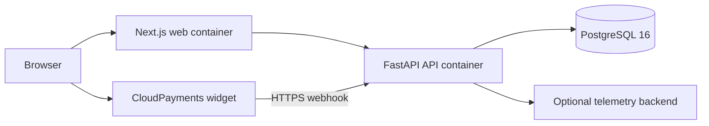

# Deployment Architecture

Status: authoritative current deployment
Last verified: 2026-07-11

## Current RU deployment

Production Compose builds web and API images, applies Alembic migrations before
API startup, exposes web and API ports, and keeps PostgreSQL internal. Production
must provide HTTPS termination, Russian data residency, backups, secret storage,
and monitoring outside this repository's local Compose assumptions.

## Local worktree deployment

`scripts/repo.py` creates a Compose project name and ports derived from the Git
worktree. PostgreSQL, web, API, and the optional observability service are scoped
to that project. No fixed container names are permitted in development Compose.

## Future Platform Kernel connection

Platform Kernel is a separately deployed service and repository. Future calls
will use verified regional identity and the Payment Portal access API described
by ANY-71. This repository must not copy Platform Kernel runtime tables or store
its artifacts and usage events.

No user or payment data may be silently replicated between regional data planes.
