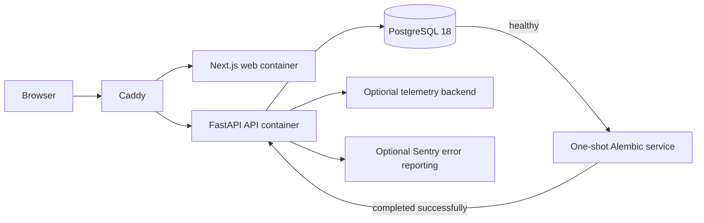

# Deployment Architecture

Status: authoritative current deployment plus target contour isolation
Last verified: 2026-09-24

## Current `ru` deployment


```mermaid
flowchart LR
  Browser["Browser"] --> Caddy["Caddy"]
  Caddy --> Web["Next.js web container"]
  Caddy --> API["FastAPI API container"]
  DB[("PostgreSQL 18")] -->|"healthy"| Migrate["One-shot Alembic service"]
  Migrate -->|"completed successfully"| API
  API --> DB
  API --> OTEL["Optional telemetry backend"]
  API --> Sentry["Optional Sentry error reporting"]
```

Production Compose builds web and API images and runs Alembic through a
one-shot `migrate` service after PostgreSQL becomes healthy. The API depends on
successful migration completion and its container command starts only Uvicorn;
a failed migration therefore blocks API startup. Only Caddy publishes host
ports, while PostgreSQL, API, and web remain internal. Production must provide
HTTPS termination, `ru` data residency, backups, secret storage, and
monitoring outside this repository's local Compose assumptions.

Both the API and migration service require explicit `INSTANCE_TENANT_ID` and
`INSTANCE_REGION` production environment values. `docker-compose.prod.yml`
fails interpolation when either is absent. The settings are normalized to
lowercase and are the implemented server authority for registration, login,
password reset, required legal-document discovery, authenticated session
scope, and legal writes. They are descriptive deployment identity, not
caller-selectable routing inputs. Local repository defaults are explicitly
`anytoolai` / `ru`; production has no silent contour default.

The direct-provider and CloudPayments runtime has been physically removed.
Current API composition exposes no provider registry, callback route, provider
configuration, or billing lifecycle command. Checkout remains unavailable.

Production exposes optional `SENTRY_DSN` and `SENTRY_RELEASE` values to the
shared API/migration environment. An empty DSN keeps Sentry disabled; when a
production deployment supplies a DSN, it must use HTTPS and must also supply
the immutable release identifier through `SENTRY_RELEASE`. `APP_ENV` remains
the Sentry environment source and `OTEL_SERVICE_NAME` remains the
service-identity source. The repository does not hardcode a DSN, discover
releases from container git state, or expose separate Sentry enablement,
environment, service, sampling, debug, Spotlight, metrics, or logging switches.

Sentry is an optional outbound backend application-error destination, separate
from the optional OTLP telemetry backend. It does not own or receive tracing,
application logs, metrics, or profiling, and it does not replace persisted
database state as business truth. Project-side data scrubbing, disabled or
policy-compliant IP collection, and notifications for new or regressed
production issues are operator-managed settings; this repository does not
automate Sentry project management or broad monitoring owned by ANY-86.

`GET /api/health/live` reports only whether the API process can serve HTTP and
does not access PostgreSQL. `GET /api/health/ready` runs `SELECT 1` and returns
HTTP 503 with `{"status":"not_ready"}` when PostgreSQL is unavailable, without
returning database or exception details. Docker uses readiness for API health.
Caddy's `/api/*` proxy exposes both canonical health endpoints for external
monitoring such as HetrixTools. The supported health surface is limited to
these two endpoints; `/health`, `/health/live`, and `/health/ready` are removed
and return HTTP 404.

## Target contour deployments

Each production contour is its own data plane: web, API, PostgreSQL, and any
future External Billing credentials and webhook endpoints. A `ru` instance
does not serve `eu` or `us`. No user or payment data may be silently replicated
between contour data planes.

Region Resolver is deployed separately. It is not part of this Compose stack.
This portal may later receive the resolver origin as instance configuration.
There is no current provider webhook runtime or callback endpoint. If a future
External Billing webhook integration is implemented by its owning later step,
it is contour-local and terminates at that contour's API; Region Resolver is
not a webhook proxy.

The clean baseline bootstraps only the configured contour and its local country
membership. It never authorizes one production database to operate as two
contours.

## One-time Step-4 recreate and bootstrap

The Step-4 database is a destructive compatibility boundary. Pre-Step-4
application binaries must never run against it. A database stamped with any
discarded migration revision is recreated, not upgraded, downgraded, stamped,
or bridged into the sole clean head. Image-only rollback across this boundary
is forbidden: rollback or recovery restores a matching application and
database baseline. Any reset, bootstrap, schema verification, or smoke failure
blocks rollout.

Before starting, identify the exact Step-4 application revision/image and
target environment, and record the pre-reset application/database pairing.
Stop every pre-Step-4 API, web, worker, and scheduler process that can access
the database and verify that it cannot restart against the clean database.

For the repository-managed local harness, read `worktree_id` from
`.harness/runtime.json` or from the JSON previously printed by
`python scripts/repo.py up`, then run exactly:

```bash
python scripts/repo.py reset --confirm <worktree_id>
python scripts/repo.py test-db up
python scripts/repo.py migrate-api
```

`reset` executes the harness-scoped Compose
`down --volumes --remove-orphans`; it is the supported destructive local reset.
`test-db up` starts only PostgreSQL. `migrate-api` applies `alembic upgrade head`
to that harness database.

The sole clean migration owns schema creation plus configured-contour and legal
bootstrap. Do not create a separate bootstrap CLI. Before starting normal
runtime, perform the Step-7 PostgreSQL schema/bootstrap verification and prove:

- Alembic reports one head and the database is at that head;
- exactly 25 application tables exist;
- every removed legacy catalog/order/payment/provider/subscription/
  entitlement/trial table is absent;
- all fifteen target billing tables are empty;
- only the configured contour/country state is present;
- the expected legal entity and six current legal document rows match the
  canonical legal source.

After verification succeeds, start only the matching Step-4 stack:

```bash
python scripts/repo.py up --reuse
```

The Compose `migrate` service runs the same `alembic upgrade head` before API
startup. The API legal seed remains an idempotent, fail-closed runtime check of
canonical legal material, not a second schema authority. Run retained
provider-independent registration, login, session, password-recovery, and
legal smoke checks.

For shared dev/test/pre-production environments, operators must use that
environment's authoritative process-stop and database destroy/recreate
mechanisms. This repository has no canonical shared-environment commands for
those actions, so the runbook does not fabricate them. The required order is
still: stop and fence old consumers; recreate the old-stamped database; apply
the sole clean head/bootstrap from the matching Step-4 build; perform the same
schema/bootstrap checks; start only the matching runtime; run the
provider-independent auth/legal smoke suite.

On any failure, keep rollout blocked. Recovery restores or recreates a matching
application+database pair. Never roll back only the image while preserving the
Step-4 database.

## Local worktree deployment

`scripts/repo.py` creates a Compose project name and ports derived from the Git
worktree. PostgreSQL, the one-shot migration service, web, API, and the optional
observability service are scoped to that project. No fixed container names are
permitted in development Compose.

## Future Platform Kernel connection

Platform Kernel is a separately deployed service and repository in the **same**
contour. Future calls will use verified contour identity and the access
boundary defined by [ADR 0005](decisions/0005-external-billing-boundary.md) and
the accepted
[Portal <-> Kernel Access Contract Design](../superpowers/specs/2026-09-15-portal-kernel-access-contract-design.md).
This repository must not copy Platform Kernel runtime tables or store its
artifacts and usage events.
