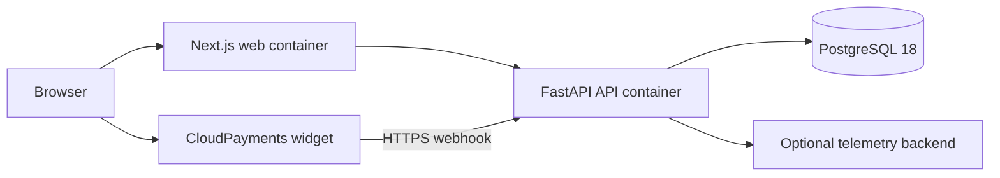

# Deployment Architecture

Status: authoritative current deployment plus target contour isolation
Last verified: 2026-08-18

## Current `ru` deployment

```mermaid
flowchart LR
  Browser["Browser"] --> Web["Next.js web container"]
  Web --> API["FastAPI API container"]
  API --> DB[("PostgreSQL 18")]
  Browser --> CP["CloudPayments widget"]
  CP -->|"HTTPS webhook"| API
  API --> OTEL["Optional telemetry backend"]
```

Production Compose builds web and API images, applies Alembic migrations before
API startup, exposes web and API ports, and keeps PostgreSQL internal. Production
must provide HTTPS termination, `ru` data residency, backups, secret storage,
and monitoring outside this repository's local Compose assumptions.

## Target contour deployments

Each production contour is its own data plane: web, API, PostgreSQL, provider
credentials, and webhook endpoints. A `ru` instance does not serve `eu` or `us`.
No user or payment data may be silently replicated between contour data planes.

Region Resolver is deployed separately. It is not part of this Compose stack.
This portal may later receive the resolver origin as instance configuration.
Provider webhooks continue to hit the contour API directly.

The first-install schema can physically hold more than one `regions` row. That
does not authorize one production database to operate as two contours.

## Local worktree deployment

`scripts/repo.py` creates a Compose project name and ports derived from the Git
worktree. PostgreSQL, web, API, and the optional observability service are scoped
to that project. No fixed container names are permitted in development Compose.

## Future Platform Kernel connection

Platform Kernel is a separately deployed service and repository in the **same**
contour. Future calls will use verified contour identity and the Payment Portal
access API described by ANY-71. This repository must not copy Platform Kernel
runtime tables or store its artifacts and usage events.
