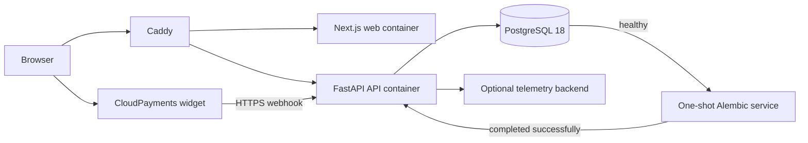

# Deployment Architecture

Status: authoritative current deployment
Last verified: 2026-08-17

## Current RU deployment

```mermaid
flowchart LR
  Browser["Browser"] --> Caddy["Caddy"]
  Caddy --> Web["Next.js web container"]
  Caddy --> API["FastAPI API container"]
  DB[("PostgreSQL 18")] -->|"healthy"| Migrate["One-shot Alembic service"]
  Migrate -->|"completed successfully"| API
  API --> DB
  Browser --> CP["CloudPayments widget"]
  CP -->|"HTTPS webhook"| API
  API --> OTEL["Optional telemetry backend"]
```

Production Compose builds web and API images and runs Alembic through a
one-shot `migrate` service after PostgreSQL becomes healthy. The API depends on
successful migration completion and its container command starts only Uvicorn;
a failed migration therefore blocks API startup. Only Caddy publishes host
ports, while PostgreSQL, API, and web remain internal. Production must provide
HTTPS termination, Russian data residency, backups, secret storage, and
monitoring outside this repository's local Compose assumptions.

`GET /api/health/live` reports only whether the API process can serve HTTP and
does not access PostgreSQL. `GET /api/health/ready` runs `SELECT 1` and returns
HTTP 503 with `{"status":"not_ready"}` when PostgreSQL is unavailable, without
returning database or exception details. Docker uses readiness for API health.
Caddy's `/api/*` proxy exposes both canonical health endpoints for external
monitoring such as HetrixTools. `/health`, `/health/live`, and `/health/ready`
remain available as compatibility routes.

## Local worktree deployment

`scripts/repo.py` creates a Compose project name and ports derived from the Git
worktree. PostgreSQL, the one-shot migration service, web, API, and the optional
observability service are scoped to that project. No fixed container names are
permitted in development Compose.

## Future Platform Kernel connection

Platform Kernel is a separately deployed service and repository. Future calls
will use verified regional identity and the Payment Portal access API described
by ANY-71. This repository must not copy Platform Kernel runtime tables or store
its artifacts and usage events.

No user or payment data may be silently replicated between regional data planes.
