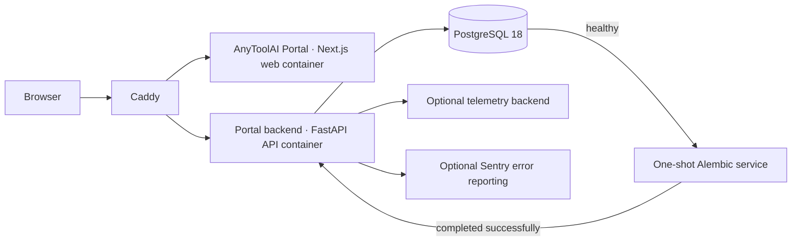

# Deployment Architecture

Status: authoritative current deployment plus target contour isolation
Last source review: 2026-11-10; deployment acceptance remains separate.

## Current `ru` deployment

The AnyToolAI Portal remains pre-production. This topology is the supported
deployment composition, not evidence of a launched billing service. Its web
entry combines public product discovery and the account/auth cabinet.


```mermaid
flowchart LR
  Browser["Browser"] --> Caddy["Caddy"]
  Caddy --> Web["AnyToolAI Portal · Next.js web container"]
  Caddy --> API["Portal backend · FastAPI API container"]
  DB[("PostgreSQL 18")] -->|"healthy"| Migrate["One-shot Alembic service"]
  Migrate -->|"completed successfully"| API
  API --> DB
  API --> OTEL["Optional telemetry backend"]
  API --> Sentry["Optional Sentry error reporting"]
```

Production Compose builds web and API images and runs Alembic through a
one-shot `migrate` service after PostgreSQL becomes healthy. The API depends on
successful migration completion and its container command starts only Uvicorn;
a failed migration therefore blocks API startup. Only Caddy publishes host
ports, while PostgreSQL, API, and web remain internal. Production must provide
HTTPS termination, `ru` data residency, backups, secret storage, and
monitoring outside this repository's local Compose assumptions.

Both the API and migration service require explicit `INSTANCE_TENANT_ID` and
`INSTANCE_REGION` production environment values. `docker-compose.prod.yml`
fails interpolation when either is absent. The settings are normalized to
lowercase and are the implemented server authority for registration, login,
password reset, required legal-document discovery, authenticated session
scope, and legal writes. They are descriptive deployment identity, not
caller-selectable routing inputs. Local repository defaults are explicitly
`anytoolai` / `ru`; production has no silent contour default. The current
bootstrap and legal source support exactly `anytoolai` / `ru`. Settings,
Alembic bootstrap, and runtime legal seeding fail before successful startup or
bootstrap when a different tenant/region pair is configured. Enabling another
scope requires its dedicated contour/legal enablement ticket; the current
deployment variables are not a generic contour bootstrap selector.

The direct-provider and CloudPayments runtime has been physically removed.
The API implements configured External Billing source reads, purchase/Widget
flows, embedded polling/recovery and local paid projection/cabinet reads. Its
worker runs inside the API process; there is no separate worker service.
Production source conformance, metered vocabulary and launch retain their
acceptance gates. ANY-766 implements consumer-scoped snapshot V3, delegation V2, durable
recipient delivery, browser launch and usage integration. Step 16 verifies the
main local HTTP/browser journeys with explicitly labelled external substitutes. Remote installation/live acceptance belong to
ANY-767. Configuration and resource limits are in the
[billing runbook](../engineering/ANY-709-billing-runbook.md#connection-and-deployment)
and [worker operations guide](../engineering/billing-background-operations.md#embedded-worker-settings-and-resource-limits).

Production exposes optional `SENTRY_DSN` and `SENTRY_RELEASE` values to the
shared API/migration environment. An empty DSN keeps Sentry disabled; when a
production deployment supplies a DSN, it must use HTTPS and must also supply
the immutable release identifier through `SENTRY_RELEASE`. `APP_ENV` remains
the Sentry environment source and `OTEL_SERVICE_NAME` remains the
service-identity source. The repository does not hardcode a DSN, discover
releases from container git state, or expose separate Sentry enablement,
environment, service, sampling, debug, Spotlight, metrics, or logging switches.

Sentry is an optional outbound backend application-error destination, separate
from the optional OTLP telemetry backend. It does not own or receive tracing,
application logs, metrics, or profiling, and it does not replace persisted
database state as business truth. Project-side data scrubbing, disabled or
policy-compliant IP collection, and notifications for new or regressed
production issues are operator-managed settings; this repository does not
automate Sentry project management or broad monitoring owned by ANY-86.

`GET /api/health/live` reports only whether the API process can serve HTTP and
does not access PostgreSQL. `GET /api/health/ready` runs `SELECT 1` and returns
HTTP 503 with `{"status":"not_ready"}` when PostgreSQL is unavailable, without
returning database or exception details. Docker uses readiness for API health.
Caddy's `/api/*` proxy exposes both canonical health endpoints for external
monitoring such as HetrixTools. The supported health surface is limited to
these two endpoints; `/health`, `/health/live`, and `/health/ready` are removed
and return HTTP 404.

## Target contour deployments

Each production contour is its own data plane: web, API, PostgreSQL and configured
External Billing credentials and objects. A `ru` instance
does not serve `eu` or `us`. No user or payment data may be silently replicated
between contour data planes.

Region Resolver is deployed separately. It is not part of this Compose stack.
This portal may later receive the resolver origin as instance configuration.
The conceptual user-facing destination is the AnyToolAI Portal for the selected
contour, with Platform Kernel as a separate API/service boundary; no separate
Application Portal peer frontend is required. The Resolver API schema remains
undefined, and this topology defines no response fields or client behavior.
The ANY-715 MVP build uses contour-local embedded polling and has no webhook
receiver. `/api/billing/lbx/webhook` returns 404; there are no receiver settings
to forward through Compose/harness. Keep polling enabled and use the
[polling-only operations guide](../engineering/billing-background-operations.md#polling-only-operation).
Retain existing receipt tables/history; this build does not process that inbox.

The clean baseline validates the configured scope and then bootstraps only the
currently supported `anytoolai` / `ru` contour and its RU country membership.
It never silently substitutes RU data for a different configured scope or
authorizes one production database to operate as two contours.

<a id="one-time-step-4-recreate-and-bootstrap"></a>

## One-time Step-4 recreate and current bootstrap

The Step-4 database is a destructive compatibility boundary. Pre-Step-4
application binaries must never run against it. A database stamped with any
discarded pre-Step-4 migration revision is recreated, not upgraded, downgraded,
stamped or bridged into the clean baseline. Image-only rollback across this boundary
is forbidden: rollback or recovery restores a matching application and
database baseline. Any reset, bootstrap, schema verification, or smoke failure
blocks rollout.

Retired post-Step-4 ANY-709 branch labels use the separately verified
[consolidation transition](../engineering/ANY-709-billing-runbook.md#consolidated-any-709-migration).
They must not be confused with discarded pre-Step-4 databases.

Before starting, identify the exact target application revision/image and
target environment, and record the pre-reset application/database pairing.
Stop every pre-Step-4 API, web, worker, and scheduler process that can access
the database and verify that it cannot restart against the clean database.

For the repository-managed local harness, read `worktree_id` from
`.harness/runtime.json` or from the JSON previously printed by
`python scripts/repo.py up`, then run exactly:

```bash
python scripts/repo.py reset --confirm <worktree_id>
python scripts/repo.py test-db up
python scripts/repo.py migrate-api
```

`reset` executes the harness-scoped Compose
`down --volumes --remove-orphans`; it is the supported destructive local reset.
`test-db up` starts only PostgreSQL. `migrate-api` applies `alembic upgrade head`
to that harness database.

The clean baseline migration owns schema creation and configured-contour/legal
bootstrap; subsequent revisions apply through the same `upgrade head`. The
[schema reference](payment-portal-data-model.md#physical-baseline) owns the
current migration chain and table inventory. Do not create a separate
bootstrap CLI. Before starting normal runtime on a fresh database, verify:

- Alembic reports one head and the database is at that head;
- the current head is `20261111_0011` and exactly 29 application tables exist;
- every removed legacy catalog/order/payment/provider/subscription/
  entitlement/trial table is absent;
- all seventeen billing/link/purchase tables are empty before explicit flows;
- only the configured contour/country state is present;
- the expected legal entity and six current legal document rows match the
  canonical legal source.

The [Step 10 consumer cutover](../contracts/product-backend-api/README.md#implemented-step-10-settings-and-cutover)
requires the updated Portal/Kernel/browser together. Migration 0009 preserves
retained delegation credentials; API startup installs the configured P/digest
guard. Old Kernel-only identity binaries are not a supported rollback.

After verification succeeds, start only the matching application stack:

```bash
python scripts/repo.py up --reuse
```

The Compose `migrate` service runs the same `alembic upgrade head` before API
startup. The API legal seed remains an idempotent, fail-closed runtime check of
canonical legal material, not a second schema authority. Run retained
provider-independent registration, login, session, password-recovery, and
legal smoke checks.

For shared dev/test/pre-production environments, operators must use that
environment's authoritative process-stop and database destroy/recreate
mechanisms. This repository has no canonical shared-environment commands for
those actions, so the runbook does not fabricate them. The required order is
still: stop and fence old consumers; recreate the old-stamped database; apply
the current head/bootstrap from the matching build; perform the same
schema/bootstrap checks; start only the matching runtime; run the
provider-independent auth/legal smoke suite.

On any failure, keep rollout blocked. Recovery restores or recreates a matching
application+database pair. Never roll back only the image while preserving the
Step-4 database.

## Reviewed image installation (ANY-766 Step 17)

The optional `deploy/compose.images.yml` removes application build contexts and
selects `PORTAL_API_IMAGE` (also used by `migrate`) and `PORTAL_WEB_IMAGE` from the
operator's environment file. Use immutable registry digests after publication,
or unique reviewed version tags already present locally; `latest` and untagged
references are refused by `scripts/repo.py image-up`. The override never pulls.
The existing source-build Compose path remains available. These Linux commands
require a matching reviewed control checkout and Docker Compose supporting
`!reset`. No portable installer or additional release service is used.

`.github/workflows/publish-images.yml` is manually dispatched with `backend`,
`frontend` or `all`. Its default is build only; `publish=true` is a separately
authorized post-review GHCR action. Backend builds do not require frontend inputs.
Frontend builds require `APP_PUBLIC_BASE_URL`, `NEXT_PUBLIC_API_BASE_URL` and the
optional public `NEXT_PUBLIC_SENTRY_DSN`; runtime environment changes do not
rewrite the browser bundle. Frontend image tags include the workflow run ID so
builds with different origins cannot silently share a source-only tag.
Never send backend consumer credentials as build arguments.

Prepare a private environment file from `.env.production.example`, with actual
scope, DB, browser origins and consumer credentials, plus the selected image refs.
Retain the existing Compose project/volume names on updates. An operator creates
one private directory and shared lock path for all control checkouts. After
review and explicit installation authorization, parameterized commands are:

```bash
ENV_FILE=/operator/portal/images.env
PROJECT=payments-portal-prod
LOCK=/operator/portal/locks/deployment.lock
# Pull only the reviewed digests, with separately authorized registry access.
# docker pull "$PORTAL_API_IMAGE"
# docker pull "$PORTAL_WEB_IMAGE"
./.venv/bin/python scripts/repo.py image-up --env-file "$ENV_FILE" \
  --project "$PROJECT" --lock-file "$LOCK"
# Frontend-only: existing compatible backend, migration and volumes are untouched.
./.venv/bin/python scripts/repo.py image-up --env-file "$ENV_FILE" \
  --project "$PROJECT" --lock-file "$LOCK" --frontend-only
# Existing ingress is operator-owned; on first installation start it separately.
docker compose --project-name "$PROJECT" --env-file "$ENV_FILE" \
  -f docker-compose.prod.yml -f deploy/compose.images.yml \
  up -d --no-deps --no-build --pull never caddy
```

`image-up` holds the deployment lock throughout: stop the API (including its
embedded worker), wait for retained PostgreSQL, run a fresh migration container
from the selected backend image, then start API only after migration success and
readiness, followed by web. The default API stop grace is 75 seconds for the
default 60-second worker I/O budget; increase `PORTAL_API_STOP_GRACE_PERIOD` if
raising that budget, retaining time for cleanup. PostgreSQL readiness uses TCP
and a cold-initialization start period. A migration failure leaves the old API stopped; do
not restart it to bypass the failure. No command deletes volumes. Close public
ingress and disable all other producers/automation for the whole maintenance
window; the per-command lock does not replace that operational ownership. Take
and verify separate application/database backups before updating retained data.
Use the existing backup/recovery procedure and matching reader+database pair;
never repair failure by downgrading, stamping or rewriting purchase history.

### Paired compatibility and synchronized cutover

The concrete supported pair is the current ANY-766 Portal and Kernel reader set:
Portal migration head `20261111_0011`, Kernel head `0021`, consumer identity V2,
AccessSnapshot V3, manifest/invalidation/usage/exhaustion V1. Source baselines are
Portal `0b1cbfa310c02aee182a75aaf7608fc587266a67` and Kernel
`88da001f0595a4bc8e4729423acd2340bf7b73ca`, plus the reviewed Step 17 diff.
Record final reviewed source SHAs, actual image IDs/digests and all frontend
build inputs with the selected environment. Equal source labels or Alembic heads
alone do not establish application/peer compatibility.

The Portal reader floor includes the ANY-765 selected-consent digest fix and
ANY-766 Step 11: new product-link-v4 / purchased-technical-terms:v3 /
accepted-purchase:v4 histories require these readers even if the migration head
has not changed. Pre-selected-digest readers and pre-Step-11 readers are excluded.
No image-only rollback to them is supported. Historical documents/digests,
allowance IDs and quantities remain unchanged. The old Kernel-only delegation
API and snapshot V2 binaries are also excluded; there is no rolling mixed-wire
mode for this cutover.

Before installing this pair over the Step 8 baseline:

1. Close both ingress paths and stop Portal API/embedded workers and all extra
   producers. Use the running Kernel revision's `prod-quiesce` to stop admission,
   drain every `created/running` job, then stop workers. A failed drain keeps the
   worker running and blocks migration. Verify backups of both independent DBs.
2. Configure all consumers, source/owner mappings, directional credentials,
   fixed callbacks, allowed products and monotonic policy versions together.
   Preserve the existing Kernel audience and identity; never transfer retained
   allowance ownership by changing configuration. Enable Kernel invalidation and
   usage receiver permissions before enabling Portal delivery.
3. While both old application sets remain stopped, run Portal's selected
   `migrate` image through head `20261111_0011`: 0009 binds retained delegations
   and policy scope; 0010 partitions recipient/outbox/work keys and retires stale
   claims; 0011 adds exhaustion deduplication. Configure consumers before first
   API startup installs/verifies P/digest and recipient state. Do not run an old
   worker against migrated delivery keys.
4. Use the selected Kernel images and its existing runner through head `0021`:
   `0020` retains R floors and usage/reservations while clearing incompatible
   cache metadata and initializing consumer/P; `0021` adds durable exhaustion.
   Require profile generation, matching source checks, readiness and activation
   as documented in the Kernel deployment runbook. Retain both DB volumes.
5. Start the matching Portal API/web with `image-up`, verify auth/access and
   independent recipient recovery, then reopen ingress only after the approved
   acceptance. Browser identity V1 requires fresh delegation; preserve same-owner
   pending frozen starts and keys. Policy-only changes advance P, never reset R
   or usage. Restore a matching verified backup pair on incompatible rollback.

Local Linux builds on 2026-11-11 used Docker Engine 28.1.1 / Compose 2.35.1.
The selected pre-review images have no registry digest; their actual local IDs are:

- `any766-step17/portal-api:local` — `sha256:50a2e49078d1c1d4689a4178b67799669eaefa2e0cba493108f506e2ae7450fe`.
- `any766-step17/portal-web:install-verified` — `sha256:b369e48d7c2943603d7d3f7eb428baeaa6c06a002365453d62b048ca354f4bfe`.

Backend target: `apps/api/Dockerfile`, `production`, using its checked-in lock.
Web target: `apps/web/Dockerfile`, `runtime`; build inputs were
`APP_PUBLIC_BASE_URL=https://portal.step17.example.test`,
`NEXT_PUBLIC_API_BASE_URL=https://api.step17.example.test`, empty public Sentry DSN.
These reserved test names are configuration inputs; no public DNS/TLS installation
is claimed. Runtime probes use container HTTP. Source labels carry the baseline
SHA above with `-step17-local`; the controller includes the local Step 17 working
diff. Rebuild and record the final reviewed source/digests after review.
Shell variables override Compose env-file values; clear stale deployment inputs
before selecting an environment.

The disposable image rehearsal passed initial installation, production web HTTP
and compiled-origin checks, frontend-only replacement without changing backend/DB
container identities, backend/container recreation with retained synthetic user
and usage state, and current heads `20261111_0011` / `0021`. Both real non-root
Kernel backend users could read the activation marker. An intentionally failing
forward migration in each application's fixture image kept admission closed;
recovery with the selected good images retained data and Kernel's prior
profile/activation state. All nine cases passed; only run-owned containers,
networks and volumes were removed. This packaging rehearsal uses synthetic data
and reuses Step 16's paid HTTP/browser proof for unchanged runtime sources.

Registry publication, remote installation, live LBX/SMTP/provider and the full
real-service journey remain ANY-767 acceptance; Step 16's focused local proof is
reused where runtime sources are unchanged.

## Local worktree deployment

`scripts/repo.py` creates a Compose project name and ports derived from the Git
worktree. PostgreSQL, the one-shot migration service, web, API, and the optional
observability service are scoped to that project. No fixed container names are
permitted in development Compose.

## Platform Kernel connection

Platform Kernel is a separately deployed service and repository in the **same**
contour. Portal reads its configured Capability Manifest endpoint and serves
authenticated consumer-scoped snapshot V3. Its embedded worker sends invalidations through the
same Portal → Kernel connection automatically when enabled; configure the
Kernel receiver permission before starting the sender. See
[delivery startup and recovery](../engineering/billing-background-operations.md#any-766-step-7--durable-kernel-invalidations).
Focused paired local acceptance passed in ANY-766 Step 16. Follow the
[pinned implementation map](../integrations/platform-kernel.md) and the boundary
defined by [ADR 0005](decisions/0005-external-billing-boundary.md) and the accepted
[Portal <-> Kernel Access Contract Design](../superpowers/specs/2026-09-15-portal-kernel-access-contract-design.md).
This repository must not copy Platform Kernel runtime tables or store its
artifacts and usage events.
