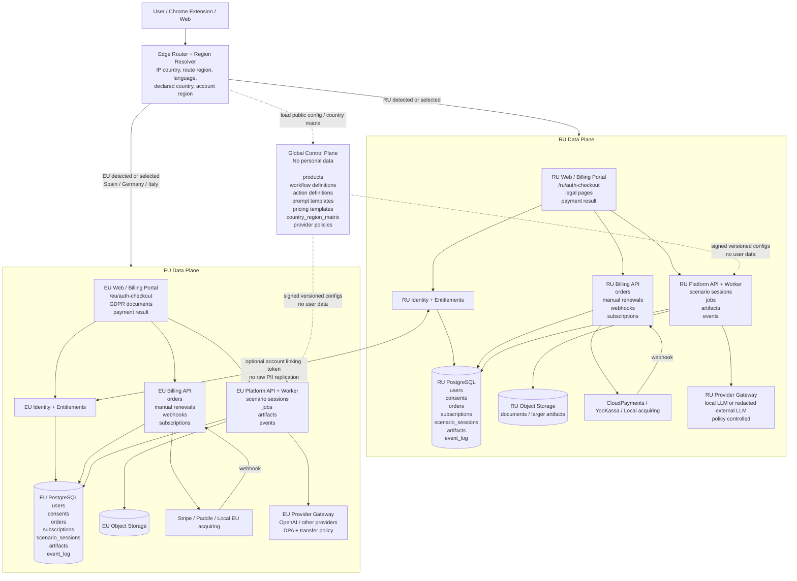
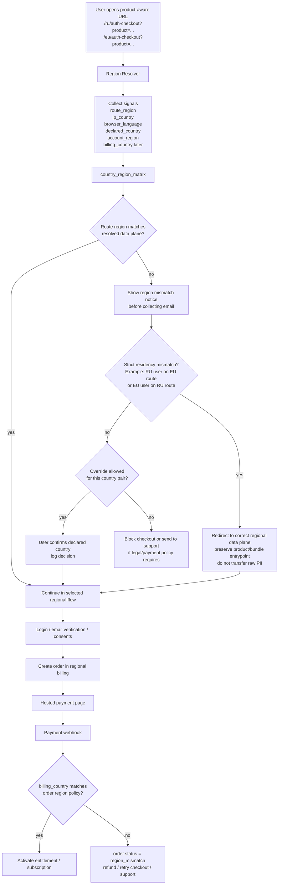

# Deployment diagram: AnytoolAI Platform + Billing Portal

## Рекомендуемая схема

Платформа и биллинг остаются единым продуктовым решением, но деплоятся по региональным контурам. Общий `Global Control Plane` не хранит ПДн и управляет только конфигурациями, продуктами, workflow, prompts, pricing templates и country matrix. Все пользовательские данные, artifacts, платежи, согласия, события и LLM-вызовы обрабатываются внутри соответствующего `Regional Data Plane`.

В этом репозитории сейчас реализован только RU Billing Portal MVP:
[apps/web](../../apps/web/), [apps/api](../../apps/api/),
[docker-compose.yml](../../docker-compose.yml), [docker-compose.prod.yml](../../docker-compose.prod.yml).
RU web/API entrypoints: [apps/web/src/app/ru](../../apps/web/src/app/ru/),
[auth.py](../../apps/api/app/auth.py), [cloudpayments.py](../../apps/api/app/cloudpayments.py).

## Логика выбора контура

## Ключевые правила

- `Global Control Plane` не хранит пользователей, email, artifacts, переписки, документы, платежи, consent logs или event logs.
- В каждом региональном контуре вместе деплоятся `platform runtime`, `billing`, `identity`, `entitlements`, региональная БД и object storage.
- `Billing Portal` и `Platform Runtime` остаются разными bounded contexts, но используют один региональный `identity/entitlements` слой.
- `Provider Gateway` вызывается только из регионального data plane и применяет региональную LLM-политику.
- Для России контур должен быть самым строгим: отдельный data plane, отдельные документы, отдельные платежные провайдеры, осторожная политика по внешним LLM.
- Для Испании, Германии и Италии достаточно одного EU data plane.
- США, Канада и другие рынки не входят в эту версию диаграммы. Их можно добавить позже как новые `Regional Data Plane` без изменения базовой модели.
- Если пользователь пришел в неправильный регион, нельзя молча собирать ПДн и потом решать проблему. Сначала выбирается корректный региональный контур, потом идет login/checkout.
