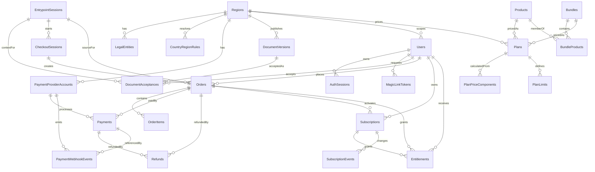

# ANY-71: модель данных Payment Portal

Версия: 0.2  
Дата: 2026-07-05  
Статус: draft для обсуждения  

## 0. Зафиксированные решения

Решения после обсуждений 2026-07-04 - 2026-07-05:

- База данных: PostgreSQL.
- До production модель можно менять без backward-compatible миграций.
- Для новых production domain tables используем `uuid` primary keys.
- Связка аккаунтов между регионами не нужна: RU и EU аккаунты независимые.
- EU-контур продает через Merchant of Record.
- Для RU/EU на текущем этапе достаточно `order_items`; отдельные fiscal receipt / CloudKassir tables откладываются.
- Platform Kernel на первом этапе проверяет доступ синхронно через Payment Portal API; локальный entitlement cache не входит в первую модель.
- Trial делаем как `subscription + entitlement` без `order/payment`.
- Bundle/all-access делаем как самостоятельные sellable plans с собственной ценой. Цена рассчитывается из состава продуктов и дополнительной скидки, но финальная цена фиксируется в `plans` и snapshot-ится в `order_items`.
- Фактические продукты в текущем коде Payment Portal: `document-summary` и `prompt-optimizer`.
- Таблица `users` хранится в региональной БД Payment Portal / Identity слоя. Platform Kernel не хранит raw user profile, а использует `region + user_id` из проверенного auth token.
- Payment Portal хранит плановые лимиты доступа в `plan_limits`, а Platform Kernel хранит фактическое usage/consumption, потому что именно он запускает сценарии.
- Модель подписок должна поддерживать оба режима продления: `manual` и `auto`. Ручное продление — допустимый launch-mode, если recurring-платежи/согласия еще не готовы, но не целевая архитектурная обязанность.

## 1. Назначение модели

Payment Portal должен стать доменным контуром для аккаунта, юридических согласий, заказов, платежей, подписок и entitlement-доступа к продуктам AnytoolAI.

Модель должна соединяться с Platform Kernel, но не дублировать его runtime-таблицы. Platform Kernel владеет `scenario_sessions`, `jobs`, `action_runs`, `provider_calls`, `artifacts`, `event_log`, `guest_quota_usage`, `product_handoffs`. Payment Portal владеет `users`, `legal`, `catalog`, `orders`, `payments`, `subscriptions`, `entitlements`, `webhook_events`.

Критичное правило: artifacts и scenario runtime могут содержать ПДн и коммерческие данные, поэтому Payment Portal не должен становиться единственным "privacy perimeter". Региональный контур должен применяться и к billing, и к platform runtime.

Текущие файлы реализации, от которых отталкивается план реализации:
[models.py](../../apps/api/app/models.py),
[auth.py](../../apps/api/app/auth.py),
[cloudpayments.py](../../apps/api/app/cloudpayments.py),
[database.py](../../apps/api/app/database.py),
[alembic versions](../../apps/api/alembic/versions/),
[test_api.py](../../apps/api/tests/test_api.py).
Текущий web catalog snapshot находится в
[catalog.ts](../../apps/web/src/lib/catalog.ts), legal document registry - в
[legal.ts](../../apps/web/src/lib/legal.ts).

## 2. Базовые решения

### 2.1 Региональная модель

Для текущей архитектуры закладываем два региона:

- `ru` — российский контур.
- `eu` — европейский контур для Spain / Germany / Italy.

Модель должна позволять позже добавить другие регионы без перепроектирования таблиц.

Каждая таблица, где есть пользовательские, юридические, платежные или entitlement-данные, должна иметь:

- `tenant_id`
- `region`

Для MVP значения могут быть:

```text
tenant_id = "anytoolai"
region = "ru"
```

### 2.2 Аккаунты по регионам

Так как допустимо, что аккаунт пользователя разный для разных регионов, email не должен быть глобально уникальным. Уникальность должна быть:

```text
unique(tenant_id, region, email_normalized)
```

Связка аккаунтов между регионами не входит в модель. RU и EU аккаунты считаются независимыми.

### 2.3 UUID vs bigint

Для production-модели используем `uuid` как primary key для публичных и cross-service сущностей:

- `users`
- `orders`
- `payments`
- `subscriptions`
- `entitlements`
- `entrypoint_sessions`
- `document_acceptances`

Причина выбора:

- данные еще не задеплоены, поэтому можно выбрать целевую модель сразу;
- сущности будут проходить между Payment Portal, Platform Kernel, web, CE/mobile и платежными провайдерами;
- UUID безопаснее отдавать наружу, чем последовательный bigint;
- UUID лучше переживает будущую декомпозицию сервисов и регионов.

Если runtime поддерживает UUIDv7, лучше использовать UUIDv7 из приложения из-за лучшей locality в индексах. Если нет — достаточно PostgreSQL `uuid` + `gen_random_uuid()` / app-generated UUIDv4.

Последовательные `bigint` можно оставить только для чисто внутренних append-only логов, но для простоты первой production-модели все новые domain tables проектируются на UUID.

### 2.4 Enum-поля

На старте лучше использовать `text` + CHECK constraints или application-level enum, а не PostgreSQL enum. Статусы платежей и подписок будут меняться после подключения CloudPayments / Stripe / Paddle / YooKassa, а PG enum сложнее эволюционировать миграциями.

## 3. Границы с Platform Kernel

Payment Portal не должен знать продуктовую domain-семантику Freelancer Suite. Он должен работать с платформенными идентификаторами:

- `product_id` / `product_code`
- `frontend_id`
- `scenario_id`
- `scenario_session_id`
- `artifact_id`
- `bundle_id`
- `all_access`

Payment Portal отвечает на вопрос:

```text
Есть ли у user_id активный доступ к product_id / bundle_id / all_access в region?
```

Platform Kernel отвечает на вопрос:

```text
Как запустить scenario, workflow и action chain, если доступ есть?
```

## 4. ERD

В Mermaid ERD используются PascalCase entity IDs, потому что часть VS Code preview renderers нестабильно отображает `erDiagram` со `snake_case` identifiers. Реальные имена таблиц остаются в разделе 6.



## 5. Таблицы первой production-модели

Минимальный production-ready слой после текущей первой версии:

```text
regions
country_region_rules
legal_entities
users
auth_sessions
magic_link_tokens
products
bundles
bundle_products
plans
plan_price_components
plan_limits
document_versions
document_acceptances
entrypoint_sessions
checkout_sessions
orders
order_items
payments
refunds
subscriptions
entitlements
subscription_events
payment_provider_accounts
payment_webhook_events
```

Можно отложить:

```text
local entitlement cache
fiscal receipt tables
coupon_codes / discounts
credit_balance / wallet / ledger_entries
admin_users / audit_admin_actions
provider_reconciliation_runs
subscription_schedules
```

Локальный entitlement cache не входит в первую модель. На первом этапе Platform Kernel проверяет доступ синхронно через Payment Portal API.

## 6. Таблицы и поля

Ниже указаны доменные поля таблиц. Общие технические поля не повторяются в каждой таблице, но должны быть добавлены при реализации DDL/Alembic schema по правилу ниже.

### 6.0 Common technical fields

Для обычных mutable tables:

| Поле | Тип | Комментарий |
|---|---|---|
| `created_at` | timestamptz | `not null default now()` |
| `updated_at` | timestamptz | `not null default now()`, обновляется приложением или DB trigger |

Для append-only / audit / event tables:

| Поле | Тип | Комментарий |
|---|---|---|
| `created_at` | timestamptz | `not null default now()` |

Append-only / audit / event tables в этой модели:

- `document_acceptances`
- `subscription_events`
- `payment_webhook_events`

Таблицы с доменным временем события могут иметь дополнительное поле времени, например `accepted_at`, `occurred_at`, `received_at`, `processed_at`. Это не заменяет `created_at`, если таблица не использует уже существующее событие-время как физический created timestamp.

Исключения:

- `payment_webhook_events` уже имеет `received_at`; его можно использовать как физический timestamp поступления события вместо отдельного `created_at`, чтобы не дублировать одно и то же значение.
- Join table `bundle_products` может обойтись без `updated_at`, если изменения состава bundle делаются через `included_from` / `included_until`.

### 6.1 `regions`

Назначение: список региональных контуров.

| Поле | Тип | Комментарий |
|---|---|---|
| `code` | text PK | `ru`, `eu` |
| `name` | text | Human-readable name |
| `residency_zone` | text | `russia`, `eu_eea` |
| `default_currency` | char(3) | `RUB`, `EUR` |
| `default_locale` | text | `ru-RU`, `en-EU` |
| `status` | text | `active`, `disabled` |

### 6.2 `country_region_rules`

Назначение: country matrix для region resolver.

| Поле | Тип | Комментарий |
|---|---|---|
| `id` | uuid PK | |
| `country_code` | char(2) | ISO country, например `RU`, `ES`, `DE`, `IT` |
| `region` | text FK -> regions.code | |
| `market_enabled` | boolean | Можно ли продавать в страну |
| `allow_region_override` | boolean | Можно ли пользователю выбрать другой контур |
| `strict_mismatch` | boolean | Нужно ли блокировать checkout при mismatch |
| `default_document_set` | text | Например `ru_ip_v1`, `eu_gdpr_v1` |
| `default_payment_provider` | text | `cloudpayments`, `stripe`, `paddle` |

Индексы:

- `unique(country_code)`
- `index(region, market_enabled)`

### 6.3 `legal_entities`

Назначение: юрлица / ИП, от имени которых продается доступ.

| Поле | Тип | Комментарий |
|---|---|---|
| `id` | uuid PK | |
| `tenant_id` | text | `anytoolai` |
| `region` | text FK | |
| `name` | text | Юрназвание / ФИО ИП |
| `entity_type` | text | `individual_entrepreneur`, `company`, `merchant_of_record` |
| `tax_id` | text nullable | ИНН / VAT / local tax id |
| `registration_id` | text nullable | ОГРНИП / company number |
| `legal_address` | text |
| `support_email` | text |
| `status` | text | `active`, `archived` |

Для EU-контура на текущем этапе ожидается `entity_type = 'merchant_of_record'`. Это значит, что часть платежной/налоговой логики будет зависеть от Paddle/аналогичного MoR-провайдера, но AnytoolAI все равно должен хранить собственные documents/consents/access records.

Индексы:

- `index(tenant_id, region, status)`

### 6.4 `users`

Назначение: региональный пользовательский аккаунт.

| Поле | Тип | Комментарий |
|---|---|---|
| `id` | uuid PK | |
| `tenant_id` | text | |
| `region` | text FK | Аккаунт привязан к региону |
| `email` | varchar(320) | Original email |
| `email_normalized` | varchar(320) | Lowercase/normalized for uniqueness |
| `email_verified_at` | timestamptz nullable | |
| `status` | text | `active`, `blocked`, `deleted_pending`, `deleted` |
| `last_login_at` | timestamptz nullable | |
| `metadata` | jsonb | Safe extension point |

Индексы:

- `unique(tenant_id, region, email_normalized)`
- `index(region, status)`
- `index(email_normalized)` only if needed for support search in the same data plane

Миграция от текущей таблицы:

- добавить `tenant_id`, `region`, `email_normalized`, `email_verified_at`, `status`;
- заменить `unique(email)` на `unique(tenant_id, region, email_normalized)`;
- решить, нужен ли `password_hash`: текущий продукт описан через magic link, поэтому пароль лучше вынести в отдельный auth credentials слой или сделать nullable.

### 6.5 `auth_sessions`

Назначение: login sessions.

| Поле | Тип | Комментарий |
|---|---|---|
| `id` | uuid PK | |
| `tenant_id` | text | |
| `region` | text FK | |
| `user_id` | uuid FK -> users.id | |
| `token_hash` | text | Не хранить raw token |
| `created_at` | timestamptz | |
| `expires_at` | timestamptz | |
| `last_seen_at` | timestamptz | |
| `revoked_at` | timestamptz nullable | |
| `ip` | inet nullable | |
| `user_agent` | text nullable | |

Индексы:

- `unique(token_hash)`
- `index(user_id, expires_at)`

### 6.6 `magic_link_tokens`

Назначение: одноразовые login/verify tokens.

| Поле | Тип | Комментарий |
|---|---|---|
| `id` | uuid PK | |
| `tenant_id` | text | |
| `region` | text FK | |
| `email_normalized` | varchar(320) | |
| `token_hash` | text | |
| `purpose` | text | `login`, `verify_email` |
| `entrypoint_session_id` | uuid nullable | Контекст, откуда запросили вход |
| `created_at` | timestamptz | |
| `expires_at` | timestamptz | |
| `used_at` | timestamptz nullable | |
| `ip` | inet nullable | |
| `user_agent` | text nullable | |

Индексы:

- `unique(token_hash)`
- `index(tenant_id, region, email_normalized, created_at)`

### 6.7 `products`

Назначение: billing-visible каталог продуктов. Детальные workflow/scenario definitions остаются в Platform Kernel configs.

| Поле | Тип | Комментарий |
|---|---|---|
| `id` | uuid PK | |
| `tenant_id` | text | |
| `code` | text | `document-summary`, `prompt-optimizer`, future product codes |
| `platform_product_id` | text | ID в Platform Kernel configs |
| `name` | text | |
| `product_kind` | text | `chrome_extension`, `mobile_service`, `web_service` |
| `status` | text | `draft`, `active`, `archived` |
| `metadata` | jsonb | |

Индексы:

- `unique(tenant_id, code)`
- `index(status)`

Текущий snapshot из кода Payment Portal:

```text
document-summary:
  name: Document Summary
  product_kind: chrome_extension
  plan_code: document-summary-pro
  price: 990 RUB / month
  trial_days: 7
  current_free_limit_ui: 3 summary в месяц

prompt-optimizer:
  name: Prompt Optimizer
  product_kind: chrome_extension
  plan_code: prompt-optimizer-pro
  price: 990 RUB / month
  trial_days: 7
  current_free_limit_ui: 50 оптимизаций в месяц
```

`current_free_limit_ui` отражает текущий текст в веб-каталоге
([catalog.ts](../../apps/web/src/lib/catalog.ts)). Источник правды для
guest/free usage counters остается Platform Kernel; в `plan_limits` нужно
хранить лимиты платных sellable plans.

### 6.8 `bundles`

Назначение: наборы продуктов, которые продаются как отдельный bundle plan.

| Поле | Тип | Комментарий |
|---|---|---|
| `id` | uuid PK | |
| `tenant_id` | text | |
| `code` | text | |
| `name` | text | |
| `bundle_type` | text | `scenario_bundle` |
| `status` | text | `draft`, `active`, `archived` |

Индексы:

- `unique(tenant_id, code)`

`all_access` не хранится как строка в `bundles`. Для него используется `plans.scope_type = 'all_access'` и `entitlements.scope_type = 'all_access'`.

### 6.9 `bundle_products`

Назначение: состав bundle. Для `all_access` эта таблица не используется.

| Поле | Тип | Комментарий |
|---|---|---|
| `bundle_id` | uuid FK -> bundles.id | |
| `product_id` | uuid FK -> products.id | |
| `included_from` | timestamptz | |
| `included_until` | timestamptz nullable | |

Ключи и индексы:

- `primary key(bundle_id, product_id)`
- `index(product_id)`

### 6.10 `plans`

Назначение: тарифы по регионам и scope.

| Поле | Тип | Комментарий |
|---|---|---|
| `id` | uuid PK | |
| `tenant_id` | text | |
| `region` | text FK | |
| `code` | text | `document-summary-pro`, `prompt-optimizer-pro`, etc. |
| `scope_type` | text | `product`, `bundle`, `all_access` |
| `product_id` | uuid nullable FK | Required if `scope_type=product` |
| `bundle_id` | uuid nullable FK | Required if `scope_type=bundle` |
| `period_unit` | text | `day`, `month`, `year`, `one_time` |
| `period_count` | int | `1` |
| `trial_days` | int | `0`, `7`, etc. |
| `pricing_model` | text | `fixed`, `computed_from_components` |
| `list_amount_minor` | int | Sum/base amount before discount |
| `discount_type` | text nullable | `percent`, `fixed_amount`, `none` |
| `discount_value` | numeric nullable | Percent or amount depending on `discount_type` |
| `discount_amount_minor` | int | Calculated discount |
| `price_amount_minor` | int | Store money in minor units |
| `currency` | char(3) | |
| `manual_renewal_enabled` | boolean | Plan can be renewed by a new checkout/payment |
| `auto_renewal_enabled` | boolean | Plan supports recurring billing with explicit consent |
| `status` | text | `draft`, `active`, `archived` |
| `provider_refs` | jsonb | Provider price/product ids if applicable |

Constraints:

- `price_amount_minor >= 0`
- `list_amount_minor >= price_amount_minor`
- `discount_amount_minor >= 0`
- exactly one of `product_id`, `bundle_id` depending on `scope_type`, except `all_access`

Индексы:

- `unique(tenant_id, region, code)`
- `index(region, status)`
- `index(product_id, region, status)`
- `index(bundle_id, region, status)`

Правила:

- Для обычного product plan можно использовать `pricing_model = 'fixed'`.
- Для bundle/all-access используем `pricing_model = 'computed_from_components'`.
- Расчет из продуктов делается при создании/обновлении plan, а не динамически при каждом checkout.
- `price_amount_minor` является финальной ценой, которую видит пользователь и которую передаем платежному провайдеру.
- `list_amount_minor`, `discount_*` и `plan_price_components` нужны для объяснимости цены и будущего пересчета.
- При изменении цен продуктов или состава bundle лучше создавать новую версию plan/code, а не переписывать историю уже оплаченных заказов. `order_items` всегда хранит snapshot.

### 6.11 `plan_price_components`

Назначение: прозрачный расчет цены bundle/all-access plan из отдельных product plans.

| Поле | Тип | Комментарий |
|---|---|---|
| `id` | uuid PK | |
| `plan_id` | uuid FK -> plans.id | Bundle/all-access plan |
| `component_plan_id` | uuid FK -> plans.id | Product plan, входящий в расчет |
| `component_product_id` | uuid nullable FK -> products.id | Snapshot helper |
| `component_bundle_id` | uuid nullable FK -> bundles.id | Если позже появятся nested bundles; в MVP лучше не использовать |
| `quantity` | int | Обычно `1` |
| `list_amount_minor` | int | Цена компонента до скидки |
| `currency` | char(3) | Должна совпадать с parent plan |
| `weight` | numeric nullable | Если нужно неравномерное распределение скидки |
| `metadata` | jsonb | |

Constraints:

- `quantity > 0`
- `list_amount_minor >= 0`
- для MVP запрещаем nested bundles application-level правилом: `component_bundle_id is null`

Индексы:

- `index(plan_id)`
- `index(component_plan_id)`
- `unique(plan_id, component_plan_id)`

Пример:

```text
Document Summary Pro = 99000 minor RUB
Prompt Optimizer Pro = 99000 minor RUB
Bundle list_amount_minor = 198000
Discount 20% = 39600
Bundle price_amount_minor = 158400
```

### 6.11a `plan_limits`

Назначение: лимиты использования, которые входят в конкретный sellable plan.

| Поле | Тип | Комментарий |
|---|---|---|
| `id` | uuid PK | |
| `plan_id` | uuid FK -> plans.id | |
| `metric_code` | text | Например `document_summary_runs`, `prompt_optimizations` |
| `limit_value` | int nullable | `null` означает unlimited |
| `period_unit` | text | `day`, `month`, `subscription_period` |
| `period_count` | int | Обычно `1` |
| `reset_policy` | text | `calendar_period`, `rolling_period`, `subscription_period` |
| `overage_policy` | text | `block`, `soft_limit`, `paywall` |
| `metadata` | jsonb | |

Индексы:

- `unique(plan_id, metric_code)`
- `index(metric_code)`

Правила:

- Payment Portal хранит только плановые лимиты: что куплено, на какой период и по какой политике превышения.
- Platform Kernel хранит фактическое потребление по метрикам, потому что именно он запускает scenario/action и может атомарно списывать usage.
- Для guest/free квот источник правды также Platform Kernel; Payment Portal начинает участвовать после login/trial/payment, когда появляется `user_id`, `subscription` и `entitlement`.

### 6.12 `document_versions`

Назначение: версионированные документы текущего региона.

| Поле | Тип | Комментарий |
|---|---|---|
| `id` | uuid PK | |
| `tenant_id` | text | |
| `region` | text FK | |
| `legal_entity_id` | uuid FK | |
| `doc_type` | text | `privacy`, `offer`, `cancellation`, `cookies`, `security`, `pd_consent`, `recurring_consent` |
| `version` | text | `2026-07-ru-v1` |
| `title` | text | |
| `url_path` | text | `/ru/privacy` |
| `content_hash` | text | Hash rendered/published text |
| `published_at` | timestamptz | |
| `effective_from` | timestamptz | |
| `is_active` | boolean | |
| `requires_acceptance` | boolean | |

Индексы:

- `unique(tenant_id, region, doc_type, version)`
- partial unique active: `unique(tenant_id, region, doc_type) where is_active = true`
- `index(region, is_active)`

### 6.13 `document_acceptances`

Назначение: неизменяемый audit log принятия документов и согласий.

| Поле | Тип | Комментарий |
|---|---|---|
| `id` | uuid PK | |
| `tenant_id` | text | |
| `region` | text FK | |
| `user_id` | uuid nullable FK -> users.id | Может быть null до создания аккаунта |
| `guest_id` | text nullable | ID из Platform Kernel / CE kit |
| `entrypoint_session_id` | uuid nullable FK | |
| `document_version_id` | uuid FK -> document_versions.id | |
| `doc_type` | text | Snapshot for easier queries |
| `version` | text | Snapshot |
| `acceptance_kind` | text | `privacy_consent`, `terms_acceptance`, `recurring_consent`, `cookies` |
| `accepted_at` | timestamptz | |
| `ip` | inet nullable | |
| `user_agent` | text nullable | |
| `acceptance_text_hash` | text | Hash text near checkbox |
| `entrypoint_type` | text nullable | `product`, `bundle`, `catalog`, `paywall`, `platform_scenario` |
| `entrypoint_value` | text nullable | Product/bundle/scenario code |
| `source_url` | text nullable | |
| `metadata` | jsonb | |

Правила:

- acceptance records append-only; не обновлять и не удалять обычной бизнес-логикой;
- при новой версии документа нужна новая acceptance;
- если нужно фиксировать отзыв согласия, добавить отдельную таблицу `document_revocations`, а не переписывать acceptance.

Индексы:

- `index(user_id, region, doc_type, accepted_at desc)`
- `index(document_version_id)`
- `index(entrypoint_session_id)`
- `index(region, doc_type, version)`

### 6.14 `entrypoint_sessions`

Назначение: product-aware входы из Chrome Extension / mobile / web / paywall.

| Поле | Тип | Комментарий |
|---|---|---|
| `id` | uuid PK | |
| `tenant_id` | text | |
| `route_region` | text | Что было в URL: `ru`, `eu` |
| `resolved_region` | text FK | Куда реально направили flow |
| `ip_country` | char(2) nullable | |
| `declared_country` | char(2) nullable | Выбор пользователя |
| `browser_language` | text nullable | |
| `region_mismatch_status` | text | `none`, `warned`, `overridden`, `redirected`, `blocked` |
| `entrypoint_type` | text | `product`, `bundle`, `catalog`, `paywall`, `platform_scenario` |
| `entrypoint_value` | text | Product/bundle/scenario code |
| `product_id` | uuid nullable FK | |
| `bundle_id` | uuid nullable FK | |
| `frontend_id` | text nullable | `document_summary_ce`, `prompt_optimizer_ce`, etc. |
| `platform_guest_id` | text nullable | From Platform Kernel guest identity |
| `platform_user_id` | text nullable | If separate platform identity exists |
| `scenario_session_id` | text nullable | If checkout came from quota/paywall inside scenario |
| `artifact_id` | text nullable | If checkout relates to a result artifact |
| `user_id` | uuid nullable FK | Set after login |
| `source_url` | text nullable | |
| `acquisition_source` | text nullable | |
| `ip` | inet nullable | |
| `user_agent` | text nullable | |
| `metadata` | jsonb | |

Индексы:

- `index(resolved_region, created_at desc)`
- `index(user_id, created_at desc)`
- `index(entrypoint_type, entrypoint_value)`
- `index(frontend_id, created_at desc)`
- `index(scenario_session_id)`

### 6.15 `checkout_sessions`

Назначение: временная checkout-сессия перед созданием order / provider session.

| Поле | Тип | Комментарий |
|---|---|---|
| `id` | uuid PK | |
| `tenant_id` | text | |
| `region` | text FK | |
| `user_id` | uuid FK | |
| `entrypoint_session_id` | uuid nullable FK | |
| `plan_id` | uuid FK | |
| `status` | text | `created`, `requires_consents`, `ready`, `order_created`, `expired`, `abandoned` |
| `amount_minor` | int | Snapshot |
| `currency` | char(3) | Snapshot |
| `expires_at` | timestamptz | |
| `metadata` | jsonb | |

Индексы:

- `index(user_id, created_at desc)`
- `index(status, expires_at)`

### 6.16 `orders`

Назначение: внутренний заказ, источник связи между checkout, payment provider и access activation.

| Поле | Тип | Комментарий |
|---|---|---|
| `id` | uuid PK | |
| `tenant_id` | text | |
| `region` | text FK | |
| `order_number` | text | Human/support-friendly |
| `user_id` | uuid FK | |
| `checkout_session_id` | uuid nullable FK | |
| `entrypoint_session_id` | uuid nullable FK | |
| `plan_id` | uuid FK | |
| `status` | text | See order lifecycle |
| `amount_minor` | int | Final amount |
| `currency` | char(3) | |
| `tax_amount_minor` | int | 0 initially |
| `discount_amount_minor` | int | 0 initially |
| `provider` | text | `cloudpayments`, `stripe`, `paddle`, `yookassa` |
| `provider_account_id` | uuid FK | |
| `merchant_order_id` | text | ID sent to provider; for CloudPayments can map to invoice/external id |
| `provider_invoice_id` | text nullable | |
| `billing_country` | char(2) nullable | |
| `region_mismatch_status` | text | `none`, `suspected`, `confirmed`, `blocked` |
| `paid_at` | timestamptz nullable | |
| `failed_at` | timestamptz nullable | |
| `canceled_at` | timestamptz nullable | |
| `expires_at` | timestamptz nullable | |
| `metadata` | jsonb | |

Индексы:

- `unique(tenant_id, region, order_number)`
- `unique(provider_account_id, merchant_order_id)`
- `index(user_id, created_at desc)`
- `index(region, status, created_at desc)`
- `index(provider, provider_invoice_id)`
- `index(entrypoint_session_id)`

### 6.17 `order_items`

Назначение: snapshot состава заказа. Даже если сейчас один item, таблица нужна для bundle/all-access, fiscal receipts и будущих скидок.

| Поле | Тип | Комментарий |
|---|---|---|
| `id` | uuid PK | |
| `order_id` | uuid FK -> orders.id | |
| `item_type` | text | `product_plan`, `bundle_plan`, `all_access_plan` |
| `product_id` | uuid nullable FK | |
| `bundle_id` | uuid nullable FK | |
| `plan_id` | uuid nullable FK | |
| `product_code_snapshot` | text nullable | |
| `plan_code_snapshot` | text nullable | |
| `title_snapshot` | text | Text shown to user/provider |
| `quantity` | int | |
| `list_amount_minor` | int | Amount before bundle/plan discount |
| `discount_amount_minor` | int | Discount snapshot |
| `unit_amount_minor` | int | |
| `amount_minor` | int | |
| `currency` | char(3) | |
| `trial_days_snapshot` | int | |
| `pricing_snapshot` | jsonb | Calculation details shown/used at checkout |
| `metadata` | jsonb | |

Индексы:

- `index(order_id)`
- `index(product_id)`
- `index(bundle_id)`

### 6.18 `payments`

Назначение: платежные попытки и подтвержденные платежи. Один order может иметь несколько payment attempts.

| Поле | Тип | Комментарий |
|---|---|---|
| `id` | uuid PK | |
| `tenant_id` | text | |
| `region` | text FK | |
| `order_id` | uuid FK -> orders.id | |
| `provider_account_id` | uuid FK | |
| `provider` | text | |
| `provider_payment_id` | text nullable | CloudPayments TransactionId / Stripe PaymentIntent etc. |
| `provider_invoice_id` | text nullable | |
| `status` | text | See payment statuses |
| `amount_minor` | int | |
| `currency` | char(3) | |
| `payment_method_type` | text nullable | `card`, `sbp`, `tpay`, etc. |
| `authorized_at` | timestamptz nullable | |
| `captured_at` | timestamptz nullable | |
| `failed_at` | timestamptz nullable | |
| `refunded_amount_minor` | int | Default 0 |
| `failure_code` | text nullable | |
| `failure_message_safe` | text nullable | |
| `raw_summary` | jsonb | Normalized safe subset, not full raw webhook |

Индексы:

- `unique(provider_account_id, provider_payment_id)` where provider_payment_id is not null
- `index(order_id)`
- `index(region, status, created_at desc)`

### 6.19 `refunds`

Назначение: возвраты, включая частичные.

| Поле | Тип | Комментарий |
|---|---|---|
| `id` | uuid PK | |
| `tenant_id` | text | |
| `region` | text FK | |
| `order_id` | uuid FK | |
| `payment_id` | uuid FK | |
| `provider_refund_id` | text nullable | |
| `status` | text | `requested`, `succeeded`, `failed`, `canceled` |
| `amount_minor` | int | |
| `currency` | char(3) | |
| `reason` | text nullable | |
| `requested_at` | timestamptz | |
| `succeeded_at` | timestamptz nullable | |
| `metadata` | jsonb | |

Индексы:

- `index(order_id)`
- `index(payment_id)`
- `unique(provider_account_id, provider_refund_id)` if provider ref exists

### 6.20 `subscriptions`

Назначение: состояние платного доступа во времени. Таблица должна поддерживать trial, ручное продление и auto-renew.

| Поле | Тип | Комментарий |
|---|---|---|
| `id` | uuid PK | |
| `tenant_id` | text | |
| `region` | text FK | |
| `user_id` | uuid FK | |
| `plan_id` | uuid FK | |
| `scope_type` | text | `product`, `bundle`, `all_access` |
| `product_id` | uuid nullable FK | |
| `bundle_id` | uuid nullable FK | |
| `status` | text | See subscription lifecycle |
| `renewal_mode` | text | `manual`, `auto` |
| `auto_renew_enabled` | boolean | true only after explicit recurring consent |
| `trial_started_at` | timestamptz nullable | |
| `trial_ends_at` | timestamptz nullable | |
| `current_period_start` | timestamptz | |
| `current_period_end` | timestamptz | |
| `cancel_at_period_end` | boolean | |
| `canceled_at` | timestamptz nullable | |
| `ended_at` | timestamptz nullable | |
| `source_order_id` | uuid nullable FK -> orders.id | First paid order; null is allowed for free trial |
| `latest_order_id` | uuid nullable FK -> orders.id | Last renewal |
| `provider_subscription_id` | text nullable | For recurrent later |
| `metadata` | jsonb | |

Индексы:

- `index(user_id, region, status)`
- `index(product_id, region, status)`
- `index(bundle_id, region, status)`
- partial index for active access: `(user_id, region, product_id) where status in ('trialing','active','past_due')`
- `unique(provider_account_id, provider_subscription_id)` if provider recurrent is used

### 6.21 `entitlements`

Назначение: explicit access grants for Platform Kernel. Это основная таблица, которую runtime должен читать или кэшировать.

| Поле | Тип | Комментарий |
|---|---|---|
| `id` | uuid PK | |
| `tenant_id` | text | |
| `region` | text FK | |
| `user_id` | uuid FK | |
| `scope_type` | text | `product`, `bundle`, `all_access` |
| `product_id` | uuid nullable FK | |
| `bundle_id` | uuid nullable FK | |
| `status` | text | `active`, `expired`, `revoked`, `superseded` |
| `valid_from` | timestamptz | |
| `valid_until` | timestamptz nullable | null only for explicit lifetime/admin grants |
| `source_type` | text | `subscription`, `order`, `manual_grant`, `trial`, `migration` |
| `source_id` | uuid | |
| `source_order_id` | uuid nullable FK | |
| `subscription_id` | uuid nullable FK | |
| `reason` | text nullable | |
| `metadata` | jsonb | |

Правило:

- Platform Kernel не должен вычислять payment/subscription lifecycle сам. Он проверяет `entitlements`.
- При оплате, продлении, возврате, отмене или истечении подписки Payment Portal обновляет `entitlements`.
- Platform Kernel читает `entitlements` через синхронный Payment Portal API.

Индексы:

- `index(user_id, region, status)`
- `index(product_id, region, status)`
- `index(bundle_id, region, status)`
- partial index: `(user_id, region, product_id, valid_until) where status = 'active'`
- partial index: `(user_id, region, scope_type) where status = 'active'`

Замена текущей `product_access_states`:

- так как проект еще не деплоился, backfill и compatibility view не нужны;
- текущую временную таблицу можно заменить новой моделью `subscriptions` + `entitlements` при переходе на production schema;
- тесты текущего access flow нужно переписать на новую модель доступа.

### 6.22 `subscription_events`

Назначение: audit trail изменений подписки.

| Поле | Тип | Комментарий |
|---|---|---|
| `id` | uuid PK | |
| `subscription_id` | uuid FK | |
| `event_type` | text | `created`, `trial_started`, `activated`, `renewed`, `canceled`, `expired`, `refunded`, `reactivated` |
| `source_order_id` | uuid nullable | |
| `source_payment_id` | uuid nullable | |
| `occurred_at` | timestamptz | |
| `properties` | jsonb | |

Индексы:

- `index(subscription_id, occurred_at)`
- `index(event_type, occurred_at)`

### 6.23 `payment_provider_accounts`

Назначение: региональные provider configs без секретов.

| Поле | Тип | Комментарий |
|---|---|---|
| `id` | uuid PK | |
| `tenant_id` | text | |
| `region` | text FK | |
| `legal_entity_id` | uuid FK | |
| `provider` | text | `cloudpayments`, `stripe`, `paddle`, `yookassa` |
| `public_identifier` | text nullable | Public id / terminal id if not secret |
| `default_currency` | char(3) | |
| `enabled` | boolean | |
| `test_mode` | boolean | |
| `config` | jsonb | Non-secret provider settings |

Правила:

- API secrets, webhook secrets и private keys должны храниться в env/vault, не в БД.
- В `config` можно хранить только несекретные настройки: enabled methods, locale, receipt mode, widget mode.

Индексы:

- `unique(tenant_id, region, provider, legal_entity_id)`
- `index(region, enabled)`

### 6.24 `payment_webhook_events`

Назначение: raw webhook inbox + idempotent processing log. Текущая таблица из ANY-70 должна эволюционировать в эту таблицу.

| Поле | Тип | Комментарий |
|---|---|---|
| `id` | uuid PK | |
| `tenant_id` | text | add |
| `region` | text FK | add |
| `provider_account_id` | uuid nullable FK | add |
| `provider` | text | already exists |
| `endpoint` | text | already exists |
| `event_type` | text nullable | already exists |
| `provider_event_id` | text nullable | if provider gives one |
| `idempotency_key` | text nullable | normalized key |
| `payload_hash` | text | hash of raw payload |
| `invoice_id` | text nullable | already exists |
| `transaction_id` | text nullable | already exists |
| `account_id` | text nullable | already exists |
| `order_id` | uuid nullable FK | add |
| `payment_id` | uuid nullable FK | add |
| `amount_minor` | int nullable | prefer minor units |
| `amount` | numeric nullable | keep during migration |
| `currency` | char(3) nullable | |
| `raw_payload` | jsonb | already exists |
| `headers` | jsonb nullable | already exists |
| `received_at` | timestamptz | already exists |
| `processed_at` | timestamptz nullable | |
| `status` | text | `received`, `processing`, `processed`, `ignored`, `failed`, `duplicate` |
| `error_code` | text nullable | add |
| `error_message` | text nullable | already exists |

Индексы:

- `index(region, provider, received_at desc)`
- `index(provider, endpoint, event_type)`
- `index(provider_account_id, provider_event_id)` where provider_event_id is not null
- `index(order_id)`
- `index(payment_id)`
- `unique(provider_account_id, idempotency_key)` where idempotency_key is not null
- fallback unique/index: `(provider_account_id, event_type, transaction_id, payload_hash)`

## 7. Status модели

### 7.1 Order status

```text
created
requires_consents
pending_payment
paid
payment_failed
canceled
expired
refunded
partially_refunded
region_mismatch
```

Правила:

- `paid` ставится только после надежного provider webhook / verified server-side provider status.
- return URL / payment result page не переводит order в `paid`.
- `region_mismatch` блокирует entitlement activation до ручного решения или повторного checkout.

### 7.2 Payment status

```text
created
requires_action
authorized
captured
succeeded
failed
canceled
refunded
partially_refunded
disputed
```

Для одностадийной CloudPayments-оплаты нормальный happy path:

```text
created -> succeeded
```

или:

```text
created -> failed
```

### 7.3 Subscription status

```text
trialing
active
past_due
canceled
expired
refunded
paused
```

Минимальный lifecycle без recurring-платежей:

```text
trialing -> active -> expired
active -> canceled
active -> refunded
```

### 7.4 Entitlement status

```text
active
expired
revoked
superseded
```

`entitlements` можно пересоздавать на новый период или обновлять текущую запись. Для auditability лучше создавать новую запись на каждый новый оплаченный или trial-период, а старую переводить в `superseded` или оставлять истекшей по `valid_until`.

### 7.5 Webhook event status

```text
received
processing
processed
ignored
duplicate
failed
```

## 8. Lifecycle: order/payment/subscription

### 8.1 Первичная покупка

```text
entrypoint_session created
checkout_session created
required document_acceptances checked
order created
order -> pending_payment
provider checkout/widget opened
webhook received
payment created/updated
order -> paid
subscription created or renewed
entitlement granted
Platform Kernel sees active entitlement through Payment Portal API
```

### 8.2 Повторная покупка / продление

```text
existing subscription found
new order created for same scope
payment succeeded by webhook
subscription.current_period_end extended
new entitlement created for new period
old entitlement remains historical or becomes superseded
```

### 8.3 Trial

Зафиксированное решение: trial делаем через `subscriptions` + `entitlements` без `order/payment`.

```text
subscriptions.status = trialing
subscriptions.source_order_id = null
entitlements.source_type = trial
entitlements.valid_until = trial_ends_at
```

Почему так:

- не нужен платежный провайдер для старта trial;
- нет платежных событий и спорной фискальной трактовки для бесплатного trial;
- проще UX: email verified -> trial access.

Ограничения:

- больше риск trial abuse;
- меньше платежных сигналов до покупки.

Trial с картой и будущим auto-renew можно добавить отдельным paid-flow с recurring consent. Базовая модель уже содержит нужные поля, но для первого запуска проще начинать trial без платежного провайдера.

### 8.3a Bundle и all-access pricing

Зафиксированное решение: bundle/all-access продаются как самостоятельные sellable plans с собственной финальной ценой.

```text
bundles.code = core-tools-bundle
plans.scope_type = bundle
plans.bundle_id = ...
plans.pricing_model = computed_from_components
plans.list_amount_minor = sum(component plan prices)
plans.discount_type = percent | fixed_amount
plans.discount_amount_minor = calculated discount
plans.price_amount_minor = final sellable price
plan_price_components = source product plans used in calculation
order_items.item_type = bundle_plan
entitlements.scope_type = bundle
```

Цена bundle/all-access вычисляется из продуктов, входящих в bundle, с дополнительной скидкой. При этом вычисленная финальная цена фиксируется в `plans.price_amount_minor`, а затем snapshot-ится в `order_items`. Checkout не должен каждый раз пересчитывать историческую цену на лету.

Плюсы выбранной модели:

- простой checkout: пользователь покупает один plan;
- можно задавать отдельную скидку, trial и период;
- provider видит один понятный line item;
- состав bundle можно менять через `bundle_products`, не меняя orders history;
- расчетная база сохраняется через `plan_price_components`;
- Platform Kernel проверяет доступ так: direct product entitlement OR bundle contains product OR all_access.

При изменении состава bundle, цены продукта или размера скидки нужно создавать новую версию plan, чтобы старые orders и subscriptions оставались воспроизводимыми.

### 8.4 Возврат

```text
refund requested
refund webhook/provider status received
refund status -> succeeded
payment.refunded_amount_minor updated
order -> refunded or partially_refunded
subscription -> refunded/canceled if policy requires
entitlement -> revoked or valid_until shortened
Platform Kernel sees revoked/shortened entitlement through Payment Portal API
```

### 8.5 Region mismatch

```text
route_region != resolved_region
warn before collecting PII
if strict mismatch: redirect to correct regional data plane
if override allowed: log declared_country and continue
if billing_country conflicts with order.region: order -> region_mismatch and no entitlement activation
```

## 9. Связь Payment Portal с Platform Kernel

### 9.0 Где хранится пользователь и как Platform Kernel его идентифицирует

Таблица `users` хранится в региональной БД Payment Portal / Identity слоя. Для RU и EU это разные региональные аккаунты: один и тот же email может существовать в обоих регионах как два независимых `users.id`.

Platform Kernel не должен использовать email как runtime identity и не должен хранить raw user profile. Корректная связка для межсервисного доступа:

```text
tenant_id + region + user_id
```

Базовый flow:

1. Пользователь логинится через Payment Portal / Identity слой.
2. Identity слой выдает auth token / session, в котором есть как минимум `tenant_id`, `region`, `user_id`.
3. Frontend / Chrome Extension / web-клиент вызывает Platform Kernel с этим token.
4. Platform Kernel валидирует token через JWKS/introspection/session API Identity слоя и извлекает `tenant_id`, `region`, `user_id`.
5. Перед запуском платного scenario Platform Kernel вызывает Payment Portal API и передает `tenant_id`, `region`, `user_id`, `product_code` или `product_id`.
6. Payment Portal возвращает активный доступ и плановые лимиты.
7. Platform Kernel проверяет и обновляет собственные usage counters; если лимит исчерпан, возвращает quota exceeded / paywall intent.

Важно: Payment Portal отвечает на вопрос "какой доступ и лимиты куплены", а Platform Kernel отвечает на вопрос "сколько уже потрачено и можно ли выполнить конкретный action сейчас".

### 9.1 Shared identifiers

Payment Portal должен принимать и сохранять:

```text
tenant_id
region
product_id / product_code
frontend_id
scenario_id nullable
scenario_session_id nullable
artifact_id nullable
guest_id nullable
user_id
```

Эти поля нужны в `entrypoint_sessions`, `document_acceptances`, `orders`, `entitlements`.

### 9.2 Access/quota check

Platform Kernel проверяет доступ синхронно через Payment Portal API:

```http
POST /v1/access/check
```

Request:

```json
{
  "tenant_id": "anytoolai",
  "region": "ru",
  "user_id": "uuid",
  "product_code": "document-summary",
  "scenario_id": "document_summary",
  "scenario_session_id": "optional-platform-session-id"
}
```

Response:

```json
{
  "allowed": true,
  "entitlement_id": "uuid",
  "subscription_id": "uuid",
  "plan_code": "document-summary-pro",
  "valid_until": "2026-08-04T00:00:00Z",
  "scope_type": "product",
  "limits": [
    {
      "metric_code": "document_summary_runs",
      "limit_value": 100,
      "period_unit": "month",
      "period_count": 1,
      "reset_policy": "subscription_period",
      "overage_policy": "paywall"
    }
  ]
}
```

Для bundle/all-access API должен учитывать:

```text
direct product entitlement
OR active bundle entitlement where bundle contains product
OR active all_access entitlement
```

Локальный entitlement cache не входит в первую модель. Если latency станет проблемой, можно добавить cache позже, но source of truth остается Payment Portal.

### 9.3 Guest quota и paywall

Guest quota остается в Platform Kernel. Когда quota exhausted:

- Platform Kernel создает paywall intent.
- Frontend открывает Payment Portal с `entrypoint_type='paywall'`.
- Payment Portal создает `entrypoint_session` с `platform_guest_id`, `scenario_session_id`, `product_id`.
- После оплаты Payment Portal выдает entitlement для `user_id`.

## 10. План реализации

Проект еще не деплоился, поэтому отдельные backward-compatible миграции, backfill из текущих временных таблиц и compatibility views не нужны. Текущую схему можно заменить целевой production schema через новый clean DDL/Alembic baseline.

Текущее состояние в [models.py](../../apps/api/app/models.py) и миграциях
[apps/api/alembic/versions](../../apps/api/alembic/versions/) можно использовать как ориентир по существующим flows, но не как источник обязательной совместимости:

- `payment_webhook_events`
- `users`
- `user_sessions`
- `product_access_states`

### Step 1: аутентификация пользователей

Цель: создать региональную identity-основу, через которую Platform Kernel сможет получать стабильную связку `tenant_id + region + user_id`.

Таблицы:

- `regions`
- `country_region_rules`
- `users`
- `auth_sessions`
- `magic_link_tokens`

Работы:

- реализовать `tenant_id`, `region`, `email_normalized`, `email_verified_at`, `status`;
- сделать уникальность email как `unique(tenant_id, region, email_normalized)`;
- заменить текущий `user_sessions` на `auth_sessions` в целевой модели;
- хранить только token hash, без raw token;
- обновить auth tests под региональные аккаунты.

### Step 2: legal and consents

Цель: зафиксировать юридический контур региона до оплаты и до передачи access в Platform Kernel.

Таблицы:

- `legal_entities`
- `document_versions`
- `document_acceptances`

Работы:

- связать документы с `tenant_id`, `region`, `legal_entity_id`;
- фиксировать принятие документов append-only;
- поддержать `user_id nullable` для acceptance до создания аккаунта;
- сохранять `entrypoint_session_id`, `guest_id`, `ip`, `user_agent`, `acceptance_text_hash`;
- добавить проверки актуальных required documents перед checkout.

### Step 3: checkout, orders, payments

Цель: построить платежный контур, где активация доступа происходит только после проверенного webhook, а не по return URL.

Таблицы:

- `payment_provider_accounts`
- `entrypoint_sessions`
- `checkout_sessions`
- `orders`
- `order_items`
- `payments`
- `refunds`
- `payment_webhook_events`

Работы:

- создать product-aware `entrypoint_sessions` для web/extension/paywall входов;
- создавать `checkout_session` и `order` до открытия provider checkout/widget;
- писать raw webhook в `payment_webhook_events`;
- нормализовать webhook в `payments` и `orders`;
- не хранить card data;
- обеспечить idempotency по provider account + provider IDs.

### Step 4: catalog, plans, bundles, limits

Цель: вынести продукты, тарифы, bundle/all-access и лимиты в явный billing catalog.

Таблицы:

- `products`
- `bundles`
- `bundle_products`
- `plans`
- `plan_price_components`
- `plan_limits`

Seed data:

```text
products:
  document-summary
  prompt-optimizer

bundles:
  core-tools-bundle

plans:
  document-summary-pro (99000 minor RUB, month, trial_days=7)
  prompt-optimizer-pro (99000 minor RUB, month, trial_days=7)
  core-tools-bundle-pro-ru
  all-access-pro-ru

plan_price_components:
  core-tools-bundle-pro-ru -> document-summary-pro
  core-tools-bundle-pro-ru -> prompt-optimizer-pro
  all-access-pro-ru -> document-summary-pro
  all-access-pro-ru -> prompt-optimizer-pro

plan_limits:
  document-summary-pro -> document_summary_runs
  prompt-optimizer-pro -> prompt_optimizations
  core-tools-bundle-pro-ru -> document_summary_runs + prompt_optimizations
  all-access-pro-ru -> document_summary_runs + prompt_optimizations
```

### Step 5: subscriptions and entitlements

Цель: отделить payment lifecycle от runtime access lifecycle.

Таблицы:

- `subscriptions`
- `entitlements`
- `subscription_events`

Работы:

- trial создавать как `subscription + entitlement` без `order/payment`;
- paid access активировать после `order -> paid`;
- при refund/cancel/expire обновлять `subscriptions`, писать `subscription_events`, отзывать или сокращать `entitlements`;
- заменить текущий `product_access_states` новой моделью без backfill и compatibility view.

### Step 6: Platform Kernel access API

Цель: дать Platform Kernel синхронную проверку доступа без локального entitlement cache на первом этапе.

Работы:

- реализовать `POST /v1/access/check`;
- проверять direct product entitlement, bundle entitlement и all-access entitlement;
- возвращать `allowed`, `entitlement_id`, `subscription_id`, `plan_code`, `valid_until`, `scope_type`, `limits`;
- оставить фактические usage counters в Platform Kernel;
- обновить текущие API/tests, которые читают `product_access_states`.

## 11. DDL/Alembic рекомендации

- Так как production deploy еще не было, можно создать clean baseline schema без backward-compatible переходов.
- Если удобнее внедрять по частям, делить DDL/Alembic revisions по тем же срезам, что и план реализации: auth, legal/consents, checkout/payments, catalog/plans, subscriptions/entitlements, access API.
- Не использовать PG enum в первой версии production-модели.
- Для money использовать `amount_minor integer`, не `numeric`.
- Для внешних provider IDs использовать `text`, потому что форматы отличаются.
- Для raw payload использовать `jsonb`.
- Для IP использовать `inet`.
- Добавить `server_default=now()` только для created timestamps; бизнес-время оплаты/активации выставлять приложением после проверки webhook.
- Общие поля `created_at` / `updated_at` добавлять по правилам из раздела 6.0, даже если они не повторены в описании конкретной таблицы.
- Не добавлять `updated_at` в append-only таблицы вроде `document_acceptances`, `subscription_events`, `payment_webhook_events`.
- Секреты платежных провайдеров не хранить в миграциях, seed data или БД.

## 12. Открытые вопросы

1. Какой retention policy нужен для `raw_payload`, IP, user agent и document acceptance logs?
2. Нужно ли хранить billing address / payer profile в первой production-версии, или достаточно email + provider metadata?
3. Какой Merchant of Record планируется для EU первым: Paddle или другой провайдер?
4. Какой минимальный набор bundle/all-access plans нужен в первом production seed: только RU или сразу RU+EU?
5. Нужна ли в админке ручная пересборка bundle price из компонентов, или достаточно seed/config-driven генерации plans на старте?
6. Какие численные лимиты нужны для `document-summary-pro`: summaries в месяц/период, unlimited или soft limit?
7. Какие численные лимиты нужны для `prompt-optimizer-pro`: optimizations в месяц/период, unlimited или soft limit?

## 13. Внешние источники, которые повлияли на модель

- [CloudPayments developer docs](https://developers.cloudpayments.ru/): виджет, уведомления, рекуррентные платежи, idempotency и payment operations. Модель webhook inbox и provider IDs должна учитывать, что CloudPayments использует отдельные уведомления `Check`, `Pay`, `Fail`, `Refund`, `Recurrent`.
- [Stripe webhooks](https://docs.stripe.com/webhooks) и [Stripe idempotent requests](https://docs.stripe.com/api/idempotent_requests): checkout/payment flow не должен быть CloudPayments-only.
- [ЮKassa webhooks](https://yookassa.ru/developers/using-api/webhooks): provider IDs и idempotency keys должны быть универсальными.
- [Paddle webhooks](https://developer.paddle.com/webhooks/): провайдер может выступать как Merchant of Record, поэтому `legal_entities.entity_type = merchant_of_record` нужен заранее.
- [GDPR official text на EUR-Lex](https://eur-lex.europa.eu/eli/reg/2016/679/oj): EU region должен иметь собственный legal/document/account контур.
- [РКН notification form](https://pd.rkn.gov.ru/operators-registry/notification/form/): для RU нужно явно учитывать место хранения баз и трансграничную передачу, поэтому `region` и `residency_zone` нельзя добавлять позже.
- [OpenAI Services Agreement](https://openai.com/policies/services-agreement/): Platform Kernel будет передавать пользовательский текст в LLM providers, поэтому payment/access модель должна сохранять региональный контекст и не отрывать entitlements от data plane.
